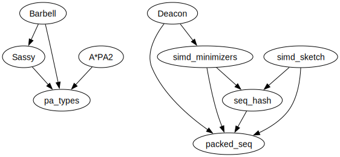

#+title: Software
#+hugo_level_offset: 2
#+hugo_section: /
#+OPTIONS: ^:{}
#+date: <2025-04-30 Wed>

For all my projects, feel free to create issues and/or reach out for help in
using them. My work is more on algorithm development
rather than direct bioinformatics applications, and so I appreciate getting in
contact with potential users :)

* Tools
Maintained:
- [[https://github.com/bede/deacon][*Deacon*]] by Bede Constantinides:
  Fast read filtering, building on simd-minimizers. 
- [[https://github.com/rickbeeloo/barbell][*Barbell*]] by Rick Beeloo: Fast and accurate demultiplexing, building on Sassy. 
- [[https://github.com/RagnarGrootKoerkamp/sassy][*Sassy & Sassy 2*]] with Rick Beeloo: up to 10x faster SIMD-based approximate string matching. 
- [[https://github.com/RagnarGrootKoerkamp/BAPCtools][*BAPCtools*]]: CLI tool for ICPC-style problem development.

Inactive:
- [[https://github.com/RagnarGrootKoerkamp/astar-pairwise-aligner][*A*PA2*]] with Pesho Ivanov: near-linear global pairwise alignment.

Proof-of-concept:
- [[https://github.com/RagnarGrootKoerkamp/simd-sketch][*simd-sketch*]]: up to 100x faster SIMD-based bottom and bucket sketches.
- [[https://github.com/COMBINE-lab/mim][*mim*]] with Rob Patro: fast multi-threaded gzip decompression.

* Libraries
Pairwise alignment:
- [[https://crates.io/crates/pa-types][*pa_types*]]: utils for pairwise alignment and Cigar strings, used by
  A*PA and Sassy.

2-bit DNA packing with SIMD support, all developed with Igor Martayan:
- [[https://github.com/rust-seq/simd-minimizers][*simd-minimizers*]]: compute minimizers of a sequence up to 6x faster.
- [[https://github.com/rust-seq/seq-hash][*seq-hash*]]: streaming k-mer hashing of packed sequences.
- [[https://github.com/rust-seq/packed-seq][*packed-seq*]]: 2-bit encoded ACTG and 2+1-bit ACTGN DNA sequences.

Low-level:
- [[https://github.com/RagnarGrootKoerkamp/prefetch-index][*prefetch-index*]]: small utility for cross-platform prefetching.
- [[https://github.com/RagnarGrootKoerkamp/ensure-simd][*ensure-simd*]]: small utility to compile-time-check that SIMD is enabled.

#+BEGIN_SRC dot :file software-dep-graph.svg
digraph {
node [fontname = "Helvetica"];
Barbell -> Sassy
Barbell -> pa_types
Sassy -> pa_types
Deacon -> simd_minimizers
Deacon -> packed_seq
simd_minimizers -> seq_hash
simd_minimizers -> packed_seq
seq_hash -> packed_seq
simd_sketch -> packed_seq
simd_sketch -> seq_hash
"A*PA2" -> pa_types
}
#+END_SRC

#+caption: Dependency graph of tools and libraries.
#+attr_html: :class inset medium
#+RESULTS:

    
* Data structures
- [[https://github.com/RagnarGrootKoerkamp][*kPHF-set*]]: A fast static hash set.
- [[https://github.com/RagnarGrootKoerkamp/static-hash-sets/tree/master/kphf][*kPtrHash*]]: A fast non-minimal k-PHF.
- [[https://github.com/RagnarGrootKoerkamp/QuickHeap][*SimdQuickHeap*]]: The fastest priority queue.
- [[https://github.com/RagnarGrootKoerkamp/QuadRank][*QuadRank*]]: Single-cache-miss rank queries.
- [[https://github.com/RagnarGrootKoerkamp/PtrHash][*PtrHash*]]: A fast minimal perfect hash function.
- [[https://github.com/RagnarGrootKoerkamp/cacheline-ef][*cacheline_ef*]]: Elias-Fano encoding, one cacheline at a time. Part of PtrHash.

* Misc
- [[https://github.com/RagnarGrootKoerkamp/oxford-bioinformatics-template][*oxford-bioinformatics template*]]: Cleaned-up version of the overleaf
  template with fixed defaults.
  
* Experimental/incomplete
- [[https://github.com/RagnarGrootKoerkamp/stpd][*STPD*]]: In-progress STPD implementation with incremental construction.
- [[https://github.com/RagnarGrootKoerkamp/cch][*CCH*]]: up to 2x faster SIMD-based implementation of customizable contraction hierarchies.
- [[https://github.com/RagnarGrootKoerkamp/amplicon-clustering][*amplicon-clustering*]]: a small sassy-based experiment for amplicon clustering.
- [[https://github.com/RagnarGrootKoerkamp/b_select][*b-select*]]: re-implementation of B-tree based select queries [cite:@rank-select-mutable-bitmaps].
- [[https://github.com/RagnarGrootKoerkamp/merge][*merge*]]: 3-way git merge based on edit distance.
- [[https://github.com/RagnarGrootKoerkamp/minimizers][*Minimizers*]]: reference implementations and experiments for minimizer and sampling
  schemes.
- [[https://github.com/RagnarGrootKoerkamp/sshash-rs][*sshash-rs*]]: quick but incomplete re-implementation of SSHash [cite:@sshash].
- [[https://github.com/RagnarGrootKoerkamp/static-search-tree][*suffix array searching*]]: static search trees for suffix array searching.
- [[https://github.com/RagnarGrootKoerkamp/static-search-tree][*static-search-tree*]] ([[file:../posts/static-search-tree/static-search-tree.org][blog]]): Code alongside the 40x faster binary search post.

