#+title: NordVPN refund dark patterns
#+filetags: @misc
#+OPTIONS: ^:{} num: num:t
#+hugo_front_matter_key_replace: author>authors
#+hugo_paired_shortcodes: %notice %detail
#+toc: headlines 3
#+hugo_level_offset: 1
#+date: <2026-03-03 Tue>

Tl;dr: if you want to refund your NordVPN payment, go to
[[https://my.nordaccount.com/billing/billing-history?intent_rf=true][my.nordaccount.com/billing/billing-history?intent_rf=true]]. The last part,
=?intent_rf=true=, is the important bit. (If that doesn't work, you'll probably
have to go through the full chat-bot flow first, see below. Or maybe they
changed the magic bit.)

---

I have a NordVPN subscription since many years.

Recently I have been getting mails that my card is expired and that I
should update it to keep the service:

#+caption: Mail from NordVPN on February 24.
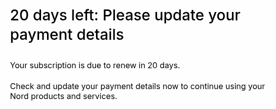

I fully anticipated auto-renewal prices to be excessive compared to their
multi-year plans, so I was happy with this. I'll simply take a new subscription
manually the first time I need it after the current plan expires.

Then today, I receive this:

#+caption: Mail from NordVPN on March 3.
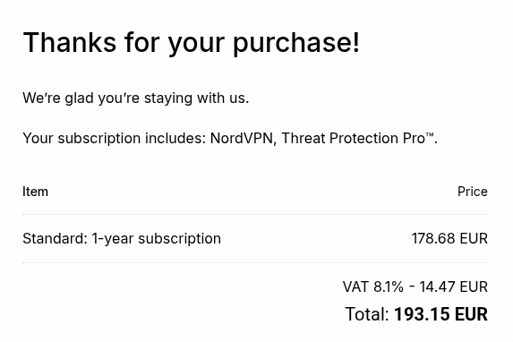

Huh?! But my card is expired?!
But I checked in my banking app and I do see a reservation there (new card, new
expiry date, but presumably the same number).
This is weird in itself (right?), but whatever, that's for some other time.

---

So this is where the real +fun+ pain begins, of trying to get a refund for this
auto-renewal fee.

On the billing page ([[https://my.nordaccount.com/billing/billing-history/][my.nordaccount.com/billing/billing-history]]), I see
this:

#+caption: Billing history.
#+attr_html: :class large
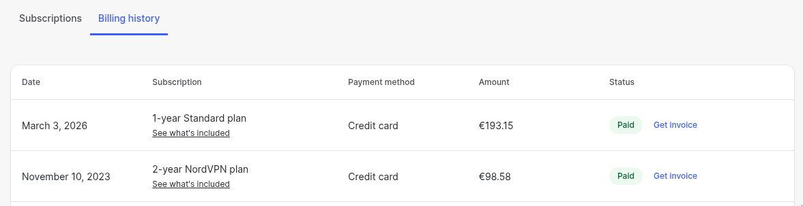

I renewed a bit over 2y ago for 98 euro for 2 years+3 extra months, so 50/year
(44 including the extra months). And now they
took nearly 200 euro for just 1 year, over 4x more expensive! So yeah, we're not
paying that.

First step is to disable auto-renewal at
[[https://my.nordaccount.com/billing/my-subscriptions/][my.nordaccount.com/billing/my-subscriptions]]. This is easy, but only cancels the
next renewal for next year, not the current one.

Now, you may click around a bit and find the (never helpful) /support center/
([[https://my.nordaccount.com/support-center/][my.nordaccount.com/support-center]]). We click /billing and subscriptions/ and
then /request a refund/. This gives a super helpful page
([[https://support.nordvpn.com/hc/en-us/sections/38324049616785-Request-a-refund][support.nordvpn.com/hc/en-us/sections/38324049616785-Request-a-refund]][fn::I
will keep showing the full links, since I completely expect them to change at
any point.]):

#+caption: Request a refund (not)
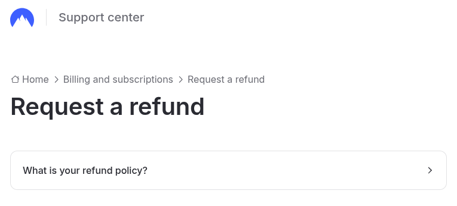

We can click /what is your refund policy?/ and the tl;dr is that it's 30-day
money-back for new subscriptions, and

#+begin_quote
Once your subscription renews, it’s no longer eligible for a refund under this policy (unless local laws require otherwise).
#+end_quote

So that's not very nice, but either way, they do show where the refund button
would be:

#+caption: Example refund button.
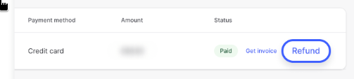

but it also states:

#+begin_quote
If, however, you believe that the decision made by our automated refunds system
is incorrect and that you have the right to get a refund in accordance with the
applicable law, please contact our customer support team via the live chat
option available at the bottom of the page, and we will review your case.
#+end_quote

And indeed, I now see the following:

#+caption: Live chat button
#+attr_html: :class large
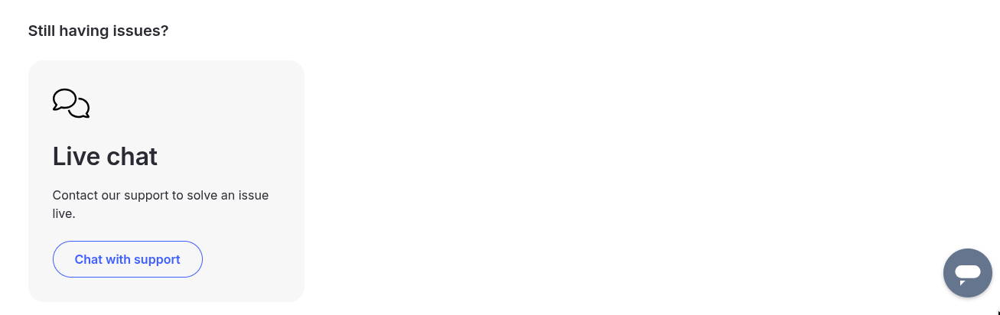

I'm 100% sure this grey button in the bottom-right was not there before, but I
may have missed the /chat with support/ button there. I was explicitly
looking for the grey chat bubble, because this button missing seems to be [[https://imgur.com/8ITbEJ2][a]]
[[https://www.reddit.com/r/vpns/comments/1dn0lsq/tutorial_how_to_actually_get_your_money_back_from/][common]] [[https://www.reddit.com/r/nordvpn/comments/1r2xqdm/live_chat_not_showing_up_no_matter_what_i_do/][theme]] [[https://www.reddit.com/r/nordvpn/comments/1kc1unr/where_is_the_live_chat/][on]] [[https://www.reddit.com/r/nordvpn/comments/1mlz0f8/cant_find_live_chat/][reddit]], where it is suggested to disable adds, clear cookies,
and switch browsers to maybe make it appear, but in the end none of those worked for me.
But then I found [[https://www.reddit.com/r/nordvpn/comments/1r2xqdm/live_chat_not_showing_up_no_matter_what_i_do/][this post]] which very helpfully directly links to the /how to
reach support/ page at
[[https://support.nordvpn.com/hc/en-us/articles/19482416296593-How-to-reach-NordVPN-customer-support][support.nordvpn.com/hc/en-us/articles/19482416296593-How-to-reach-NordVPN-customer-support]],
which currently shows (at the bottom of the article):

#+caption: Current status of live chat button
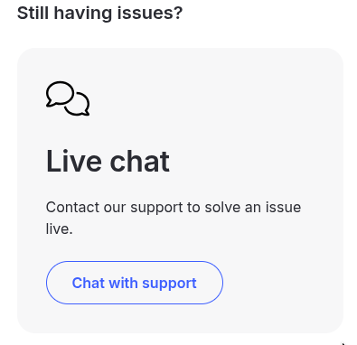

So anyway, as suggested on Reddit and the help article, you can then ask the bot
for a refund:

#+caption: After giving my name and email, I simply wrote "I want to refund my auto-renewal. It's too expensive."
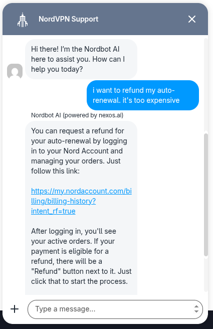

We can click the link it gives
([[https://my.nordaccount.com/billing/billing-history?intent_rf=true][my.nordaccount.com/billing/billing-history?intent_rf=true]], I assume
=intent_rf= indicates that we intend to refund), and now a =Refund= button
appeared!

#+caption: We see the /refund policy/ that does not cover our auto-renewal case, but regardless, a =Refund= button appeared now!
#+attr_html: :class large
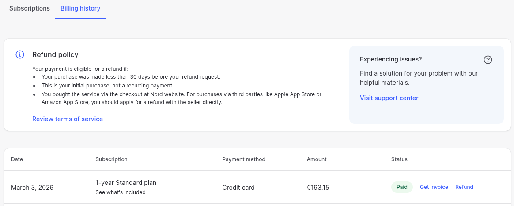

Clicking the button, we suddenly get the following offer:

#+caption: 36 months extra for free!
#+attr_html: :class medium
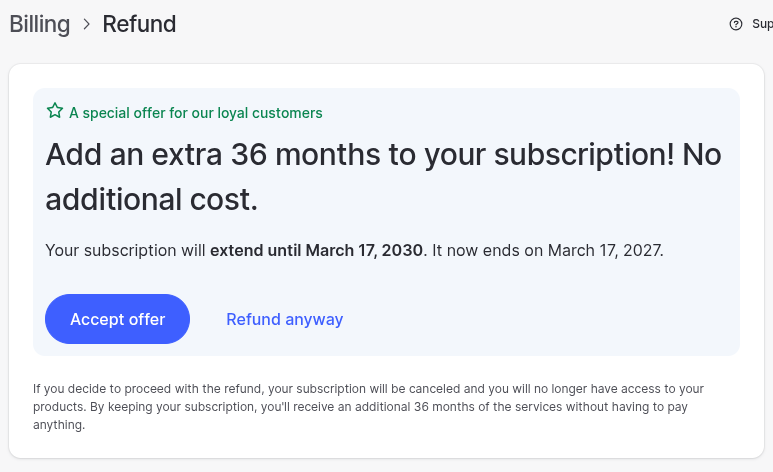

This effectively reduces the cost from 200/year to 200/4year = 50/year, which is
much more reasonable.

Newly available plans, on the other hand, are as low as 83 for 2 years + 3
months, which does come out quite a bit cheaper at 37/year, so we'll just take
the refund and later make a new subscription from scratch.

#+caption: Refund is processing
#+attr_html: :class large
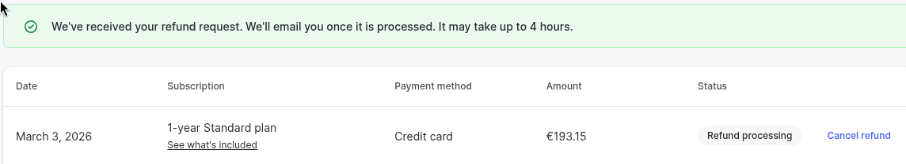

The refund request is now pending. Let's see how this goes.

---

I suspect they regularly change the look of their site to make it harder for
folks to find the right hoops to jump through in order to get to the refund
pages. Also, why does the chat-bot need to be in this process at all? Can't they
just put the magic URL somewhere to start with? And why not just show the
/refund/ button always to start with? Many questions (to which we all know the
answers... $$$).
