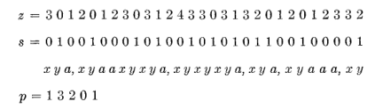

#+title: Optimal sampling schemes for w=2 and odd k
#+filetags: wip minimizers
#+OPTIONS: ^:{} num:
#+hugo_front_matter_key_replace: author>authors
#+toc: headlines 3
#+hugo_level_offset: 0
#+date: <2026-09-12 Sat>

(This is a work-in-progress draft.)

---

Bryce Kille, my co-author on the density lower bound for forward sampling
schemes paper [cite:@sampling-lower-bound], recently mentioned that ChatGPT
found optimal sampling schemes for $w=2$ with $k$ odd.

I've been considering whether to throw this problem of finding optimal-density
sampling schemes at an LLM for a while now, and this made me finally do it.
For context, my recent WABI SUS-anchors paper [cite:@sus-anchor] is a pretty simple
scheme that makes a step towards optimal density for $k=1$ (fixing the other
axis to the smallest non-trivial value[fn::Sol is running in the background on that
problem as I'm writing this. You'll know by the end if it solved it before
I could finish writing about the $w=2$ case.]). But SUS-anchors do not yet
achieve optimal density nor does I have a proof of their density apart from
empirical evaluations.

So anyway, I asked Sol (on =xhigh= mode) to also search for optimal $w=2$ schemes.
I initially let it read my python scribbles for searching $k=1$ schemes, as well
as the integration Bryce made with an ILP solver, so that it can fix part of a
sampling scheme and then use the solver to decide whether the partial scheme can be
completed into a scheme of optimal density.

It tried a bunch of things, but they didn't quite work. I think my python notes
distracted the search, since $k=1$ turns out to be quite different from $w=2$.
At some point, it started talking about /comma-free codes/ and the /Eastman construction/.
I had told it earlier not to use the internet, so as not to
accidentally spoil the process of finding a solution, but at this point I helped
it download a very nice overview paper: [cite/title/b:@comma-free-codes-perrin] [cite:@comma-free-codes-perrin]. Sol
then implemented a number of the techniques from the paper. At first it made
some mistakes in some tie-breaking rules and it started trying other things, but
after I convinced it that surely this paper must lead to a solution, it indeed
did find one eventually!

This post is to first collect background on comma-free codes and related
concepts (both for my and your understanding),
and then to reverse engineer/re-invent the solution that Sol found.

* Comma-free codes
We'll now revisit in detail the aforementioned paper, as
well as some papers that precede it:
- [cite/title/b:@comma-free-codes-golomb], [cite/t:@comma-free-codes-golomb]
- [cite/title/b:@comma-free-codes-eastman], [cite/t:@comma-free-codes-eastman]
- [cite/title/b:@comma-free-codes-scholtz], [cite/t:@comma-free-codes-scholtz]
- [cite/title/b:@free-lie-algebras-viennot], [cite/t:@free-lie-algebras-viennot]
- [cite/title/b:@comma-free-codes-perrin], [cite/t:@comma-free-codes-perrin]

(Side note: I can only hope my papers are as beautiful and nice to read as all
these older texts. It really is such a joy to read them.)
  
Following existing work, we use $A$ to denote the alphabet. A /word/ is a
non-empty string of characters of $A$.
  
** Golomb's comma-free codes
We start with [cite/t:@comma-free-codes-golomb].
#+begin_definition Comma-free code
A set $D$ of length-\(n\) words is a /comma-free code/ when for any
$x,y\in D$, the only substrings of $xy$ that are in $D$ are $x$ and $y$ itself.
#+end_definition
(The authors use the term /comma-free dictionary/ even though the paper is
titled /comma-free codes/. Subsequent literature consistently uses /code/ as
well. Furthermore they use $n$ instead of our $\sigma$ for the size of the
alphabet and $n$ instead of our $n$ for the length of the word.)

Clearly, $x,y\in D$ with $x\neq y$ can never be a rotation of each other, and so
$|D| \leq \frac 1k \sum_{d|n} \mu(d) \sigma^{n/d}$, which counts the number of
necklaces (distinct words under rotation) of length $n$, or equivalently, does
inclusion-exclusion (via the Môbius $\mu$ function) on the divisors $d$ of $n$
over the /total/ number of words of length $n/d$, i.e. $\sigma^{n/d}$.

They believe that equality can be attained for all odd $n$ and proves it up
to $n=15$ by giving explicit constructions.

To give an idea (since this will do some foreshadowing for later): for $n=3$ he
considers words $abc$ with $a<b\geq c$, which is optimal.
For $n=5$, Golomb et al. use the constraint $a<b\geq c$ and $d\geq e$, or otherwise $a<b<c<d\geq e$.
Looking at at the sign of all $n$ consecutive (cyclic) differences, we get
patterns =+---=, =+-+-= and =+++-=, all of which start with an odd number of =+=
and end with an odd number of =-=. Call this property $P$.
We then have the following construction: because $n$ is odd, there is always a sequence
of =+= followed by a sequence of =-= of total odd length. Then we can break the
cycle at the boundary of these two, removing the sign that occurs an even number
of times, so that indeed we now have a sequence satisfying $P$.

For $n=7$, the list of all possible patterns of differences satisfying $P$ is
given and it turns out to work.

For $n=9$, there may be multiple places where the sequence could be broken. This
is solved using a recursive structure: split the word into three words of length
3 satisfying $a<b\geq c$, and then impose $w_1 < w_2 \geq w_3$.

For $n\in \{11,13,15\}$, the same technique can be used. In particular, it works
for $n=15=3\cdot 5$.

The paper then continues with partial results for even $n$ as well as asymptotic
results for $n\to\infty$. I'll omit those here.

At this point, I am obliged to quote the application that is listed:

#+begin_quote
From their researches in the transfer of genetic information from parent to
offspring, Crick, Griffith, and Orgel [cite:@codes-without-commas] advance the
following hypothesis. Genetic information, they suggest, is encoded into a giant
molecule (chromosome) by means of an affixed sequence of nucleotides, of which
there are four types. Each such sequence is uniquely decodable into a new
protein molecule, consisting of a long sequence of amino acids, of which there
are twenty types. They propose that each amino acid is specified by three
consecutive nucleotides. However, only twenty of the sixty-four sequences of
three nucleotides "make sense". Crick, Griffith, and Orgel theorize that the
twenty sequence of nucleotides actually corresponding to amino acids form a
comma-free dictionary. As we have seen, $W_3(4)=20$, which agrees with the number
of amino acids.
The reasonableness of this condition can be seen if we think of the sequence of
nucleotides as an infinite message, written without punctuation, from which an
finite portion must be decodable into a sequence of amino acids by suitable
insertion of commas. If the manner of inserting commas were not unique, genetic
chaos could result.
#+end_quote

I don't know about you, but I'm literally having teary eyes writing this. Math
and science can just be so beautiful, even when it turns out to be wrong.
And indeed, Crick et al. use exactly the same $a<b\geq c$ pattern for their solution.

** Eastman's construction
We continue our journey with [cite:@comma-free-codes-eastman], who gives a
construction for comma-free codes for any odd $n$.
In earlier work [CITE], Eastman already give an explicit construction for all
primes $n\leq 31$, but now a new, recursive method is introduced.
I'll first copy Eastman's notation, and then give the equivalent in terms of
Golomb's presentation.

For $\sigma=2$ and $n=3$, we have ={100, 101}= as code, which can be
represented by ={10a}= where =a= indicates a character at least at large as
the preceding character (i.e. Golomb's =+=).

For $\sigma=2$, $n=5$, we get ={10Ba}:={1010a, 10aaa}=, i.e., where =B= can
be replaced by either =10= or =aa=.
For $n=7$, we get ={10BBa}=, where each of the =B='s is substituted independently.

Generalizing, /pattern $i$/ is =10B..Ba= with a total of $i$ copies of $B$, and
always having odd length. For alphabets $\sigma>2$, the general pattern is
=xyB..Ba= where $x>y$ and =B= is replaced by either /any/ decreasing sequence =xy= or =aa=.

For $n=13$, we get a comma-free code when selecting patterns $5$, $200$, and
$101$, where the latter two should be interpreted as the concatenation of
patterns $2$, $0$, $0$ and $1$, $0$, $1$ respectively.
These latter words have 3 /sections/.
Each section of a word can also be seen as its own value under lexicographic comparison,
corresponding to an integer up to $\sigma^m$ for sections of length $m$.
(Note that by /lexicographic value/, I do /not/ mean the number of repetitions
of $B$, but rather the value of the entire word. E.g. the value of =110= would
be $v=6$ when $\sigma=2$.)

We now get to the recursive construction:

#+begin_definition Eastman construction
The comma-free code $\mathcal C_{\sigma, 1}$ is $A$. For $n$ odd and $n\geq 3$,
$\mathcal C_{\sigma, n}$ is given by all patterns with an odd number of sections
$p_1$, $\dots$, $p_i$ such that the word $v = v_1\dots v_i$ spelled by the
section-values is a code in $\mathcal C_{\rho, i}$ for a sufficiently large $\rho$.
#+end_definition

Similar to Golomb et al., Eastman now considers the sequence of cyclic
differences for any odd length word $z$ to recover a factorization of a rotation
of $z$ into sections:
=0= for increments/equality ($z_i\leq z_{i+1}$) and =1= for decrements
($z_i > z_{i+1}$). Clearly, =a= maps to =0=, while =B= maps to either =00= or
=?1=. A pattern =xyB..Ba= maps to =?1(00|?1)*0=, with the initial question mark
corresponding to the wrap-around comparison.
=y= implies =1=, =a= implies =0=, and =x= maps to either =0= or =1=.
In particular, any sequence of =1= ends in an =a= and starts in an =xy=:
odd-length sequences of =1= are of the form =y(xy)*= and even-length sequences
are of the form =xy(xy)*=.
Using this, we can fully infer the pattern of =x/y/a= characters for each cyclic
input sequence =z=. Since $z$ has odd length and =xy= characters come in pairs,
we get an odd number of =a= characters and thus an odd number of sections, where
each section starts after an odd-length run of =a= characters.

#+caption: The example Eastman gives for the construction of a pattern corresponding to an arbitrary input word $z$.

The proof that $\mathcal C_{\sigma, n}$ is comma-free is somewhat involved and I
have not yet (TODO?) figured out an intuitive summary, so please see the
original instead. (Unfortunately, I kinda expect that we'll need to understand
this proof in some detail to be able to prove our final result later on; we'll see.)

The paper ends with a proof that $\mathcal C_{\sigma,n}$ is maximal, i.e., that
for every aperiodic word of length $n$, it contains exactly one of its rotations.
The proof is by induction on $n$: first split $z$ into sections (of which there
are $<n$) as described above. Then by induction, some rotation of the sections
is in the corresponding comma-free code, and we can use that rotation to recover
the rotation of $z$.

---

So now that we have defined this construction of a comma-free code for arbitrary
odd $n$, the question is what we learn from this.
I think one specific reason why this recursive construction works only for odd
lengths is the following: an odd number can be written as the sum of an odd
number of odd numbers. This means that after doing one such step, we are again
left with an odd-length string, so that at last we end with a single
(high-order) pattern, and we can simply sample the start position of the
rotation of that pattern.

*** Knuth's take

In The art of computer programming, volume 4, fascicle 5b (todo bibtex), Donald
Knuth covers Eastman's algorithm in exercise 37 with a simplified presentation.

We start with the entire string and repeatedly partition it into longer
substrings. Initially, there are $n$ substrings of length 1, and the number of
parts remains odd. Strings are first compared by length, with longer strings
being larger, and otherwise compared lexicographically.
Knuth then introduces *dips*: substrings $z_1\dots z_k$ such that $z_1\geq
\dots\geq z_{k-1} < z_k$, equivalent to =xyaaaa= strings from before that had a
single decrement and then only increments.
Every string can be uniquely factored into dips, by starting a dip at every
$z_i < z_{i+1}$ and extending them left as far as possible.
We then consider the dips of odd length and right-extend them by as many
succeeding even-length dips as possible, to obtain an odd number of odd-length *superdips*.

*** Perrin et al.'s take
[cite/t/f:@comma-free-codes-perrin] also explain Eastman's construction in terms
of Knuth's dips and superdips.
They define:
- $S_0(A) = A$;
- $D_n(A) = D(S_{n-1}(A))$, i.e. /$n$-dips/ over the alphabet $S_{n-1}(A)$ with the
  radix order $u<v$ if either $|u|<|v|$ or $|u|=|v|$ and $u$ is lex smaller than
  $v$;
- $S_n(A) = S(S_{n-1}(A))$, i.e. /$n$-superdips/ over the alphabet $S_{n-1}(A)$, also
  with radix order.

Again, each $S_n(A)$ contains only words of odd length.
A (cyclic) word can be parsed into the form $D_n(A)*$ or $S_n(A)*$ by doing this
for $i=1,\dots,n$.

** Scholtz' construction
- $X_1 = A$
- $x_i$ is any word of minimal odd length of $X_i$
- $X_{i+1} = x_i^*(X_i\backslash x_i)$, i.e., any number of repetitions of $x_i$
  followed by another element of $X_i$.

#+begin_src 
a    | a b
b    | a*b
aab  | b*a*ab = bab aab ...
     | (aab)*
#+end_src

*** Perrin et al.'s take

** Lyndon words
It turns out this theory concerns the factorization of words, and words are
"simply" elements of the /free Lie algebra/ ([[https://en.wikipedia.org/wiki/Free_Lie_algebra][wikipedia]]) over $A$.
This page links to [[https://en.wikipedia.org/wiki/Hall_word][Hall sets]] and [[https://en.wikipedia.org/wiki/Lyndon_word][Lyndon words]].

A Lyndon word [cite:@lyndon-word] is a non-empty string that is the
lexicographic minimum over all its rotations. E.g. =ab= is Lyndon, but =ba= is
not. =aabababb= is also Lyndon.

One property of Lyndon words is that they admit a (standard) /factorization/:
every non-empty Lyndon word $w$ can be split into Lyndon words $w=uv$ with $v$ as long
as possible. The example above factorizes as $a((ab)((ab)((ab)b)))$.
Note how, as we go from left to right, the factors increase in value.

More generally, /every/ word can be formed in a unique way by concatenating a
sequence of non-decreasing Lyndon words, called the /Lyndon factorization/.

** Hall sets
Hall sets generalize Lyndon words to arbitrary orders (other than the
lexicographic one). Given an order that respects $u < uv$ for arbitrary words
$u$ and $v$, Hall words $w$ are the concatenation of two words $xy$ with $x<y$
and either $y\in A$ or $y=(z,t)$ with $z\leq x$.

** Lazard sets
Let $<$ be some order on words.
A Lazard set $Z = \{z_1,\dots, z_k\}$ is a set of words of length $\leq n$ with
$z_1<z_2<\dots < z_k$ that has the following property:
- For all $i<j$, $z_i$ is smaller (under $<$) than every non-empty suffix of $z_j$.

The way we achieve this is by starting with $Z_1 = A$ and choosing $z_1 = \min Z_1$.

** Perrin's construction

  
* LLM overview

#+begin_src
Goal
Status: complete
Objective: Discover, implement, and verify a local construction algorithm for a globally optimal w=2 sampling scheme
for every odd k and arbitrary alphabet size sigma, using Rust experiments and the local ILP oracle without web search.
Time used: 4h 45m
Tokens used: 2.11M
#+end_src

* Lean formalization

#+print_bibliography: 
