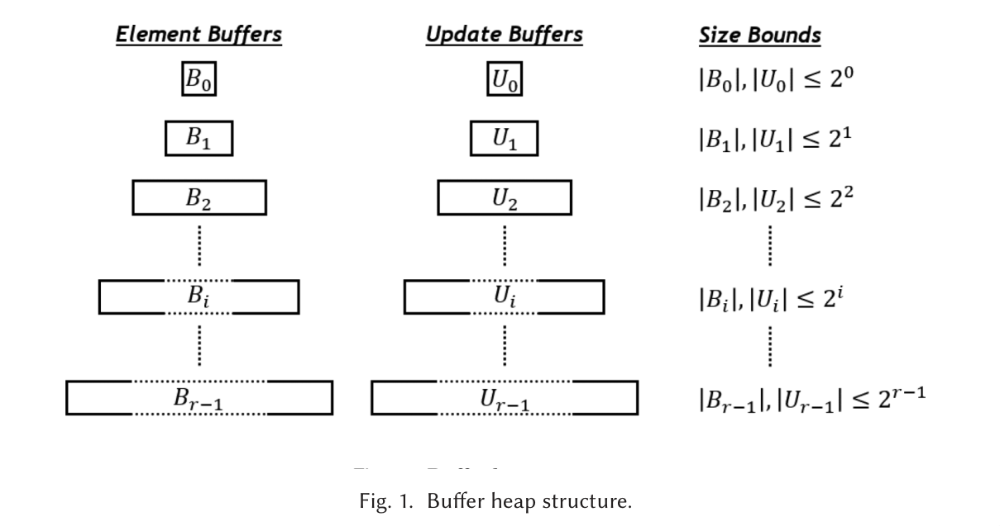

#+title: Possible improvements to the QuickHeap
#+filetags: data-structure
#+OPTIONS: ^:{} num: num:t
#+hugo_front_matter_key_replace: author>authors
#+hugo_paired_shortcodes: %notice %detail
#+toc: headlines 3
#+hugo_level_offset: 1
#+date: <2026-09-11 Fri>

Here, we'll discuss some possible improvements to the SimdQuickHeap
[cite:@simdquickheap] ([[file:../quickheap/quickheap.org][previous post]], [[file:../../static/papers/simdquickheap.pdf][paper PDF]]).
Most of these came up last week during ESA, after William Kuszmaul gave a keynote on
/history independent data structures/ (specifically, layered list labelling
[cite:@layered-list-labeling]) and Marvin Williams presented our work.

I think the discussions were started by Dennis Kobert, student at KIT. They then
quickly expanded to include others from KIT (Nikolai Maas, Marvin Williams,
Stefan Walzer, Patrick Steil) as well as Sebastian Wild.

All together, a few ideas came up:
1. A history independent quickheap (or heaps in general)
2. Adding =decreaseKey= support to the quickheap 
3. SIMDfying the radix heap.

* A history independent quickheap
** History independent data structures
A dynamic data structure is /history independent/ when the in-memory representation of,
say, the set of elements is completely independent of the /history/ of the data
structure, e.g., which elements have inserted and deleted to/from it in the
past.

History independence is nice for a few reasons. First, it gives the user privacy
guarantees that sharing the data structure does not reveal any historical
information. Second, history independence turns out to be a good way to design
efficient data structures: it is impossible for the user to get the data
structure in a "bad state" e.g. by repeatedly inserting and removing elements.
Specifically for many hashmap implementations, such behaviour can lead to
inserting many /tombstones/ to indicate deleted elements, and these deteriorate
the performance of queries.

We consider history independence for deterministic and
randomized data structures. For deterministic data structures, the situation is
pretty straightforward: if every represented state $S$ has /exactly one/
representation anyway, the data structure is trivially history independent.
If deletions are allowed, it may be the case that repeatedly inserting and
removing a specific element is expensive though, for example because the number
of elements crosses the threshold where the data structure resizes. But in
expectation over an internal random seed, or amortized over all operations, the
expected cost of each operation is ideally small.

On the other hand, we could aim for a solution where the representation is a
uniform random sample from some set of possible representations.
This way, we are not forced to 'toggle between two states' on repetitive
insertions and deletions, and we can instead average out this cost over the internal state.

** History independent list labeling
List labeling is roughly the following problem: we have a set of $m$ /slots/ and
maintain a dynamic set $S$ of $|S|=n\leq m$ elements. We can insert to $S$,
delete from $S$, and get the current slot of an element, with the guarantee that
all current elements have a different slot. (But the slot assigned to an element
need not be stable.)

Typical solutions maintain the set in sorted order with empty slots in between
elements to allow for future insertions.

The main idea behind the history independent algorithm of [cite/t/f:@layered-list-labeling] is to assign each element
a pseudo-random /weight/ (by hashing it) and then a treap-like structure where we partition
the elements into a left and right half based on the element with the smallest
weight. A difference, though, is that here a somewhat balanced partition is
needed, and so the split is on the smallest-priority element among the middle $n
/ \lg n$ elements.

Anyway, all that we need from this is the concept of assigning pseudo-random
priorities to elements and letting those decide the (then deterministic)
layout of the data structure.

** History independent quickheap
At this point, Dennis Kobert had the idea to apply a similar technique to the
SimdQuickHeap (just quickheap from now).

By default, we partition the elements by a median-of-3 random element, but this
has two drawbacks: it's not history independent, and the data structure can end
up in a bad state where the number of layers is not $O(\lg n)$ anymore.

Instead, we can partition each layer not by a random pivot key, but by the
specific key that has the smallest pseudo-random weight (let's call this the /weight/ again,
rather than overloading /priority/).
This way, our data structure corresponds to the left spine of a [[https://en.wikipedia.org/wiki/Treap][treap]].
Furthermore, the layout of the data structure is fully deterministic once the seed of
the hash function is chosen.
On inserting a key, we find it's bucket. Then, we
compute it's weight and if it has smaller weight than any of its parent pivots,
the largest such corresponding subtree is rebuilt.

Thus, this requires that we store the weight of each pivot, and store or
recompute the weight of each key during partitioning.

** Duplicate elements and randomized weights
A problem with the model above is that if we have many equal keys, they all get
the same weight, which could lead to very skew distributions (for example, if
90% of the keys are equal).

As an alternative, we can choose a uniform random weight for each inserted key,
rather than letting it depend on the key itself, so that identical keys have
distinct weights. This makes the data
structure non-deterministic:
the representation of the heap is now uniform random over the set of all
possible weight assignments to keys.

Initially, this requires us to store the weight of each key, so that we can
re-use it once a bucket is partitioned. But it turns out this is not necessary:
we can simply generate new randomness once a bucket is partitioned, as long as
we generate random numbers that in the range between the weights of the two
enclosing pivots.

On inserting an element, we generate its random weight, find its bucket, and
rebuild all subtrees above it for which the new element has a smaller weight
than the current pivot.

** Stronger quickheaps
The final realization is that in fact, we do not need to store/compute the
random weight of all elements at all. Instead, we can simply
take a random element to partition a bucket.
To insert an element, we can directly compute the probability that its weight is
less than the weight of any of the pivots above it as $1/k$ for a subtree
containing the new element that currently has $k$ elements. Thus, on every
insertion, we rebuild the entire tree with probability $1/k_0 = 1/n$, the left subtree
with probability $1/k_1$, and so on.

But this is exactly the algorithm introduced in
[cite/title/b:@stronger-quickheaps] by [cite/t/f:@stronger-quickheaps], under the name
/Randomized QuickHeap/!

So, conclusion of this line of thinking: we wanted to develop history
independent quickheaps (to me, mostly to speed up the data structure), and via
many steps, we arrived back at the original 2012 solution :)

** Order of elements
So far, I have only considered the shape of the tree for the purposes of "the
state of the data structure", but we should also consider the order in which
elements are stored in each bucket. In particular, inserting an element
currently always pushes the element to the back of a bucket, but this clearly
leaks information. To make the data structure fully history independent, we must
keep every bucket randomly shuffled at all times. One way to do this, we think,
is to choose a random index for the new element and move it there, and then
taking the previous element in that location and appending it to the back of the
bucket. This is similar to the [[https://en.wikipedia.org/wiki/Fisher%E2%80%93Yates_shuffle][Fisher-Yates shuffle algorithm]].

* QuickHeap with =decreaseKey=
Another, independent, idea is to add support for =decreaseKey= operations, as
these are beneficial when running e.g. Dijkstra's algorithm in dense graphs,
where each node could be pushed as much as 10 times and it's preferable to not
blow up the memory usage by 10x.

** Some theoretical bounds
In general, the I/O-complexity of a comparison-based priority queue is
lower-bounded by $\Omega(\frac 1B \log_{M/B} n)$ amortized I/Os per operation,
which is also the minimal cost per element when sorting $n$ items using
comparisons.  An $M/B$-ary variant of the binary heap with buffers of $M$
elements in each node reaches this lower bound [cite:@decreasekey-expensive;@sequence-heap].
When decrease-key must be supported, this increases to $\Omega(\frac 1B \log B /
\log\log n)$ [cite:@decreasekey-expensive] as a cell-probe lower bound, but note
that this reduces to $\Omega(\frac 1B)$ for $n\gg B$.
In the pointer model, a lower bound is $\Omega(\log\log n/\log\log\log n)$ time [cite:@decrease-key-lower-bound].

** The buffer heap

The fastest algorithm (I think; but it's from 2018) achieves $O(\frac 1B \log
\frac nB / \log \log n)$ amortized I/Os per operation instead [cite:@external-memory-priority-queue-decreasekey].

The cache-oblivious /buffer heap/ [cite:@buffer-heap] supports decrease-key in $O(\frac 1B \log_2 \frac nM)$ I/Os and appears to be practical.
Note that this is the /same/ I/O complexity as the quickheap currently has!
Which would suggest that we can add decrease-key support for free from an
I/O-complexity perspective.

A key figure in this paper is the following.

#+caption: Screenshot from [cite/t:@buffer-heap]: the data structure has separate buffers for contained values and updates.

Either way the "technical overview" section in this paper is recommended
reading: in-memory decrease-key solutions can keep a pointer, but this is not
efficient in external memory. To identify the nodes for removal, two indices are
needed, one by priority and one by ID, which is what complicates things in the
first place. (I guess a general statement would be that it's
hard/impossible to store an arbitrary bijection in such a way that it can be
updated and queried from both directions in $O(\frac 1B)$ I/Os per operation.)

The technique of separately storing updates was also done before already.

The main layout is as follows: there are around $\log n$ layers and layer $i$
contains at most $2^i$ elements and at most $2^i$ updates (see the figure), such
that all keys in layer $B_i$ are less than those in layer $B_{i+1}$.
Furthermore, all updates to the elements in $B_i$ that are not yet applied live
in $U_0, \dots, U_i$.
Lastly, each $B_i$ contains each id at most once, and buckets of elements and
updates are sorted by /id/ (rather than by /key/)! Updates are also sorted by
timestamp as a secondary key in case multiple updates touch a single element.
(Although, if the keys/priorities are (sufficiently) unique, sorting by that can
surely also work.)

I'll now briefly summarize the operations on the data structure. See the paper
for more detail (where the full explanation, pseudocode, and analysis is a total
of 10 pages).

*Decrease-key* simply pushes an update event to $U_0$, and then fixes overflow
of $U_0$ if needed.

*Sink.* When $B_{i-1}$ overflows, it is converted into a list of /sink/ instructions
that are /merged/ into $U_i$ (so that it remains sorted).
Then once $U_i$ is processed, this will add the element to $B_i$.

*Fixing $U$ overflow* is done by applying the updates of $U_i$ to $B_i$,
emptying $U_i$, and then moving remaining pending updates to $U_{i+1}$.
It recurses to larger levels $i$ until $U_i$ does not overflow anymore.

*Apply-updates* merges $B_i$ and $U_i$ and applies the necessary updates to each
element, merging any extra updates into $U_{i+1}$.

*Delete-min* and *find-min* first process updates coming before the first
non-empty $B_i$ and then also calling *redistribute*, which repeatedly partitions
the smallest non-empty bucket into two halves (in this case, specifically in
such a way that most buckets end up with exactly $2^i$ elements).

*Reconstruct* is a function that is called after each operation and ensures the
data structure remains in good shape. Specifically, if the data structure
currently contains $n$ elements, than this will force a rebuild of the entire
structure once $n/2$ operations are applied, so that the space overhead of
pending deletes is never too large.

The main reason this has good I/O complexity is that updates are only gradually
"pushed down" and merged into existing buffers. Furthermore, merging two buffers
of $2^i$ elements (or within a factor 2 of that or so) can be done for only
a constant factor overhead in the I/O complexity.

** Deletion tokens for the quickheap
As with the buffer heap, our main idea is to insert the element with the new
priority, and to insert a separate deletion token (/anti matter/) to indicate
the element should be removed. So far, we assumed that the old priority is available
when doing a decrease-key, so that we can directly push the deletion token to
the right buffer rather than bubbling it down. We "clean up" a partition once
$1/3$rd of it is deletion tokens. This operation entails finding matching
elements and deletion tokens and this requires either hashing or sorting all elements.
Neither is ideal, but it's anyway inevitable, and so probably we should just
sort the elements using an I/O-efficient (but not optimal) sort in $O(\frac 1B \log_2 \frac nM)$
I/Os per element. Merge-sort already does this anyway.

One thing to figure out here is if pushing an update directly to the right
bucket and only sorting that lazily later is bad. Currently I think it should be
fine. If a bucket is cleaned up, should we also directly rebuild the entire subtree?

** Bloom filters
Stefan Walzer also had an idea to use bloom filters to reduce the memory
usage for cleaning up buckets with many deletions. First, we can build a,
say, 8-bit filter on the deleted elements. Then we can scan through the elements
and preserve those not in the filter. That should only leave a small fraction of
elements that was false detected as deleted. 

Then we can build an /invertible bloom filter/ that also supports removing
elements and looking up all elements contained in it, which has size
proportional to the number of false-positive elements from before. Then we could
insert all elements detected as deleted and remove all deleted elements, at
which point we can read out the remaining elements.

This still uses $O(n)$ space for a bucket of $n$ elements, but it's closer to
$n$ bytes rather than $n$ words, which might make a difference in practice.

* The SIMD radix heap
Another idea is to combine the ideas of the SimdQuickHeap with the radix heap of
Johnson [cite:@radix-heap-johnson].
There are a few approaches to this: we can either radixify the quickheap, or
simdfy the radix heap.

** Adding SIMD to the radix heap
This turns out to be not straightforward at all. Whereas the quickheap
repeatedly partitions a layer into two, which can be done using comparisons and
efficient compress-and-store SIMD instructions, the radix heap directly
classifies elements into /multiple/ groups, and SIMD /scatter/ instructions
aren't nearly as efficient, and also require additional logic to make sure
elements classified to the same bucket are written to /consecutive/ (rather than
the same) locations.

Either way, Patrick noticed that the C++ radix implementation that we use uses
a loop to find the next empty bucket. Instead, we can simply keep track of which
buckets are empty in a bitmask (see Marvin's vibe-coded [[https://github.com/marvinwilliams/radix-heap/commits/master/][fork]]), which provides a decent (20%?) speedup.
Additionally adding AVX-512 gave less of a benefit, IIRC.

** Two-level radix heap
The two-level radix heap is introduced by [cite/t/f:@radix-heap].
A simple form is the following: instead of a radix of $2$, use a first-level radix
of say 4, so that elements are partitioned into $w/2$ levels of how many
trailing bits they share with the current minimum divided by 2 (for $w=64$ bit
values). Then, partition each level spanning $4^i$ values into 4 segments by the
top-2 bits of the value relative to the current minimum. This way, we first look
the number of trailing zeros, and then at fixed number of bits before that. In a
way, this is similar to floating point representations with an exponent and
mantissa, but considering low-endian digits first.

The main benefit of this approach is that each partition step does not only use
the number of trailing zeros, but also the last bits before that, so that
overall, each element has to go through fewer partition operations, for less
total I/O. In fact, this is similar to the multi-way partitioning we want to do
for the quickheap as well.

#+print_bibliography:
