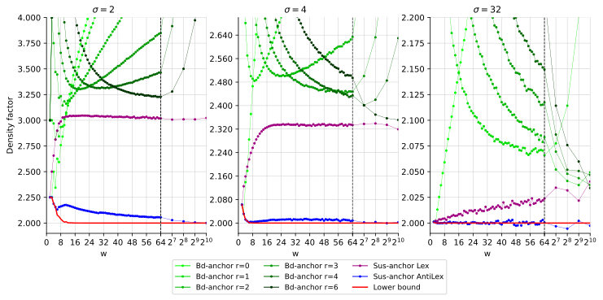

#+title: The anti-lexicographic SUS-anchor: a near-optimal k=1 sampling scheme
#+filetags: @paper minimizers 
#+OPTIONS: ^:{} num: num:t
#+hugo_front_matter_key_replace: author>authors
#+hugo_paired_shortcodes: %notice %detail
#+toc: headlines 3
#+hugo_level_offset: 2
#+date: <2026-05-12 Tue>

$$
\newcommand{\sus}{\mathsf{SUS}}
\newcommand{\lcp}{\mathsf{lcp}}
\newcommand{\last}{\mathsf{last}}
$$

* Abstract
*Motivation.*
In recent years, there has been a renewed interest in the search for low density
minimizer schemes. These schemes take a /window/ of $w$ consecutive \(k\)-mers,
and /sample/ one of them: the smallest under some specific order.
Schemes such as the mod-minimizer provide a low /density/ (fraction of sampled \(k\)-mers) when
$k \gg w$, while schemes such as the greedy minimizer work well for explicit
small parameters roughly in the regime $k \leq 2w$, for $k$ and $w$ up
to $15$ or so.

When $k < \log_\sigma w$ is very small, minimizer schemes cannot do well, and
more general /sampling/ schemes are needed that can be richer than just
comparing \(k\)-mers. Bidirectional-string anchors (bd-anchors) form one such scheme.

*Methods.*
Inspired by bd-anchors, we introduce the /smallest unique substring/ or SUS-anchor:
Given a window, this considers all suffixes that do not occur as a substring
elsewhere in the window. It then samples the start position of the smallest suffix according to the
new /anti-lexicographic/ order that minimizes the first character and maximizes
the remaining characters.
We give a linear-time and $O(w)$ space streaming algorithm to compute all
SUS-anchors of a string.

*Results.*
For alphabet size $\sigma=4$ and $k=1$, the anti-lexicographic SUS-anchors empirically has density
$<1\%$ away from the density lower bound,
significantly improving over bd-anchors that are often $>15\%$ above it.
For alphabet size $\sigma=2$, the density is at most $10\%$ above the lower
bound, which again improves over the $>50\%$ overhead of bd-anchors.
# The good density also extends to $1<k<\log_\sigma w$.

# Additionally, we revisit the /ABB/ scheme and show that the ABB+ variant with tie-breaking achieves
# good density up to slightly larger $k$, and that a /threshold/-based order
# also achieves good density (TODO).

* Introduction
Minimizers [cite:@winnowing;@minimizers] are a technique to subsample the
\(k\)-mers of a string such that consecutive samples are at most $w$ positions apart.
Minimizer sampling has many applications in bioinformatics.
In particular, the minimizers of a string are a /sketch/ or compressed (lossy)
representation,
allowing for faster processing.
Specific applications include seeding for read-mapping as done by minimap
[cite:@minimap], the minimizer-space De Bruijn graph
[cite:@mdbg], text-indexing using the U-index [cite:@u-index], sketching for
Jaccard similarity in mashmap [cite:@mashmap], host depletion in Deacon
[cite:@deacon-preprint], and more [cite:@minimizer-sketches].

*Recent work.*
There is a long line of active work on minimizers.
Of particular interest is the /density/, which is the expected fraction of
sampled positions.
Recently, the mod-minimizer [cite:@modmini;@oc-modmini] introduced schemes with near-optimal
density for
$k\to\infty$. The GreedyMini [cite:@greedymini] is the state of the art
for smaller $w$ and $k$ roughly up to $15$, achieving particularly close to
optimal density for $k=w+1$, $k=w$, and $k$ just below $w$.
Shur et al. recently introduced
/spacers/ [cite:@10-minimizers] that prefer sampling \(k\)-mers starting with
=10= (assuming a binary alphabet) for which the next occurrence of =10= is as far ahead as possible.
Spacers improve the density of the ABB+ scheme we introduce here, and are
especially good when $w$ is large.
For particularly small parameters $(\sigma,k)=(2,\leq 6)$ and $(\sigma,k)=(4,
2)$, exactly optimal minimizer schemes are given by the search algorithm OptMini [cite:@optmini] and
analysed theoretically by Shur [cite:@on-minimizers-of-minimum-density].

This raises the question: *can we find near-optimal /sampling/ schemes for small $k$, and in
particular for $k=1$*?
An ILP search suggests that the answer is yes: this is always possible when
$k\equiv 1\mod w$
[cite:@sampling-lower-bound], and thus we are motivated to search for a "clean",
constant-space scheme.

Some further recent work includes SimdMinimizers [cite:@simd-minimizers],
a SIMD-based algorithm that computes /random minimizers/ at around 500 Mbp/s.
A precise analysis of the density of the random minimizer is given in [cite:@random-mini-density].
Vigemers [cite:@vigemers] reduce the imbalance when using minimizers for
partitioning, and multiminimizers [cite:@multiminimizers] reduce the density at
the cost of more compute.

*Sampling and selection schemes.*
Minimizer schemes hash each \(k\)-mer and sample the \(k\)-mer with the smallest
hash in a window of $w$ \(k\)-mers (or $\ell=w+k-1$ characters).
Minimizers cannot achieve a good density of $O(1/w)$ for constant $k$ as
$w\to\infty$ [cite:@asymptotic-optimal-minimizers],
but this restriction does not apply to /sampling schemes/, which have more
freedom because they are not required to first hash all \(k\)-mers.
In particular, /selection schemes/ with $k=1$ simply sample a single /position/
based on a window of length $w=\ell$.
Bidirectional string anchors (bd-anchors) are one such selection scheme
[cite:@bdanchors-esa;@bdanchors]. These sample the start position of the
smallest /rotation/ of a window and achieve a density of $O(1/w)$.
For large $w$ and alphabet size $\sigma=4$, bd-anchors have a density around $20\%$ above the lower bound. Our goal is
to reduce this to $0\%$ overhead.

*Contributions.*
In this paper, we introduce SUS-anchors, short for /smallest unique substring/ anchors.
As the name implies, given a window, these sample the start position of the
smallest substring that does not occur a second time. This is equivalent (after
reversing the order of the alphabet) to finding the /maximal suffix/ of each window. 
Specifically:
- We introduce the concept of /character-based orders/ that generalizes e.g. the
  lexicographic, alternating [cite:@minimizers], and ABB
  [cite:@minimally-overlapping-words] orders.
- We then introduce two new orders: the /ABB+/ and /anti-lexicographic/ order.
- We give an $O(n)$ time and $O(\ell)$ space sliding-window algorithm to compute the
  SUS-anchors of a string of length $n$ that is based on the /monotone-queue/
  approach [cite:@simd-minimizers].
- We experimentally show that SUS-anchors with the anti-lexicographic order have density within
  $1\%$ of optimal for $\sigma=4$ and any $w$.
# - Lastly, we show that the threshold order achieves good density TODO.
# TODO: Mention threshold

Parts of this paper have been previously introduced in the
author's thesis [cite:@thesis].

* Preliminaries
** Minimizers and sampling schemes
For a more in-depth introduction to minimizers, we refer the reader
to the survey by Zheng et al. [cite:@minimizer-sketches],
the mod-minimizer paper
[cite:@modmini], and the author's thesis [cite:@thesis]. Here we briefly
introduce the required notation and concepts.

*Notation.*
For an integer $w$, we write $[w] = \{0, 1, \dots, w-1\}$, and for a string
$W=w_0\dots w_{|W|-1}$
we use $W[i\dots j)$ to indicate the substring $w_i\dots w_{j-1}$.
We assume an alphabet $\Sigma$ of size $\sigma$.

*Sampling schemes.*
Given parameters $w\geq 1$ and $k\geq 1$, a /window/ is a string over $\Sigma$ of length
$\ell=w+k-1$ that contains exactly $w$ \(k\)-mers.
A /local sampling scheme/ or just /sampling scheme/ is a function $f:
\Sigma^\ell \to [w]$ that indicates that from window $W$, the \(k\)-mer
$W[f(W)\dots f(W)+k)$ is /sampled/.

Given a text $T$, we are interested in the /set/ of all sampled positions when
sliding window $W$ over the text.
Consecutive sampled positions differ by at most $w$, and
a sampling scheme is /forward/ when the
sampled position in $T$ never decreases when sliding the window forward.

Often considered are /minimizer schemes/ [cite:@winnowing;@minimizers], which are forward sampling schemes that sample the start
position of the smallest \(k\)-mer (according to some order given by a hash function) starting in the window.

In this paper, we are particularly interested in /selection/ schemes, which are
sampling schemes with $k=1$ [cite:@small-uhs].

*Density.*
The /particular density/ of a sampling scheme is the fraction of positions that
are sampled. The /density/ is the expected value of the particular density on a
random string with length going to infinity.
# For forward schemes, the density equals the particular density on the De Bruijn
# sequence [cite:@debruijnseq] of order $c=w+k$ and length $\sigma^{w+k}$ [cite:@improved-minimizers].
# Thus, it can be computed exactly when $\sigma^{w+k}$ is not too large.

*Density lower bounds.*
A trivial lower bound on the density of sampling schemes is $1/w$, since at
least one in every $w$ positions is sampled. The best
current lower bound for /forward/ sampling schemes [cite:@sampling-lower-bound]
simplifies (with a small loss of
accuracy) to $\frac 1{w+k} \left\lceil \frac{w+k}w\right\rceil$.
For $k=1$, this gives a lower bound for forward selection schemes of
$\frac1{w+1}\left\lceil\frac{w+1}w\right\rceil = \frac 2{w+1}$.
The main insight is that the density equals the expected number of samples
in a random cyclic string (cycle) of length $w+1$, and in any such cycle,
at least two different positions must be sampled.

For /minimizer/ schemes, a lower bound is given by $1/\sigma^k$ [cite:@asymptotic-optimal-minimizers]: if
$w\to\infty$, exactly all occurrences of the smallest \(k\)-mer will be sampled,
and these occur every $\sigma^k$ positions in expectation.
Note, however, that this bound does /not/ hold for general sampling schemes, and
it is exactly this property that will allow us to design near-optimal sampling
schemes for small $k$.

** Bidirectional string anchors
:PROPERTIES:
:CUSTOM_ID: bd-anchors
:END:
/Bidirectional string anchors/ (/bd-anchors/) are a $k=1$ selection scheme introduced by
Loukides, Pissis, and Sweering for the purposes of
text indexing [cite:@bdanchors-esa;@bdanchors].
Given a window, they sample the (leftmost) start position of the
lexicographically smallest rotation.
A drawback of bd-anchors is that they are not forward: the window =ZABAAC= has
=AAC...= as smallest rotation, while the shifted window =ABAACA= has =AAB...= as
smallest rotation. After further shifting to =BAACAY=, the smallest rotation is =AAC...=
again: the =AB= prefix caused the selected position to jump around.
To ensure the density[fn::Note that even though typically $\ell=w+k-1=w$, we will $w$ for
the density and $\ell$ for the length of the window.] is in $O(1/w)$,
/reduced/ bd-anchors [cite:@bdanchors] avoid sampling the last $r=C\lceil \log_\sigma \ell\rceil$
positions, where $C=4$ in theory but in practice $C=3$ or less
suffices.[fn::It appears that Theorem 6 of the ESA paper [cite:@bdanchors-esa]
on the density of bd-anchors does not hold, as it was relaxed to $O(1/w \cdot
(1 + \log_\sigma w))$ in the journal version [cite:@bdanchors].]
Given the choice of $r>\log_\sigma \ell$, in most windows of a random string
the bd-anchor is the same as the smallest lexicographic \((r+1)\)-mer.
Note though that reduced bd-anchors are still not forward.

In practice, bd-anchors can be computed in $O(n\ell)$ time by using Booth's linear-time
algorithm for the lexicographically minimal rotation [cite:@smallest-rotation].
An $O(n)$ time algorithm is possible using a data
structure of Kociumaka [cite:@minimal-suffix-cpm16],
but this is mostly of theoretical interest only since it requires $O(n)$
words of space for e.g. a suffix array. 
Theorem 3 of [cite:@bdanchors] gives an $O(n)$ time and $O(\ell)$ space
algorithm by using Kociumaka's method on overlapping chunks of size e.g. $2\ell$.

** Maximal suffixes
Separate from the literature on minimizers, there is a line of work on
the /non-empty minimal suffix/ and /maximal suffix/ of a string [cite:@factorizing-words].
While these two problems appear similar, as one might simply reverse the order
of the alphabet, a crucial point is that a string $A$ is always smaller than
$B$ when $A$ is a prefix of $B$.
Thus, the minimal suffix prefers shorter suffixes, while the maximal suffix
prefers longer suffixes. Because of this, minimal suffixes are less stable as we
slide a window over a text, and we do not further consider them.

Babenko et al. [cite:@minimal-maximal-suffix-cpm13] introduce an algorithm that preprocesses a
string of length $n$ into a linear-space data structure and can then find the
maximal suffix of query substrings of length $\ell$ in $O(\log \ell)$ time, which 
was improved to $O(1)$ query time in [cite:@minimal-maximal-suffix-tcs].

* Character-based orders
To capture some of the existing "lexicographic-like" orders, we define
/character-based orders/ that compare strings one character at a time[fn::A slight generalization of this concept that we do not otherwise need in this paper uses orders $O_i$ on strings of length $i$ and then compares /prefixes/ $a_0\dots a_\ell \lt_{O_\ell} b_0\dots b_\ell$ instead.].
This is a natural requirement in our setting, because it allows comparing
suffixes of a string without worrying that future characters (after shifting the
window) will change the order, as long as one is not a prefix of the other.

#+begin_newdefinition Character-based order
An order $O$ on strings over $\Sigma$ is /character-based/ if there exist
orders $O_i$ on $\Sigma$ for $i\in \{0, 1, 2, \dots\}$ such that for
all strings $A=a_0\dots a_{|A|-1}$ and $B=b_0\dots b_{|B|-1}$ with longest common
prefix $\ell = \mathsf{lcp}(A,B)$ we have
\begin{equation*}
A <_O B \quad\quad \text{iff} \quad\quad (\text{$A$ is a strict prefix of $B$}) \text{ or } a_\ell <_{O_\ell} b_{\ell}.
\end{equation*}

The orders can be either /total orders/, or /linear preorders/ when equalities
are allowed.
#+end_newdefinition

This scheme encapsulates the *lexicographic order* on strings, where each $O_i$ is
simply the lexicographic order on $\Sigma$.
The main drawback of the lexicographic order is that it clusters small strings:
since =AAAAX= is small, the next \(k\)-mer =AAAXY= is also small, possibly causing
consecutive positions to be sampled as minimizers.
Most of the following schemes instead look for a /transition/ from a small
character (=A=) to a large (=Z=) or non-small (=BCD..Z=) character.

The *alternating order* [cite:@minimizers] uses the lexicographic order for even $i$, and the reverse
lexicographic order for odd $i$, so that =AZAZAZ...= is the smallest string. The *ABB order* [cite:@non-overlapping-codes;@minimally-overlapping-words] uses the lexicographic order for
$O_0$, and for $i>0$ it uses the order
$$1=_{O_i}2=_{O_i}\dots=_{O_i}\sigma-1 <_{O_i} 0,$$
so that any string like =ABBBB...= or =AXYZDEF...= is minimal.
This scheme has the nice property that occurrences of small strings starting in
=A= and not containing further =A='s are disjoint [cite:@non-overlapping-codes]. *Vigemers* [cite:@vigemers] are also a character-based order, where $O_i$ is the
order after xor'ing by a character $\gamma_i$.

A drawback of the ABB order is that it throws away some information: for example,
over the normal alphabet, =AB= and =AC= are considered equal. Thus, we also consider a version with tiebreaking, /ABB+/:
#+begin_newdefinition ABB+ order
The /ABB+/ order first compares two strings via the ABB order, and, in case of
a tie, compares them via the plain lexicographic order.
#+end_newdefinition
# [TODO: Break ties using antilexicographic?]
Note that this is only useful when comparing strings (\(k\)-mers) of equal
length, and that the ABB+ order is not itself a character-based order.

The following scheme is more practical.
#+begin_newdefinition Anti-lexicographic order
The /anti-lexicographic order/ uses the lexicographic order for $O_0$, and
/reverse/ lexicographic order for $O_i$ for $i>0$.
#+end_newdefinition
In this order, the smallest alphabetic string is =AZZZZ...=.

# When $\sigma \gg \ell = w+k-1$, all schemes so far reduce to just
# finding the smallest character. This prevents the otherwise beneficial effect of the
# ABB scheme that small strings do not occur close to each other.
# The following order reduces this problem.
# #+begin_newdefinition Threshold order
# The /threshold order/ partitions the alphabet $\Sigma$ into a set $S$ of /small/
# characters of size $|S|\approx\frac 14 |\Sigma|$, and a set $L$ of /large/ characters of size $|L|\approx\frac 34 |\Sigma|$. It then uses (abusing notation) orders $S <_{O_0} L$
# and $L <_{O_i} S$ for $i>0$.
# As with ABB+, ties are broken using the plain lexicographic order.
# #+end_newdefinition
# # [TODO: Break ties using antilexicographic?]

# Like the ABB scheme, the threshold scheme tries to avoid small overlapping \(k\)-mers:
# a small \(k\)-mer starts with a small character, followed by as many large
# characters as possible, thus "pushing" the next small \(k\)-mer as far ahead as possible.
# To reach completely non-overlapping sampled \(k\)-mers, as required for optimal
# minimizer schemes, we would like every window to contain a string of the form $SL^{k-1}$.
# Using $|S| \approx \frac 1{ke} |\Sigma|$ maximizes the probability that such a
# string occurs in a window, but in practice gives too many windows without any
# small character and $|S|\approx \frac 14 |\Sigma|$ gives better results.

  
* Smallest unique substring anchors
*Intuition.*
Consider again the bd-anchor, which samples the start position of the smallest
rotation of a window $W$.
As we saw in [[#bd-anchors]], a drawback is that rotations "wrap around", and that
the character $W[0]$ at
the start of a string influences whether the rotation starting at the last
character $W[\ell-1]$ is small or not. This is easily fixed by considering only the smallest
/suffix/ instead. However, the smallest suffix is the empty suffix, and so we
could sample the first character of the smallest /non-empty/ suffix.
Unfortunately, this results in a bad density: a random window ends
in the smallest symbol $0$ with probability $1/\sigma$, in which case the suffix
consisting of just this character is the smallest one, and the density will be
around $1/\sigma$ regardless of $w$.
To avoid this, we impose the following restriction (which, in a way,
generalizes the "non-empty" condition): a suffix is only allowed to
be sampled if it does not occur elsewhere in the window as a substring.
Thus, we look for the /smallest unique suffix/ $W[i\dots)$.
Let $S=W[i\dots j)$ be the shortest prefix of $W[i\dots)$ that is unique in $W$.
Then $S$ is the /smallest unique substring/ (SUS[fn::Not to be confused with the /shortest/ unique substring, which is
also commonly abbreviated as SUS.]) of $W$ [cite:@thesis].
As an example, the string =CABBAB= has =AB= as its smallest suffix, and =ABBAB=
as its smallest /unique/ suffix. The smallest unique /substring/ is =ABB=, and
the index of the correspondingly sampled /SUS-anchor/ is 1.

#+begin_newdefinition SUS-anchor
Given a window $W$ of length $w=\ell$, the /smallest unique substring/
is the smallest substring $\sus(W)=W[i\dots j)$ that does not occur elsewhere in $W$.
Then $W[i\dots w)$ is the smallest unique /suffix/, and the SUS-anchor is $i$.
#+end_newdefinition

*MS-anchor.*
It turns out that the concept of /smallest unique suffix/ is exactly equivalent
to that of the /maximal suffix/
[cite:@factorizing-words;@minimal-maximal-suffix-tcs] after reversing the order of the alphabet:
in both cases, we look for the extremal suffix where longer suffixes should be
preferred over shorter ones.

#+begin_newdefinition MS-anchor
Given a window $W$ of length $w=\ell$,
the /maximal suffix anchor/ or MS-anchor samples the position $i\in[w]$ where the maximal
suffix $W[i\dots \ell)$ of $W$ starts.
#+end_newdefinition

*Variants.* Alongside the lexicographic variant,
the SUS-anchor allows variants based on character-based orders.
Specifically, we consider SUS-anchors with the anti-lexicographic order.
# We consider the ABB order, the anti-lexicographic order, and the threshold order.
# Note that the tiebreaking of the ABB+ order is not needed, as all suffixes have
# a different length.
These variants work just like the lexicographic version: simply consider the set of
suffixes that do not occur as a substring elsewhere, and then take the
smallest of these using the chosen character-based order.

** Properties
We now state some observations and then prove some properties of SUS-anchors.

#+begin_observation 
Given a window $W$, the smallest unique suffix is smaller than all longer
suffixes, because all longer suffixes must be unique and thus larger than the
smallest unique suffix.
#+end_observation

#+begin_observation
Unless removing the last character from the smallest unique substring results in
a non-unique substring.
#+end_observation

#+begin_mytheorem SUS-anchors are forward
SUS-anchors are forward for any character-based order.
#+end_mytheorem

#+begin_proof
Consider two consecutive windows $W$ and $W'$ with $\sus(W) = W[i\dots j)$.
If $i=0$, the scheme is trivially forward.
Otherwise, let $0\leq i' < i-1$ be the start index of a suffix $W'[i'\dots)$.
By the previous observation, $W[i\dots) <_O W[i'+1\dots)$, and since $W[i\dots)$
is not a prefix of $W[i'+1\dots)$ (for otherwise it would not be unique),
appending $W'[\ell-1]$ to these two suffixes will not change their relative order.
Since $W[i\dots)$ is unique in $W$, $W'[i-1\dots)$ is also unique in $W'$,
and so $W'[i-1\dots)$ is a smaller unique suffix than $W'[i'\dots)$ for all $i'<i-1$.
Thus, $\sus(W')$ cannot start at an index less than $i-1$, and
thus the sus-anchor is forward.
#+end_proof

#+begin_mytheorem Charged context
Given two consecutive windows $W$ and $W'$ that together form a /context/, the
sampled SUS-anchor changes if and only if either $\sus(W)$ is a prefix of $W$ or
$\sus(W')$ is a suffix of $W'$. In this case, the context is /charged/.
#+end_mytheorem

#+begin_proof
Let $\sus(W) = W[i\dots j)$ and $\sus(W') = W'[i'\dots j')$.

If $i=0$ is sampled, $W'$ cannot sample the same position.
If $W'[i'\dots j')=W[i'\dots \ell)$ is a suffix, then $W'[i'\dots j'-1)$ is not
unique in $W'$, and thus also not in $W$. Thus, $W$ must sample a different position.

For the other direction, assume that $i' > i-1$, so
that different text positions are sampled.
If $i=0$ or $i'=\ell-1$ we are done, so
assume $i>0$ and $i'<\ell-1$.

If $W[i\dots) < W[i'+1\dots)$, then for every possible character $W'[\ell-1]$ that
can be appended, we have $W'[i-1\dots) < W'[i'\dots)$, which is in contradiction
with the fact that $W'[i'\dots)$ is smaller than all longer suffixes.
Thus, $W[i'+1\dots)$ must be a prefix of $W[i\dots)$, so that the suffix is not
unique. This means that $W'[i'\dots \ell-1)$ is not unique in $W'$, and thus, the
SUS $W'[i'\dots j')$ can only end in $j'=\ell$, as required.
#+end_proof

# #+begin_observation 
# Given a non-empty string $A$ and empty string $B$, and a character-based order
# $O$, we have $A>_O B$.
# As we repeatedly append the same character to both $A$ and $B$, $A>_O B$ remains
# true as long as $B$ is a prefix of $A$.
# The next character fixes $\ell = \lcp(A, B)$ and /may/ flip the order /once/,
# after which it remains the same on pushing more characters.
# In particular, once $A<_O B$, it will remain smaller.
# #+end_observation

** Computing SUS-anchors
Via the equivalence to maximal suffixes, we can use the theoretical algorithm of
[cite:@minimal-maximal-suffix-tcs] that requires $O(n)$ space, $O(n)$
preprocessing, and supports $O(1)$ queries for substring suffix-maximum.
To reduce the space usage, we can use the same trick as for bd-anchors, and run
it on chunks of size $2\ell$ that overlap by $\ell-1$, so that the total space
usage is $O(\ell)$ and the total time remains $O(n)$.

#+begin_mytheorem 
The SUS-anchors of a string of length $n$ can be computed in $O(n)$ time and
$O(\ell)$ space.
#+end_mytheorem

The method below works for the maximal suffix, as well as for any
character-based order that is a total order in every position.

*A streaming version.*
We now directly adapt the algorithm of [cite:@minimal-maximal-suffix-tcs] to our streaming setting.
Suppose that we have so far processed $T[0\dots t)$.
The algorithm maintains a doubly linked list $A=(a_0, a_1, a_2, \dots)$ of /active/ text positions $a_i$
such that $T[a_i\dots t) > T[j\dots t)$ for all $a_i < j < t$.
This list is /decreasing/ in the sense that $T[a_0\dots t) > T[a_1\dots t) >
T[a_2\dots t) > \dots$, and it plays a similar role to the /monotone queue/ in
the classic minimizer algorithm [cite:@simd-minimizers].
Unlike that original case, here we also store a list of /events/ for every text
position that can modify the middle of the list.

As we shift the window and increment $t$ to $t'=t+1$, we remove $a_0$ when $a_0 < t'-\ell$.
After appending $T[t]$, we get a new suffix $T[t\dots
t')$, and we have to update $A$.
- *Repeatedly pop $A$.* We remove the last element $\last(A)=A_{|A|-1}$ from $A$ as long as $T[t\dots t') > T[\last(A)\dots t')$.
- *Add event.* Then, if $A$ is not empty and $T[t\dots) > T[\last(A)\dots)$
  (taking into account upcoming characters), compute $\lambda=\lcp(T[t\dots),
  T[\last(A)\dots))$ and add the event "check if we should drop the element
  preceding $t$ from $A$" to the event queue for
  position $t+\lambda+1$.
- *Push $t$.* Then, push $t$ to $A$ and increment $t'$.
- *Handle event.* As soon as $t''$ reaches position $t+\lambda+1$, we check if
  $t$ is still in $A$, and if so, if it has now become larger than its
  preceding element. Then repeatedly remove the preceding element as long as $T[t\dots t'')$ is
  larger, and end when either there is no preceding element, or when $T[a_i\dots
  t'') > T[t\dots t'')$. In that case, again check if the order will flip in the
  future, and if so, add a new event to the event queue.

*Practical considerations.*
To make this practical, all $\lcp$ computations can be bounded to $\ell$, and
the event queues can be stored in a ring buffer with just $\ell+1$ slots for the
current and next $\ell$ positions.
Originally, the $\lcp$ computations are done in constant time using the suffix array.
Instead, we simply do a word-by-word scan on the
bit-representation of the text, which takes expected constant time on random
strings since LCPs of, say, over $64$ bits are unlikely in random strings.

*A more direct version.*
A final modification drops the event queues and allows us to replace the doubly
linked list $A$ by a simple double-ended queue. 
For each $a\in A$, we now additionally store the text position $x_a$ where $a$ becomes
"hot", i.e., we store that $a$ becomes the first element of $A$ (and thus the
start of the maximal suffix of the window) when the
character $T[x_a]$ enters the sliding window.
When comparing $t$ to $\last(A)$, there are three cases. 
1. $T[t\dots) < T[\last(A)\dots)$, in which case we push $t$ and note that it
   becomes hot when $\last(A)$ falls out of the window, i.e., $x_t = \last(A)+\ell$.
2. $T[t\dots) > T[\last(A)\dots)$: $t$ "takes over" $\last(A)$ when character
   $t+\lambda$ enters the window, where $\lambda = \lcp(T[t\dots), T[\last(A)\dots))$.
   - If $\last(A)$ is already hot by that time ($x_{\last(A)} < t+\lambda$), simply push $t$.
   - If not, $\last(A)$ will never be hot, and we pop it and (repeatedly) compare $t$ to the new $\last(A)$.
Once this process finishes, the first element of $A$ indicates the maximum suffix of the
current window. We then increment $t$ to the next text position and check
whether we reached the position $x_{a_1}$ where the next element of $A$ becomes
hot (either because $a_0$ falls out of the window or $a_1$ introduces a new
maximal suffix). In that case, we pop $a_0$.

# #+begin_export latex
# \begin{algorithm}
# \caption{SUS-Anchors (direct version)}
# \KwIn{Text $T[0\dots n)$, window length $\ell$, character-based order $O$}
# \KwOut{SUS-anchor of $T[t-\ell+1\dots t+1)$ for each $\ell-1 \le t < n$}
# \BlankLine
# $A \gets$ empty deque of (position, hot-time) pairs\;
# \For{$t \gets 0, 1, \dots, n-1$}{
#     \tcp{Push $t$ onto $A$ with its hot time $x_t$}
#     $x_t \gets t$\;
#     \While{$A$ is not empty}{
#         $(a,\; x_a) \gets \last(A)$\;
#         $\lambda \gets \lcp\bigl(T[t\dots t{+}\ell),\; T[a\dots a{+}\ell)\bigr)$\;
#         \uIf(\tcp*[h]{$t$ is smaller: hot when $a$ exits the window}){$T[t\dots) \le_O T[a\dots)$}{
#             $x_t \gets a + \ell$\;
#             \textbf{break}\;
#         }
#         \Else(\tcp*[h]{$t$ is larger: takes over $a$ at time $\mathit{act}$}){
#             $\mathit{act} \gets \min(t + \lambda,\; a + \ell)$\;
#             \uIf(\tcp*[h]{$a$ becomes hot before $t$ takes over; push $t$ behind $a$}){$\mathit{act} > x_a$}{
#                 $x_t \gets \mathit{act}$\;
#                 \textbf{break}\;
#             }
#             \Else(\tcp*[h]{$a$ will never be hot; discard it}){
#                 pop $\last(A)$\;
#             }
#         }
#     }
#     push $(t,\; x_t)$ to back of $A$\;
#     \BlankLine
#     \tcp{Output anchor for completed window}
#     \If{$t \ge \ell - 1$}{
#         \textbf{output} $\mathrm{first}(A)$ as SUS-anchor of $T[t-\ell+1\dots t+1)$\;
#     }
#     \BlankLine
#     \tcp{Advance the front of $A$ for the next window}
#     \If{$\mathrm{first}(A) + \ell - 1 = t$ \normalfont{or} $\bigl(|A| > 1$ \normalfont{and} $x_{a_1} \le t+1\bigr)$}{
#         pop $\mathrm{first}(A)$\;
#     }
# }
# \end{algorithm}
# #+end_export

# ** TODO Theoretical density

# - Lemma: an optimal minimizer scheme /never/ selects two overlapping k-mers!
#   - How does this generalize to selection schemes? Intuition: never select two
#     overlapping strings either

* Results

#+name: selection-s4
#+caption: Comparison of the density factor (the density multiplied by $w+1$) of selection schemes for $\sigma\in\{2,4,32\}$, $k=1$, and varying $w$. The lower bound is shown in red. Bd-anchors (lime/green) are shown for various $r$, and SUS-anchors are shown with both the lexicographic (purple) and anti-lexicographic order (blue).  (The other orders are worse than anti-lexicographic.) On the right of each plot, we show scaling for large $w$. Each data point is the particular density on an independent random string of length $10^6$.
#+attr_html: :class inset large
#+attr_latex: :width \linewidth :placement [t]

# \makebox[\linewidth]{
# \includesvg[width=1.4\linewidth]{./plots/sus-anchors-1}
# }

We compare bd-anchors with various $r$ and sus-anchors with various underlying
orderings in [[selection-s4]]. We see that as $w$ grows, so does the optimal value of
$r$.
Still, even with the best choice of $r$, bd-anchors have density over $50\%$
($\sigma=2$), $15\%$ ($\sigma=4$), or $2.5\%$ ($\sigma=32$)
above the lower bound for all but the smallest $w$.
# TODO: update 2.5%

Lexicographic SUS-anchors perform consistently slightly better than the best
bd-anchor for all $\sigma$ and not too small $w$.
Anti-lexicographic SUS-anchors are much better, and get surprisingly close to
the lower bound. They are away from the lower bound by less than $10\%$ for
$\sigma=2$ and less than $1\%$ for $\sigma=4$ and $\sigma=32$.

# TODO: scaling by k for lexicographic variants

# - fig2: $\sigma=4$, $w\in\{12, 24, 48\}$

# #+caption: The /anti-lex threshold minimizers/ are near-optimal for $3\leq k \leq 6$, again unlike any other scheme so far.
# #+attr_html: :class inset
# [[./plots/9-threshold.svg]]

# *Sampling schemes.*
# To end, in <fig> we once more compare all sampling schemes so far. We also include a
# $k>1$ variant of the sus-anchor, that simply picks the smallest unique substring
# that has length at least $k$. Since the sus-anchor works well for small $k$, we
# can use $r=1$ for the extended mod-mini version of it. As can be seen, this is
# nearly optimal exactly in the small-$k$ region where the ABB+ order was lacking.
# And the mod-version also works well for $k=w+1$ and just above.
# The ABB+ scheme then picks up around $\log_\sigma(w)$, and remains near-optimal
# until around $w/6$. From then on, double decycling is best up to $k=w$, after
# which the mod-minimizer versions work best. Looking at the plot, the biggest
# headroom is currently for intermediate values of $k$. It is unclear whether
# this is due to the lower bound not being tight, or because better sampling
# schemes just have not been found yet.

* Discussion
We introduced anti-lexicographic SUS-anchors, gave a linear-time algorithm to
compute them, and showed that they empirically get to within $1\%$ of the density lower bound
for $\sigma=4$.

*Future work.*
On a practical level, future work is needed to improve the current
monotone-queue-based algorithm to a rescan-like approach [cite:@simd-minimizers]
or even a branchless variant that could be implemented in parallel using SIMD.

It would also be interesting to use SUS-anchors in combination with the
mod-minimizer [cite:@modmini], especially in order to remove the $r$ parameter,
but this has not worked out so far.

Further work is needed to prove that, for example, anti-lexicographic SUS anchors have a density
of $2/(w+1) + o(1/w)$.
Given how close to optimal these schemes already are, the fact that exactly optimal schemes /do/
exist for small $w$ [cite:@sampling-lower-bound], as well as manually constructed schemes that
are exactly optimal for $\sigma=2$ and $w\leq 12$, the question remains whether
"clean", constant space schemes can be developed for generic $w$. The /spacers/
of [cite:@10-minimizers] are similar to our own ongoing work, and provide a
first step in this direction.

# In another direction, GreedyMini has shown that close-to-optimal density is
# achievable for $k\approx w$, and our new character-based orders show good
# density up to approximately (TODO) $w/6$. ILP results suggest that the lower
# bound is not attainable for $k\approx w/3$ [cite:@sampling-lower-bound], and it
# is an open question how close one can get (as $w\to\infty$ and/or $\sigma\to\infty$).
# Relatedly, non-minimizer sampling schemes are required to achieve good density for
# small $k$, but this is not needed for larger $k$. Yet the question remains
# whether sampling schemes could give (small) improvements for larger $k$.

Lastly, the SUS-anchor is a forward scheme. It is known that non-forward schemes
can be (at least) slightly better at times and break the forward lower bound,
but this is not well understood.

#+print_bibliography:
