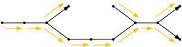
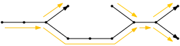
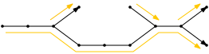
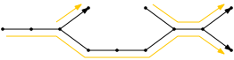
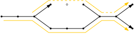

#+title: Types of tigs
#+filetags: @survey highlight
#+OPTIONS: ^:{} num: num:t
#+hugo_front_matter_key_replace: author>authors
#+hugo_level_offset: 2
# #+toc: headlines 3
#+date: <2025-03-09 Sun>

* De Bruijn graph
Consider an edge-centric De Bruijn graph, where each edge corresponds to a
k-mer, and nodes are the $k-1$ overlaps between adjacent k-mers. In the figures,
all edges are directed towards the right.

#+attr_html: :class inset medium

* k-mers

The goal is now to store all edges / k-mers of the graph efficiently.
A /spectrum preserving string set/ (SPSS) is a set of strings whose k-mers are
the k-mers of the input graph, that does not contain duplicate k-mers [cite:@spss].

The most simple solution is to just store all k-mers individually.

#+attr_html: :class inset medium

* Unitigs
The non-branching paths in a the graph.
These can be stored as compressed strings, but are shown as k-mer-by-k-mer paths
in the graph.

*Tools:* [[https://github.com/algbio/GGCAT][GGCAT]], [[https://github.com/COMBINE-lab/cuttlefish][Cuttlefish]]

#+attr_html: :class inset medium

* Simplitigs aka pathtigs

Adjacent unitigs overlap in $k-1$ characters, so it's more efficient to store
them adjacently [cite:@simplitigs].
One way to construct simplitigs is by simply greedily extending paths, and the
resulting strings are called /greedy simplitigs/.

*Tools:* [[https://github.com/algbio/matchtigs][matchtigs]], [[https://github.com/algbio/GGCAT][GGCAT]] (fast reimplementation)

#+attr_html: :class inset medium

* Eulertigs: efficient optimal simplitigs

It turns out that an optimal decomposition into simplitigs can be found in
linear time by considering an Eulerian circuit. The resulting optimal simplitigs
are called /eulertigs/ [cite:@eulertigs].

*Tools:* [[https://github.com/algbio/matchtigs][matchtigs]], [[https://github.com/algbio/GGCAT][GGCAT]] (fast reimplementation)

* Matchtigs

We can achieve more compression by joining unitigs 'at a distance', and
duplicating some in-between k-mers [cite:@matchtigs].
Matchtigs depend on a somewhat expensive matching algorithms.

*Tools:* [[https://github.com/algbio/matchtigs][matchtigs]]

** Greedy matchtigs aka greedytigs
Greedy matchtigs use a greedy Dijkstra-based approach to match "loose ends", and are nearly as
good in practice.

*Tools:* [[https://github.com/algbio/matchtigs][matchtigs]], [[https://github.com/algbio/GGCAT][GGCAT]] (forwards to slow matchtigs implementation)

#+attr_html: :class inset medium

* Masked superstrings

We can achieve even more compression by introducing some new k-mers during the
overlapping process, and then mask these out (shown as dashed)
[cite:@masked-superstrings].

*Tools:* [[https://github.com/OndrejSladky/kmercamel][KmerCamel]]

#+attr_html: :class inset medium

#+print_bibliography:
