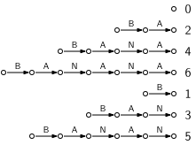
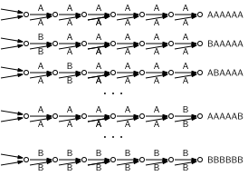
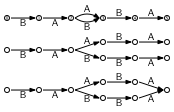

#+title: Wheeler graphs
#+filetags: @survey data-structure suffix-array fm-index
#+OPTIONS: ^:{} num: num:t
#+hugo_front_matter_key_replace: author>authors
#+hugo_paired_shortcodes: %notice %detail
#+toc: headlines 3
#+hugo_level_offset: 2
#+date: <2026-02-26 Thu>

These are some notes on Wheeler DFAs after chatting with Nicola
Prezza[fn::Also thanks to Nicola for proofreading this post and fixing some bugs
and gaps in my understanding.] and others
from the RAVEN lab at DSB 2026 in Venice.

* Deterministic Finite Automaton (DFA)
A DFA is a graph where edges are labelled by characters.
Each node can have at most one outgoing edge with each label. (Otherwise it
would be /non-deterministic/.)

Each node has a set of paths/walks ending there, and each of those paths spells a
(possibly left-infinite) string.

* Wheeler-DFA
A /Wheeler-DFA/ is a DFA, together with an order $\preceq$ on the nodes, that
satisfies the following properties:
1. If $u$ and $v$ are two nodes and $u\xrightarrow{a} x$ and $v\xrightarrow{b} y$ are two
   edges labelled with characters $a< b$, then $x\preceq y$.
2. If $u\preceq v$ are two nodes with outgoing edges $u\xrightarrow{a}x$ and
   $v\xrightarrow{a}y$, then $x\preceq y$.
3. There is at most one node without incoming edges (uniquely corresponding to
   the empty string), and this precedes all other nodes in $\preceq$.

These axioms exactly correspond to the definition of co-lex sorted strings: the
empty string is the smallest, strings ending in $a$ come before those ending in
$b$ when $a< b$, and if both end in the same character, then we drop the last
character and compare by the remainder.

Together, this has a strong implication:
- $\preceq$ sorts the set of all nodes, such that for any $u\preceq v$, /all/
  paths ending in $u$ are co-lex smaller than /all/ paths ending in $v$.

* Linear graphs: Prefix array
To start with, let's consider a plain linear text. From the graph
perspective, a text of $n$ characters has $n+1$ nodes with $n$ labelled
transitions between them from each to the next.
The /prefix/ array on the text corresponds to a permutation of the nodes, such
that the nodes are /co-lex/ sorted (from right to left) by the value of the
string ending in the node (ie the path to the node). And indeed, that order is
exactly the order $\preceq$.

#+caption: Co-lex sorted prefixes of =BANANA= (i.e., the /prefix array/), drawn as DFAs.
#+attr_html: :class medium

* De Bruijn graphs are Wheeler

For example, all De Bruijn graphs are Wheeler. There is exactly one node for
each present k-mer, and all paths in ending in that node end in spelling the
k-mer. Thus, the nodes naturally partition the set of /all/ paths by their last
$k$ characters. It follows that they can be sorted using the co-lex order on k-mers.

#+caption: In a De Bruijn graph, all paths to a note labelled by a given k-mer end by spelling this k-mer.
#+attr_html: :class medium

* Not all DFAs are Wheeler

Many practically relevant graphs, such as for example variation graphs, are
/not/ Wheeler. But some graphs (in particular, acyclic graphs) can be "Wheelerized". A trivial way to do this is
to duplicate every node for each incoming edge (where each copy has 1 incoming
edge, and the full set of outgoing edges). Or effectively the same, we can
duplicate the entire subgraph for each node with multiple incoming edges, so
that a tree remains. Then, every node has exactly one unique incoming path, and
these can trivially be sorted.

A cubic algorithm (in the output size) that works for any Wheeler language (i.e., for which a
Wheeler-DFA exists) is given by [cite/t:@ordering-dfa]. A log-linear algorithm
(in the output size)
for acyclic Wheeler DFAs is given by [cite/t:@dfa-prefix-sorting], and extending
this to cyclic DFAs is ongoing work.

One way to construct the WFA is this: as long as the axioms are
violated, only split violating nodes into two copies with the same set of outgoing
edges but each only a subset of the incoming edges. This process will
terminate if and only if the language is Wheeler (i.e., if there exists an
equivalent Wheeler-DFA at all)
and can be done in such a way to create the unique minimal
Wheeler-DFA corresponding to the input.
Unfortunately, though, this may still require an exponential number of steps.

An example is given below.

#+name: example
#+caption: Wheelerizing a variation graph (top). Middle: by lazily making it into a tree. Bottom: by only expanding nodes as needed.
#+attr_html: :class medium

We can co-lex sort the paths in the graph at the top as follows, labelled by
their final node:
#+begin_src txt
      0
  BAA 3 *
   BA 2
BAABA 5
BABBA 5
    B 1
 BAAB 4  *
  BAB 3 *
 BABB 4  *
#+end_src
The graph is not Wheeler, because there are multiple nodes (3 and 4, marked with
a star) whose
corresponding paths do not form an interval. By turning the graph into a tree,
each path has its own node and the Wheeler condition holds trivially.
The optimal Wheelerization of this graph duplicates only nodes 3 and 4, as shown
in the bottom of the figure.

My *intuition* is this: any time we want to merge two paths, we have to first
ensure that they are sufficiently similar, in that they are consecutive in the
set of all co-lex sorted paths. Thus, in a random text we would have to
"right-extend" the two paths for around $\lg n$ steps until they become
'sufficiently similar' again. In a variation graph, the situation is more
tricky: if another copy of the path following the variation is present somewhere
else in the graph, we may have to extend until the two copies diverge. For
example, if there is a variation like ={A,C}UVWXYZ= and an occurrence of
=BUVWXYA= somewhere else, then we have to split the paths (duplicate nodes) to
get ={AUVWXY,CUVWXY}Z=, since only after appending =Z= do the two paths become
"more similar" to each other than to the secondary =BUVWXYA=.

* Locating patterns via binary search

We can test if a string is present in a text by binary searching the prefix
array, and then returning the positions in the interval that match.
Similarly, we can binary search the nodes in a Wheeler-DFA. One option is to
store for each node two (out of possibly many) incoming edges, corresponding to
the smallest (infimum) and largest (supremum) path ending in the node. This graph will have at most
$2n$ edges, and co-lex comparisons can be made via a 'backwards' traversal.

This narrows down the interval for a pattern right-to-left.

* Locating patterns via the BOSS table

The BOSS table [cite:@boss] extends the idea of the LF-mapping in an FM-index to
De Bruijn graphs, and the same technique somewhat works on Wheeler graphs (with
false positives if the matching interval consists of a single node). We can extend
the pattern $P$ one-by-one on the right (not left, since we use the prefix rather
than suffix array), and find the interval of nodes with paths ending in this
pattern via an LF-like step. 
If there is a range of at least two nodes matching the pattern, then the
largest path to the first up to the smallest path to the last both end in the
pattern.
If only a single node $u$ matches, then we know that an occurrence of $P$ can only
occur at $u$. But it may not exist: is could be that it is sorted strictly between the
smallest and largest path ending in $u$, but not $P$ itself. The development of
an algorithm to detect whether this is the case is ongoing work by Riccardo
Maso. The idea is to binary search on the longest prefix $\alpha$ of the pattern that
occurs in at least two nodes (with each step taking logarithmic time to locate).
If $P=\alpha c \beta$, we can then walk the remainder $c\beta$ in the DFA starting at each of
the nodes matching $\alpha$.  Extending each matching node by $c$ will result in
at most one node, since $\alpha$ is the longest prefix matching more than one
node. From there on, we simply walk $\beta$, the remainder of $P$, or report that no
match is found if this is not possible. Note that this is trivial since in a
DFA, each node has at most one outgoing edge of each label.

Like for the BOSS table, we make a table entry for each outgoing edge, and track the
boundaries between nodes. For the last graph in [[example]], we get:
#+begin_src txt
cumulative occ (start pos per char):
$: 0
A: 1
B: 5

idx               id last? next
0               $ 0  1     B -- start of string
1             BAA 3a 1     B
2              BA 2  0     A -- first outgoing edge
3              BA 2  1     B -- second outgoing edge
4   BAABA - BABBA 5  1     $ -- end of string
5               B 1  1     A
6            BAAB 4a 1     A
7             BAB 3b 1     B
8            BABB 4b 1     A
#+end_src

$\newcommand{\occ}{\mathsf{occ}}$

To match eg =BAAB=, we do the usual process:
- Start with the full interval $[0, 9)$.
- Count the number of =B= in =next= to the start and end of the interval: 0 and 4.
- Update to $\occ[B] + [0,4) = [5, 9)$
- Count =A= to start and end of range: $[1, 4)$
- Update to $\occ[A] + [1,4) = [2, 5)$
- Count =A= to start and end of range: $[0, 1)$
- Update to $\occ[A] + [0,1) = [1, 2)$
- Count =B= to start and end of range: $[1, 2)$
- Update to $\occ[B] + [1, 2) = [6, 7)$
And indeed, index $6$ corresponds to =BAAB=.

#+print_bibliography:
