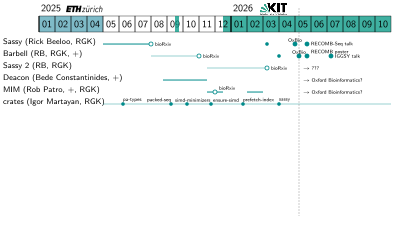
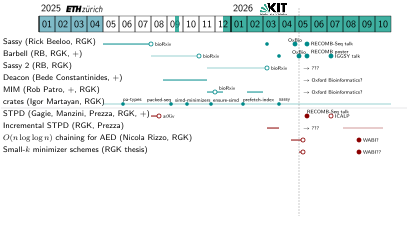
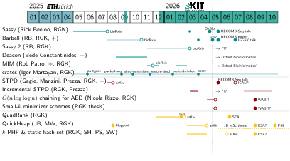
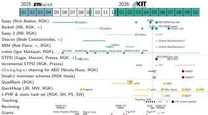

#+title: Spring update
#+author: Ragnar Groot Koerkamp
#+hugo_section: slides
#+OPTIONS: ^:{} num: num:0 toc:0 
#+toc: headlines 1
#+hugo_front_matter_key_replace: author>authors
#+date: <2026-05-12 Tue 11:00>

#+reveal_theme: white
#+reveal_extra_css: /css/slide.min.css
#+reveal_extra_css: /css/kit.min.css
#+reveal_init_options: width:1920, height:1080, margin: 0.06, minScale:0.2, maxScale:2.5, disableLayout:false, transition:'none', slideNumber:'c/t', controls:false, hash:true, center:false, navigationMode:'linear', hideCursorTime:2000
#+REVEAL_PLUGINS: (notes highlight)
#+REVEAL_HIGHLIGHT_CSS: /css/vs.min.css
#+reveal_reveal_js_version: 4

#+REVEAL_TITLE_SLIDE: <h1>%t</h1>
#+REVEAL_TITLE_SLIDE: 
%s

#+REVEAL_TITLE_SLIDE: <h2 class="author">Ragnar {Groot Koerkamp}</h2>
#+REVEAL_TITLE_SLIDE: <h2 class="date">%d</h2>
#+REVEAL_TITLE_SLIDE: </img>
#+REVEAL_TITLE_SLIDE: </img>

# UPDATE
#+reveal_slide_footer: May 12, 2026 Ragnar Groot Koerkamp: Spring update </img>

# For slides only!
# UPDATE and create dir
#+reveal_export_file_name: ../../static/slides/2026-spring-update/slides/index.html

# Export using C-c C-e R R
# Turn off org-special-block-extras-mode

#+begin_export html

#+end_export

* Bioinformatics software

#+attr_html: :class large :src /ox-hugo/update-bfx.svg

* Bioinformatics theory
#+attr_html: :class large :src /ox-hugo/update-theory.svg

* Algorithm engineering
#+attr_html: :class large :src /ox-hugo/update-algeng.svg

* Misc
#+attr_html: :class large :src /ox-hugo/update-misc.svg

# Local Variables:
# eval: (toggle-org-reveal-export-on-save)
# End:
