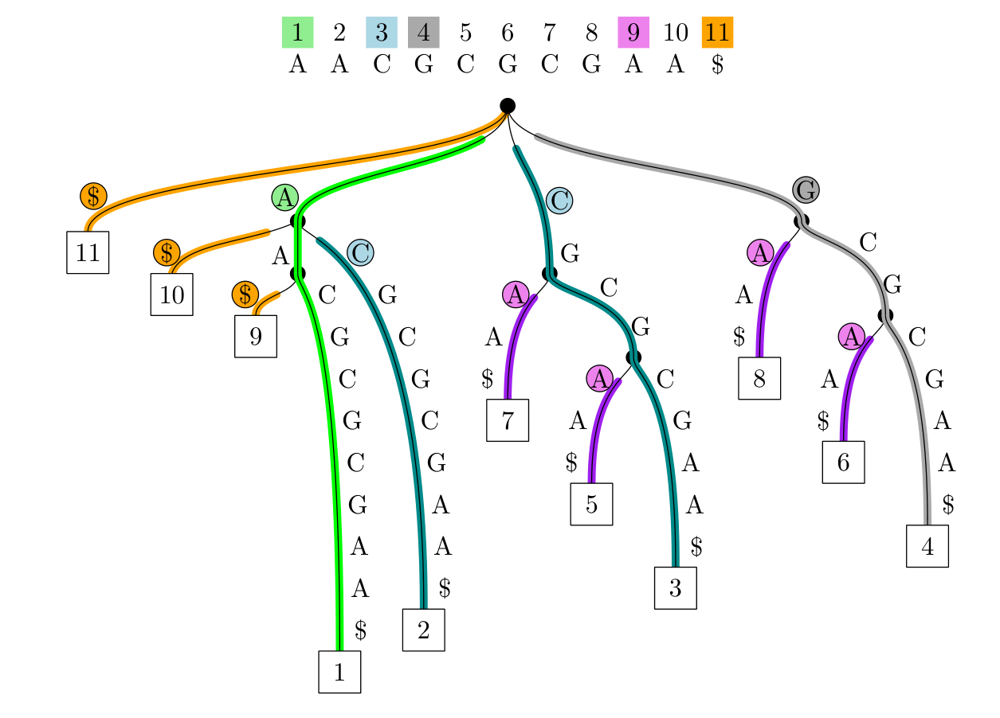

#+title: The Jump Index
#+author: Ragnar Groot Koerkamp
#+hugo_section: slides
#+OPTIONS: ^:{} num: num:0 toc:0 
#+toc: headlines 1
#+hugo_front_matter_key_replace: author>authors
#+date: <2026-05-25 Mon 16:30>

#+reveal_theme: white
#+reveal_extra_css: /css/slide.min.css
#+reveal_extra_css: /css/kit.min.css
#+reveal_extra_css: /css/blog-yellow.min.css
#+reveal_init_options: width:1920, height:1080, margin: 0.06, minScale:0.2, maxScale:2.5, disableLayout:false, transition:'none', slideNumber:'c/t', controls:false, hash:true, center:false, navigationMode:'linear', hideCursorTime:2000
#+REVEAL_PLUGINS: (notes highlight)
#+REVEAL_HIGHLIGHT_CSS: /css/vs.min.css
#+reveal_reveal_js_version: 4

#+REVEAL_TITLE_SLIDE: <h1 style="font-size:1.2rem">%t</h1>
#+REVEAL_TITLE_SLIDE: 
%s

#+REVEAL_TITLE_SLIDE: <h2 class="author">Ragnar {Groot Koerkamp}</h2>
#+REVEAL_TITLE_SLIDE: <h2 class="date">IGGSy 2026, Ascona</h2>

# #+REVEAL_TITLE_SLIDE: </img>
#+REVEAL_TITLE_SLIDE: </img>

#+REVEAL_TITLE_SLIDE: <a href="https://curiouscoding.nl/slides/jump-index/slides" style="position:absolute;bottom:7%%;left:3%%;width:40%%;color:grey;font-size:smaller;text-align:left">curiouscoding.nl/slides/jump-index/slides</a>
#+REVEAL_TITLE_SLIDE: <a href="https://github.com/RagnarGrootKoerkamp/jump-index" style="position:absolute;bottom:2%%;left:3%%;width:50%%;color:grey;font-size:smaller;text-align:left">github.com/RagnarGrootKoerkamp/jump-index</a>

# UPDATE
#+reveal_slide_footer: IGGSy 2026 Ragnar Groot Koerkamp: The Jump Index

# For slides only!
# UPDATE and create dir
#+reveal_export_file_name: ../../static/slides/jump-index/slides/index.html

# Export using C-c C-e R R
# Turn off org-special-block-extras-mode

#+begin_export html

#+end_export

* FM-index et al.: LF cache-miss per character :(
* I/O-efficient pattern matching using suffix tries
#+attr_reveal: :frag t
- Suffix trees are in text space and I/O efficient!
- Suffix trees of repetitive texts are repetitive!
#+attr_reveal: :frag t
- "run-length suffix trees" embedded in the text:
  #+attr_html: :style width:60%;font-size:23pt;
  - Suffixient Sets: [cite/t:@suffixient-sets]
  - Suffixient Array: [cite/t:@suffixient-arrays] 
  - Suffix Tree Path Decomposition: [cite/t:@stpd]
- Greedily match pattern against text.
  - "Reposition" on mismatch by searching sparse prefix array.
    
#+attr_reveal: :frag t
Jump Index:
#+attr_reveal: :frag t
- For /every possible mismatch/ (switch between paths):
  - store link/pointer =(source_pos, char, depth) ↦ target=
  - Eg: =(3, $, 2) ↦ 11=:
    - Prefix =AA= of pattern =AA$= matches at pos 2.
    - Mismatch as pos 3: got =C=, want =$=.
    - We find the =$= at pos 11.
    
#+attr_html: :class float-right :style margin-right:-3%;max-width:55%;height:auto;overflow:hidden;z-index:-1 :src /ox-hugo/stpd-leftmost.png

* Jump Index
- Full example:
  #+attr_html: :style width:60%;font-size:smaller;
  - =(source, char, depth) ↦ target=
  - =(1, $, 0) ↦ 11=
  - =(1, C, 0) ↦ 3=
  - =(1, G, 0) ↦ 4=
  - =(2, $, 1) ↦ 11=
  - =(2, C, 1) ↦ 3=
  - =(3, $, 2) ↦ 11=
  - +=(5, A, 1) ↦ 9=+
  - =(5, A, 2) ↦ 9=
  - +=(7, A, 3) ↦ 9=+
  - =(7, A, 4) ↦ 9=
#+attr_reveal: :frag t
- Store using Elias-Fano or HashMap.
- With similar pointers for suffix links, we get match statistics!
- Incremental/online construction similar to Ukkonen's algorithm.
  
#+attr_reveal: :frag t
- Locates only the /leftmost/ occurrence of each substring
  - Does **not** support locate-all!

    
#+attr_html: :class float-right :style margin-right:-3%;max-width:55%;height:auto;overflow:hidden;z-index:-1 :src /ox-hugo/stpd-leftmost.png

* Pizza & Chili results: #links $\approx r$

#+attr_html: :style font-size:28pt;
| (in M)           |      n | copies | r       | CDAWG-n | CDAWG-e | type | $\vert\mathsf{stpd}\vert$ | #(src) | #(src,c) | #(links) |
| influenza        | 154.81 | 78k    | *3.02*  |    7.73 |   17.15 | pos- |                      1.93 |   1.82 |     2.34 | *2.94*   |
|                  |        |        |         |         |         | lex- |                      1.82 |   1.58 |     2.09 | 2.98     |
| dna.001.1        | 104.86 | 100    | *1.72*  |    6.00 |   12.91 | pos- |                      1.25 |   0.76 |     1.27 | *1.61*   |
|                  |        |        |         |         |         | lex- |                      1.10 |   0.79 |     1.29 | 1.71     |
| einstein.de.txt  |  92.76 | 2.1k   | *0.10*  |    0.08 |    0.23 | pos- |                      0.06 |   0.04 |     0.09 | *0.10*   |
|                  |        |        |         |         |         | lex- |                      0.06 |   0.04 |     0.09 | 0.10     |
| Escherichia_Coli | 112.69 | 23     | *15.04* |   12.01 |   31.33 | pos- |                     11.68 |   7.07 |    11.88 | *14.97*  |
|                  |        |        |         |         |         | lex- |                      9.82 |   6.84 |    11.53 | 14.99    |

* Goal: match statistics on HPRCv2 in 50GB RAM

# Local Variables:
# eval: (toggle-org-reveal-export-on-save)
# End:

