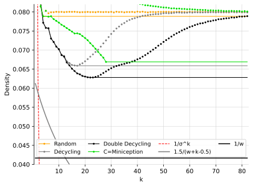
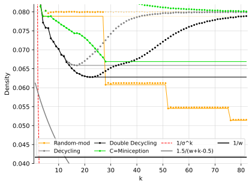
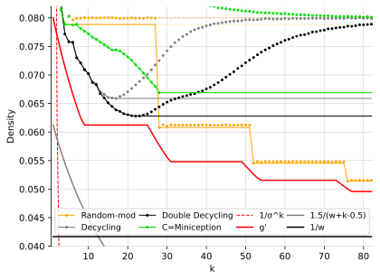
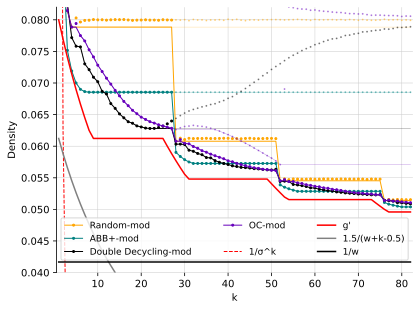
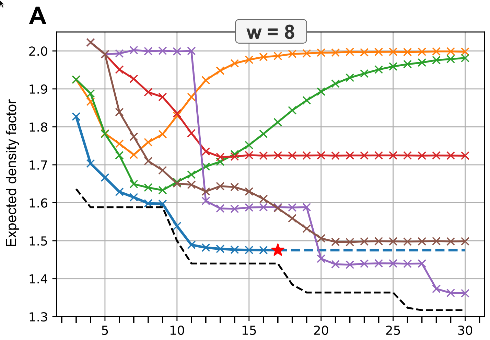
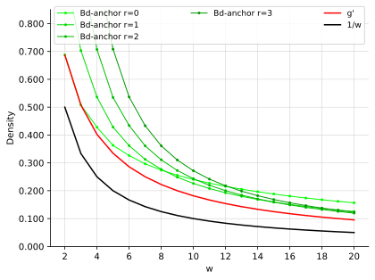
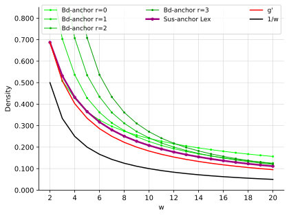
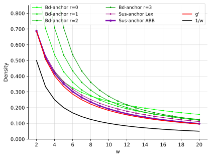
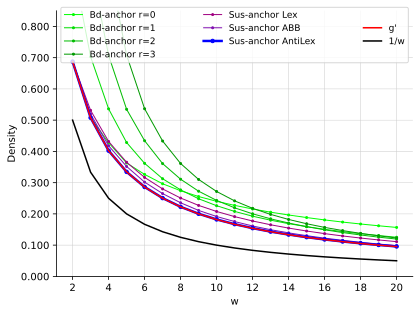

#+title: Near-optimal sampling schemes
#+hugo_section: slides
#+filetags: @slides minimizers
#+OPTIONS: ^:{} num: num:t toc:nil
#+hugo_front_matter_key_replace: author>authors
# #+toc: depth 2
#+reveal_theme: white
#+reveal_extra_css: /css/slide.min.css
# #+REVEAL_INIT_OPTIONS: transition: default
#+export_file_name: minimizers-dsb25-text
#+reveal_export_file_name: ../../static/slides/minimizers-dsb25/index.html
#+hugo_paired_shortcodes: %notice
#+date: <2025-02-27 Thu>
# Export using C-c C-e R R
#+MACRO: c @@html:<code>$1</code>@@
#+MACRO: color @@html:<code>$2</code>@@

#+begin_export html

#+end_export

# - slides: [[https://curiouscoding.nl/slides/minimizer.html][curiouscoding.nl/slides/minimizers.html]]
# - post: [[https://curiouscoding.nl/slides/minimizers][curiouscoding.nl/slides/minimizers]]

* Warming up: A cute prolblem
:PROPERTIES:
:CUSTOM_ID: warmup
:END:

#+attr_reveal: :frag (appear)
- Given a string, choose one character.
  - =CABAACBD=
- Given a rotation, choose one character.
  - =ACBDCABA=
- Can we always choose /the same/ character?
- Yes: e.g. the smallest rotation (bd-anchor):
  - =CAB=​{{{c(A)}}}​=ACBD=
  - =ACBDCAB=​{{{c(A)}}}​
** This talk: what if one character is /hidden/?
:PROPERTIES:
:CUSTOM_ID: hidden
:END:
#+attr_reveal: :frag (appear)
- Given a string (length $w$), choose one character.
  - =CABAACBD=​​{{{color(lightgrey,X)}}}
- Given a rotation (of the hidden $w+1$ string), choose one character.
  - =ACBDXCAB=​{{{color(lightgrey,A)}}}
- Can we always choose /the same/ character?
- Maybe?
  - =CAB=​{{{c(A)}}}​=ACBD=
  - =ACBDXCAB= 🤔

** The answer is no!
:PROPERTIES:
:CUSTOM_ID: lb
:END:
=C​ABAACBDX= rotations:

- =C​AB=​{{{c(A)}}}​=ACBD........=
- =.AB=​{{{c(A)}}}​=ACBDX.......=
- =..B=​{{{c(A)}}}​=ACBDXC......=
- =...=​{{{c(A)}}}​=ACBDXCA.....=
- =....ACBDXCAB....= <--- the *=A=* is not here
- =.....CBDXCAB=​{{{c(A)}}}​=...=
- =......BDXCAB=​{{{c(A)}}}​=A..=
- =.......DXCAB=​{{{c(A)}}}​=AC.=
- =........XCAB=​{{{c(A)}}}​=ACB=

#+attr_reveal: :frag t
In the $w+1$ rotations, we need at least 2 samples.

* /Minimizer/ schemes
:PROPERTIES:
:CUSTOM_ID: minimizers
:END:
#+attr_html: :style display:none
$$\newcommand{\order}{\mathcal{O}}$$

- Minimizer scheme: Given a window of $w$ k-mers, pick the (leftmost) /smallest/ one
  - according to some order $\order_k$
- $k=1$, $w=5$:
  - =C=​{{{c(A)}}}​=BCA=
- $k=2$, $w=5$:
  - =C=​{{{c(AB)}}}​=CAC.....=
  - =.=​{{{c(AB)}}}​=CACC....=
  - =..BC=​{{{c(AC)}}}​=CX...=
  - =...C=​{{{c(AC)}}}​=CXY..=
  - =....=​{{{c(AC)}}}​=CXYZ.=
  - =.....=​{{{c(CC)}}}​=XYZX=
- Density: 3/10
  - =C=​{{{c(AB)}}}​=C=​{{{c(ACC)}}}​=XYZX=

** The situation, 1 year ago
#+attr_html: :style width:65% :src /ox-hugo/1-before.svg

** The mod-minimizer

#+attr_html: :style width:65% :src /ox-hugo/2-mod.svg

** A near-tight lower bound
#+attr_html: :style width:65% :src /ox-hugo/3-lb.svg

** The current picture
#+attr_html: :style width:65% :src /ox-hugo/4-full.svg

** Greedymini
#+attr_html: :style width:65% :src /ox-hugo/greedymini.png

# - plot showing bad small k perf
# - Can we get closer to the lower bound?
# - Can we design /fully exact/ schemes for some params?
#   - $k\to\infty$: Mod-minimizer gets very close
#   - $k\approx w$: Recent greedymini does a good job, but 'bruteforce', so not insightful
#   - $k=1$ (and $k < \log_\sigma w$): Topic of this talk

** Minimizer density lower bound
:PROPERTIES:
:CUSTOM_ID: density-lower-bound
:END:
- Density of minimizer scheme is $\geq 1/\sigma^k$:

  sample exactly every =AAA= k-mer, and nothing else.

- $k=1$: density at least $1/\sigma = 1/4$.

* /Sampling/ schemes: more general
:PROPERTIES:
:CUSTOM_ID: sampling-schemes
:END:
- /Any/ function $f: \Sigma^{w+k-1} \to \{0, \dots, w-1\}$
- We fix $k=1$ from now: $f: \Sigma^w\to \{0, \dots, w-1\}$

** Bidirectional anchors
:PROPERTIES:
:CUSTOM_ID: bd-anchors
:END:
- Pick the start of the /smallest rotation/
  - =E=​{{{c(A)}}}​=DCAE......=
  - =.=​{{{c(A)}}}​=DCAEB.....=
  - =..DC=​{{{c(A)}}}​=EBE....=
  - =...C=​{{{c(A)}}}​=EBEC...=
  - =....=​{{{c(A)}}}​=EBECD..=
  - =.....E=​{{{c(B)}}}​=ECDC.=
  - =......=​{{{c(B)}}}​=ECDCD=

** Limitations of bd-anchors
:PROPERTIES:
:CUSTOM_ID: bd-anchors-limitations
:END:
- Lexicographic is bad:
  - {{{c(A)}}}​=AAABCD...=
  - =.=​{{{c(A)}}}​=AABCDE..=
  - =..=​{{{c(A)}}}​=ABCDEF.=
  - =...=​{{{c(A)}}}​=BCDEFG=
- Comparing rotations is unstable:
  - ​{{{c(A)}}}​=ABACD..=
  - =.ABACD=​{{{c(A)}}}​=.=
  - =..B=​{{{c(A)}}}​=CDAE=

- Avoid last $r$ positions.

** Bd-anchor density for $k=1$
#+attr_html: :style width:65% :src /ox-hugo/10-bd-anchor.svg

* Smallest-unique-substring anchors
:PROPERTIES:
:CUSTOM_ID: sus-anchors
:END:
- Idea: instead of smallest rotation: smallest suffix.
- What about =CABA=: is =ABA= or =A= smaller?
  - We choose =ABA= smaller for stability.
- =AB= is the /smallest unique substring/.
- Stable:
  - ​{{{c(AA)}}}​=BACD..=
  - =.=​{{{c(AB)}}}​=ACDA.=
  - =..B=​{{{c(AC)}}}​=DAE=

** Sus-anchor density

#+attr_html: :style width:65% :src /ox-hugo/11-sus.svg

** ABB order
:PROPERTIES:
:CUSTOM_ID: abb
:END:
- =AAAA= is BAD:
  - small strings overlap
  - small strings cluster
- We want the opposite!
- /ABB order/:

   =A= followed by many non-=A= is smallest: =ABBBBBBBBB=
  - no overlap
  - no clustering

** Sus-anchor, ABB order
#+attr_html: :style width:65% :src /ox-hugo/12-abb.svg

** Anti-lex
:PROPERTIES:
:CUSTOM_ID: anti-lex
:END:
- /Anti-lexicographic order/:

   =A= small, followed by largest possible suffix: =AZZZZZ= is minimal
  - no overlap
  - no clustering

** Sus-anchor, anti-lex order

#+attr_html: :style width:65% :src /ox-hugo/13-asus.svg

* Understanding the lower bound
:PROPERTIES:
:CUSTOM_ID: lower-bound-cycles
:END:

- To reach lower bound: /exactly/ 2 samples in /every/ $w+1$ cycle.

#+attr_html: :style width:70% :src /ox-hugo/lower-bound.svg
[[file:../../posts/minimizers/figs/lower-bound.svg]]

** Failure mode
:PROPERTIES:
:CUSTOM_ID: asus-failure
:END:
=0010101= cycle:
- ​{{{c(00)}}}​=1010......=
- =.=​{{{c(01010)}}}​=1.....=
- =..1=​{{{c(0101)}}}​=0....=
- =...0101=​{{{c(00)}}}​=...=
- =....101=​{{{c(00)}}}​=1..=
- =.....01=​{{{c(00)}}}​=10.=
- =......1=​{{{c(00)}}}​=101=
- The =01010= sus is not /overlap free/
  - Just like how =AAA= is not /overlap free/

#+attr_reveal: :frag t
Goal: find two *non-overlapping* substrings.

** Can we design a perfectly optimal scheme?
:PROPERTIES:
:CUSTOM_ID: perfect-schemes
:END:
- Goal:

  *For every $w+1$ window, find two non-overlapping small strings.*
#+attr_reveal: :frag t
- Instead of =011...11=, search =00...0011...11=
  - Also non-overlapping, and more signal.
  - Still not optimal.
- Tried *many* things. No general solution found yet.

* Thanks to my co-authors!
- Giulio Ermanno Pibiri
- Bryce Kille
- Daniel Liu
- Igor Martayan

Slides:
[[https://curiouscoding.nl/slides/minimizers.html][curiouscoding.nl/slides/minimizers.html]]

Blog
[[https://curiouscoding.nl/slides/minimizers][curiouscoding.nl/slides/minimizers]]

# * Tech-tip: =diskcache=
# :PROPERTIES:
# :CUSTOM_ID: diskcache
# :END:

# #+begin_src python
# from functools import cache

# @cache
# def density(tp, text_len, w, k, sigma, **args):
#     return minimizers.density(tp, _text, w, k, sigma, **args)
# #+end_src

# #+begin_src python
# from diskcache import Cache
# diskcache = Cache("cache")

# @diskcache.memoize(tag="density")
# def density(tp, text_len, w, k, sigma, **args):
#     return minimizers.density(tp, _text, w, k, sigma, **args)
# #+end_src

# - Efficient reuse of values in =.py= files.
# - No need for =.ipynb= notebooks.
#   - No/annoying hot-reloading of (compiled) modules
#   - =@cache= is lost on kernel restarts

# Local Variables:
# eval: (org-hugo-auto-export-mode -1)
# eval: (toggle-org-reveal-export-on-save)
# End:
