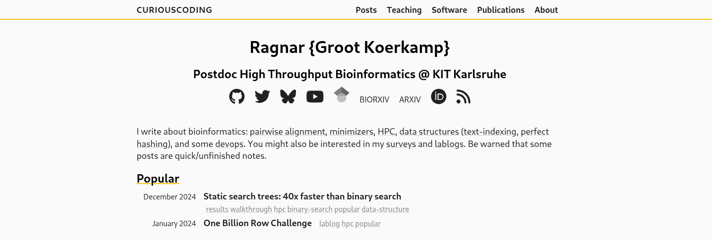
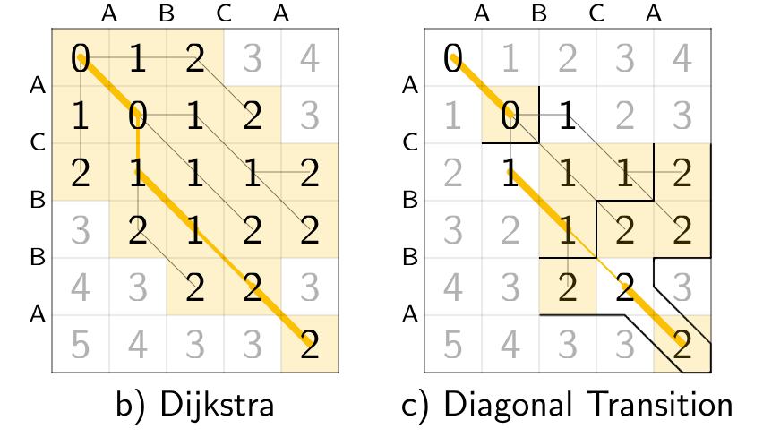

#+title: A history of pairwise alignment
#+subtitle: CiE 2026
#+author: Ragnar {Groot Koerkamp}
#+hugo_section: slides
#+filetags: @slides hpc data-structure
#+OPTIONS: ^:{} num: num:0 toc:nil
#+hugo_front_matter_key_replace: author>authors
# #+toc: depth 2
#+reveal_theme: white
#+reveal_extra_css: /css/slide.min.css
#+reveal_extra_css: /css/kit.min.css
#+reveal_extra_css: /css/blog-yellow.min.css
#+reveal_init_options: width:1920, height:1080, margin: 0.04, minScale:0.2, maxScale:2.5, disableLayout:false, transition:'none', slideNumber:'c/t', controls:false, hash:true, center:false, navigationMode:'linear', hideCursorTime:2000
#+REVEAL_PLUGINS: (highlight)
#+REVEAL_HIGHLIGHT_CSS: /css/vs.min.css
#+reveal_reveal_js_version: 4
#+export_file_name: pairwise-alignment-text
#+reveal_export_file_name: ../../static/slides/pairwise-alignment/index.html
#+hugo_paired_shortcodes: %notice
#+date: <2026-02-18 Wed>
# Export using C-c C-e R R
# Turn off org-special-block-extras-mode

#+begin_export html

#+end_export

#+REVEAL_TITLE_SLIDE: <h1 class="title">A History of Pairwise Alignment</h1>
#+REVEAL_TITLE_SLIDE: <h2 class="author">%a</h2>
#+REVEAL_TITLE_SLIDE: <h2 class="date" style="font-size:smaller;font-weight:normal;color:grey">CiE 2026, Trier</h2>
#+REVEAL_TITLE_SLIDE: <a href="https://curiouscoding.nl/slides/pairwise-alignment" style="position:absolute;bottom:3%%;left:0%%;width:60%%;color:grey;font-size:smaller">curiouscoding.nl/{posts,slides}/pairwise-alignment</a>

#+REVEAL_TITLE_SLIDE: </img>
#+REVEAL_TITLE_SLIDE: </img>

* My blog: curiouscoding.nl

#+attr_html: :class full :style top:20% :src /ox-hugo/blog-scrot.png

* Pairwise alignment:@@html: @@ finding differences between strings

* Covid -- $\alpha$, December 2020
:PROPERTIES:
:CUSTOM_ID: covid-alpha
:END:

# https://viralzone.expasy.org/9556

#+attr_html: :class full :style top:12% :src /ox-hugo/covid-alpha-highlight.png
[[file:covid-alpha-highlight.png]]

* Covid -- $\omicron$, December 2021
:PROPERTIES:
:CUSTOM_ID: covid-omicron
:END:

#+attr_html: :class full :style top:12% :src /ox-hugo/covid-omicron-highlight-marked.png
[[file:covid-omicron-highlight-marked.png]]

* Pairwise alignment
:PROPERTIES:
:CUSTOM_ID: pairwise-alignment
:END:
- Find the mutations between two sequences

#+attr_html: :class large :style width:1500px;padding-top:100px :src /ox-hugo/edit-graph.svg
[[file:fig/edit-graph.svg]]

** Dynamic programming
:PROPERTIES:
:CUSTOM_ID: dp-1
:END:

#+attr_html: :class large :style height:800px :src /ox-hugo/dp-1.svg
[[file:fig/dp-1.svg]]

** Dynamic programming
:PROPERTIES:
:CUSTOM_ID: dp-2
:END:

#+attr_html: :class large :style height:800px :src /ox-hugo/dp-2.svg
[[file:fig/dp-2.svg]]

** Dynamic programming
:PROPERTIES:
:CUSTOM_ID: dp-3
:END:

#+attr_html: :class large :style height:800px :src /ox-hugo/dp-3.svg
[[file:fig/dp-3.svg]]

** Dynamic programming
:PROPERTIES:
:CUSTOM_ID: dp-4
:END:

#+attr_html: :class large :style height:800px :src /ox-hugo/dp-4.svg
[[file:fig/dp-4.svg]]

** Dynamic programming
:PROPERTIES:
:CUSTOM_ID: dp-5
:END:

#+attr_html: :class large :style height:800px :src /ox-hugo/dp-5.svg
[[file:fig/dp-5.svg]]

* 50 000 TB of sequenced DNA → it must be fast
:PROPERTIES:
:CUSTOM_ID: datacenter
:END:

#+attr_html: :class large :style width:960px;max-height:750px;left:20% :src /ox-hugo/datacenter.jpg
[[file:datacenter.jpg]]

#+attr_html: :class full-caption attribution left
Data Center\\
PhonlamaiPhoto | istockphoto.com

#+attr_html: :class large :style height:850px;max-height:1000px;max-width:1400px;left:70% :src /ox-hugo/sra-marked.png
[[file:sra-marked.png]]

#+attr_html: :class full-caption attribution
Growth of [[https://www.ncbi.nlm.nih.gov/sra/docs/sragrowth/][SRA]]

* Goal:@@html: @@ _Fast_ code
:PROPERTIES:
:CUSTOM_ID: fast
:END:
* Goal:@@html: @@ High _throughput_ code
:PROPERTIES:
:CUSTOM_ID: throughput
:END:
* Goal:@@html: @@ _Optimal_ throughput code
:PROPERTIES:
:CUSTOM_ID: optimal
:END:
* What is high troughput code?
:PROPERTIES:
:CUSTOM_ID: complexity
:END:

#+attr_reveal: :frag (appear)
1. /Complexity/
   - /Few/ operations:

     #+attr_html: :style text-align:center;width:1920px;margin:0em -3em
     $\quad O(n^2)\quad\longleftrightarrow\quad O(n)$
2. /Efficiency/
   - /Fast/ operations:

     #+attr_html: :style text-align:center;width:1920px;margin:0em -3em;font-size:smaller
     memory read, 100 ns $\quad\longleftrightarrow\quad$ 0.1 ns, addition
3. /Implementation/
   - /Parallel/ operations:

     #+attr_html: :style text-align:center;width:1920px;margin:0em -3em;font-size:smaller
     SIMD, instruction-level parallelism
     
* Lots of work on this problem!
:PROPERTIES:
:CUSTOM_ID: pa-table
:END:
#+attr_html: :class large :style max-height:900px :src /ox-hugo/table.png
[[file:table.png]]

** Needleman-Wunsch -- Quadratic $O(n^2)$
:PROPERTIES:
:CUSTOM_ID: nw
:END:

#+attr_html: :class large :style height:800px;left:25% :src /ox-hugo/alg-nw.svg
[[file:fig/alg-nw.svg]]

#+attr_html: :class large :style height:800px;left:75% :src /ox-hugo/0_nw.gif
[[file:gif/0_nw.gif]]

* Can we do better than quadratic?

* No! (not much anyway) 
- There is a $O(n^{2-\varepsilon})$ lower bound assuming SETH.
- One of the best algorithms is /four Russians/ in $O(n^2 / \lg n)$:
  
#+attr_html: :class large :style width:1200px;padding-top:250px :src /ox-hugo/four-russians.drawio.svg
[[file:fig/four-russians.drawio.svg]]

* Can we do better than quadratic? -- take 2
#+attr_html: :class large :style width:1500px;padding-top:100px :src /ox-hugo/edit-graph.svg
[[file:fig/edit-graph.svg]]

** Yes! BFS / Dijkstra -- $O(ns)$ for distance $s$
:PROPERTIES:
:CUSTOM_ID: dijkstra
:END:

- Visit only states at distance $\leq s$, within the central $2s+1$ diagonals.

#+attr_html: :class large :style top:60%;height:800px;left:25% :src /ox-hugo/alg-dijkstra.svg
[[file:fig/alg-dijkstra.svg]]

#+attr_html: :class large :style top:60%;height:800px;left:75% :src /ox-hugo/2_dijkstra.gif
[[file:gif/2_dijkstra.gif]]

** Diagonal transition -- $O(n + s^2)$
:PROPERTIES:
:CUSTOM_ID: dt
:END:

- Greedily extend matches along diagonals → visit ${\leq} s$ states per diagonal

#+attr_html: :class large :style top:60%;height:800px;left:50% :src /ox-hugo/bfs-vs-dt.png

** Diagonal transition -- $O(n + s^2)$
:PROPERTIES:
:CUSTOM_ID: dt2
:END:

#+attr_html: :class large :style height:800px;left:25% :src /ox-hugo/alg-dt.svg
[[file:fig/alg-dt.svg]]

#+attr_html: :class large :style height:800px;left:75% :src /ox-hugo/3_diagonal_transition.gif
[[file:gif/3_diagonal_transition.gif]]

** A*PA -- near-linear, $3\times$ faster on similar seqs
:PROPERTIES:
:CUSTOM_ID: astarpa
:END:

#+attr_html: :class large :style height:800px;left:25% :src /ox-hugo/alg-astarpa.svg
[[file:fig/alg-astarpa.svg]]

#+attr_html: :class large :style height:800px;left:75% :src /ox-hugo/5_astarpa.gif
[[file:gif/5_astarpa.gif]]

#+attr_html: :class citation
[1] /Exact Global Alignment Using A* with Chaining Seed Heuristic and Match Pruning./\\
RGK and Pesho Ivanov, Bioinformatics 2024.

#+begin_notes
Worst-case vs avg-case complexity
#+end_notes

# ** Highlight: seed heuristic?
# ** Highlight: pruning?

** A*PA heuristics
:PROPERTIES:
:CUSTOM_ID: heuristics
:END:

#+attr_html: :class large :style width:100% :src /ox-hugo/df-heuristics.png
[[file:df-heuristics.png]]

** A*PA -- not quite linear, and terrible efficiency
:PROPERTIES:
:CUSTOM_ID: astarpa-bad
:END:

#+attr_html: :class large :style height:800px;left:50% :src /ox-hugo/5_astarpa_noisy.gif
[[file:gif/5_astarpa_noisy.gif]]

* Intermezzo: array indexing is not $O(1)$!
:PROPERTIES:
:CUSTOM_ID: array-indexing
:END:

#+attr_html: :class large :style left:50%;height:80%;top:55% :src /ox-hugo/bs-3.svg
[[file:bs-plots/bs-3.svg]]

** Band Doubling -- $O(ns)$
:PROPERTIES:
:CUSTOM_ID: doubling
:END:

- Compute all states within central $t$ diagonals for exponentially growing $t$.
  Super efficient!

#+attr_html: :class large :style top:60%;height:800px;left:25% :src /ox-hugo/alg-doubling.svg
[[file:fig/alg-doubling.svg]]

#+attr_html: :class large :style top:60%;height:800px;left:75% :src /ox-hugo/1_edlib.gif
[[file:gif/1_edlib.gif]]

** Optimizations
Bitpacking (Myers' 99)
- Computes $w=64$ states at once by encoding the $\{-1, 0, +1\}$
  /differences/ between adjacent states in a word.
- $O(ns/w)$

SIMD: single instruction multiple data, special CPU instructions.
- Operates on e.g. 4 or 8 64-bit words at the same time..

** A*PA2 -- good efficiency: up to $19\times$ faster
:PROPERTIES:
:CUSTOM_ID: astarpa2
:END:

- Band-doubling + bitpacking + SIMD + A*PA

#+attr_html: :class large :style top:55%;height:800px;left:25% :src /ox-hugo/alg-astarpa2.svg
[[file:fig/alg-astarpa2.svg]]

#+attr_html: :class large :style top:55%;height:800px;left:75% :src /ox-hugo/6_astarpa2.gif
[[file:gif/6_astarpa2.gif]]

#+attr_html: :class citation
[2] /A*PA2: Up to 19x Faster Exact Global Alignment. WABI 2024.

** A*PA: comparison
:PROPERTIES:
:CUSTOM_ID: pa-comparison
:END:
#+attr_html: :class large :style max-height:900px :src /ox-hugo/pa-comparison.png
[[file:pa-comparison.png]]

* But: Long-read global alignment is just not a problem people have...

* Alignment modes
:PROPERTIES:
:CUSTOM_ID: alignment-modes
:END:

#+attr_html: :class large :style height:900px :src /ox-hugo/alignment-modes.svg
[[file:a.svg]]

* Semi-global variants
:PROPERTIES:
:CUSTOM_ID: semi-global
:END:

#+attr_html: :class large :style height:900px :src /ox-hugo/dimentions.svg
[[file:a.svg]]

* ... Sassy: 100bp semi-global alignment

* Approximate String Matching
- Find pattern $P$ in text $T$.
  - $m := |P|$, $n := |T|$
- Allow up to $k$ unit-cost errors.
- Find /all/ matches.

\nbsp
- IUPAC support: Handle =ACTG=, =N=, =YR...=

\nbsp
#+attr_reveal: :frag t
- Not semi-global alignment
- Not $\Theta(nm/w)$
- Not new: Lots and LOTS of old literature

* ASM in $O(\lceil n/w\rceil k)$
- Myers' bitpacking on \(w=64\)-bit blocks.
- "Early break" when all states in block have cost $>k$, after $\approx 2k$ rows.
- Horizontal tiling because $k\ll w$ makes $O(n \lceil k/w\rceil)$ inefficient.
#+attr_html: :class large :style top:62% :src /ox-hugo/sassy1-early-break.svg
[[file:./fig/sassy1-early-break.svg]]

* SIMD: Chunking the text
- Split the text in 4 chunks.
- Process 1 chunk per SIMD-lane.
  - The blue blocks are all evaluated at the same time!
#+attr_html: :class large :src /ox-hugo/sassy1-tiling-simd.svg
[[file:./fig/sassy1-tiling-simd.svg]]

* Sassy 1: search long text at ${>}1$ Gbp/s 
- Params:
  - $20 \leq |P| \leq 1000$, $n=10^5$
  - 1 thread, fwd search only
- Results:
  
  - k=3: 1.1 Gbp/s
  - k=20: 600 Mbp/s
  - 10$\times$ Edlib, 128$\times$ parasail

#+attr_reveal: :frag t
*Applications:*
#+attr_reveal: :frag t
#+attr_html: :style background:white;padding:1em
- Crispr off-target searching
  - Many short patterns, fixed reference → Columba (Renders+ 2025)
- Barcode detection for demultiplexing
  - Many short patterns, reads → Batching!
#+attr_html: :class float-right :style z-index:-1 :src /ox-hugo/sassy1-throughput.svg
[[file:./plots/sassy1-throughput.svg]]

* CLI: =sassy grep -p <pattern> -k 3 <hg>.fa=
#+attr_html: :class plot :src /ox-hugo/sassy-grep.gif :style top:4%;width:120%;height:280%;max-height:120%
[[file:./scrots/sassy-grep.gif]]

* Sassy 2: /batching/ $\gg$ chunking
- Text chunking requires =gathering= and transposing
- Take pattern suffix of len $w'\in\{16,32\}$
  - Random DNA has edit distance $\approx 45\%$.
  - $w'>2k+\varepsilon$ ensures few spurious matches.
- One suffix per SIMD lane.
- Post-process if suffix matches with cost $\leq k$.
#+attr_html: :class float-right :src /ox-hugo/sassy2-tiling.svg
[[file:./plots/sassy2-tiling.svg]]

* Sassy 2: search at 8 Gbp/s 
- *A*: 128 patterns of len 23, 1 thread, $k\in \{0,3,4\}$. *B*: $n=10^5$, $k=3$.
#+attr_html: :class large :style top:55% :src /ox-hugo/sassy2-throughput.svg
[[file:./plots/sassy2-throughput.svg]]
* Sassy 2 Application: Crispr off-target & Barbell
- Search a 23bp guide RNA in a human genome with $k=3$ in *30ms* or amortized *>100 Gbp/s* on 16 threads.
  - 3.7$×$ Sassy1, 35$×$ Edlib
- Scan Nanopore reads for 96 ONT rapid barcodes with $k=3$ at *1.2 Gbp/s*!
  - 4.6$×$ Sassy1, 45$×$ Edlib
- Barbell (Beeloo+) is a fast & accurate demultiplexer using Sassy2.
  - Poster tonight!

* Outlook: Sassy-GPU

* Extras

** A*PA: seed heuristic
:PROPERTIES:
:CUSTOM_ID: astarpa-sh
:END:
#+attr_html: :class large :style height:900px :src /ox-hugo/layers-sh.gif
[[file:gif/layers-sh.gif]]

** A*PA: gap-chaining seed heuristic
:PROPERTIES:
:CUSTOM_ID: astarpa-gcsh
:END:
#+attr_html: :class large :style height:900px :src /ox-hugo/layers.gif
[[file:gif/layers.gif]]

** A*PA: contours
:PROPERTIES:
:CUSTOM_ID: astarpa-contours
:END:

#+attr_html: :class large :style height:900px :src /ox-hugo/astarpa-contours.png
[[file:astarpa-contours.png]]
** A*PA2: pre-pruning
:PROPERTIES:
:CUSTOM_ID: prepruning
:END:

#+attr_html: :class large :style width:100% :src /ox-hugo/df-prepruning.png
[[file:df-prepruning.png]]

** A*PA2: results (real data)
:PROPERTIES:
:CUSTOM_ID: astarpa2-results-real
:END:
#+attr_html: :class large :style max-width:100%;width:100% :src /ox-hugo/real-summary.svg
[[file:a.svg]]

** A*PA2: results (synthetic)
:PROPERTIES:
:CUSTOM_ID: astarpa2-results-synthetic
:END:
#+attr_html: :class large :style width:45%;left:25% :src /ox-hugo/scaling_n_e0.05.labels.svg
[[file:a.svg]]
#+attr_html: :class large :style width:45%;left:75% :src /ox-hugo/scaling_e.labels.svg
[[file:a.svg]]
