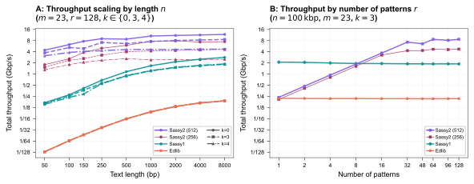

#+title: QuadRank: Engineering a high-throughput rank
#+subtitle: DSB 2026
#+author: Ragnar {Groot Koerkamp}
#+hugo_section: slides
#+filetags: @slides hpc data-strutures
#+OPTIONS: ^:{} num: num:0 toc:nil
#+hugo_front_matter_key_replace: author>authors
# #+toc: depth 2
#+reveal_theme: white
#+reveal_extra_css: /css/slide.min.css
#+reveal_extra_css: /css/p99.min.css
#+reveal_init_options: width:1920, height:1080, margin: 0.04, minScale:0.2, maxScale:2.5, disableLayout:false, transition:'none', slideNumber:'c/t', controls:false, hash:true, center:false, navigationMode:'linear', hideCursorTime:2000
#+REVEAL_PLUGINS: (highlight)
#+REVEAL_HIGHLIGHT_CSS: /css/vs.min.css
#+reveal_reveal_js_version: 4
#+export_file_name: ../../static/slides/quadrank/index.html
#+hugo_paired_shortcodes: %notice
#+date: <2026-02-18 Wed>
# Export using C-c C-e R R
# Turn off org-special-block-extras-mode
# Enable auto-export using :toggle-org-reveal-export-on-save
# Disable hugo export using :org-hugo-auto-export-mode

#+begin_export html

#+end_export

#+REVEAL_TITLE_SLIDE: <h1 class="title" style="margin-top:-10%%">QuadRank</h1>
#+REVEAL_TITLE_SLIDE: 
Engineering a High-Throughput Rank

#+REVEAL_TITLE_SLIDE: <h2 class="author" style="margin:0;margin-top:1em;">%a</h2>
#+REVEAL_TITLE_SLIDE: <h2 class="date" style="font-size:smaller;font-weight:normal;color:grey">DSB 2026</h2>
#+REVEAL_TITLE_SLIDE: <a href="https://curiouscoding.nl/posts/quadrank" style="position:absolute;bottom:9.8%%;left:3%%;width:30%%;color:grey;font-size:smaller">curiouscoding.nl/{posts,slides}/quadrank</a>
#+REVEAL_TITLE_SLIDE: <a href="https://doi.org/10.48550/ARXIV.2602.04103" style="position:absolute;bottom:4.8%%;left:3%%;width:30%%;color:grey;font-size:smaller">https://doi.org/10.48550/ARXIV.2602.04103</a>
#+REVEAL_TITLE_SLIDE: </img>

#+attr_html: :style display:none

* Binary Rank: Problem statement
:PROPERTIES:
:CUSTOM_ID: problem-statement
:END:
#+attr_html: :display none
- Input: a many-GB text $T = t_0\dots t_{n-1}$ of $n$ bits.
- Queries: given $q$, find
\begin{equation*}
\newcommand{\rank}{\mathsf{rank}}
\rank(q) := \sum_{0\leq i< q} t_i.
\end{equation*}
- $T = \underline{\texttt{1001001}}\texttt{110010100}$
  - $\rank(0) = 0$
  - $\rank(7) = 3$
  - $\rank(16) = 7$
- Why? Occurrences table in FM-index.
  
* History
:PROPERTIES:
:CUSTOM_ID: history
:END:

#+attr_html: :class full :src /ox-hugo/rank-overview.svg :style background:white
[[file:./figs/rank-overview.svg]]
  
* Naive solutions
:PROPERTIES:
:CUSTOM_ID: naive
:END:
- Linear scan:
  - $O(n/w)$ time using $w$ bit popcount, no space overhead.
# TODO: Fig
- Precompute all 64-bit answers $r_i := \rank(i)$: 
  - $O(1)$ time, $64\times$ overhead.
# TODO: Fig
    
* Middle-ground: block-based offsets
:PROPERTIES:
:CUSTOM_ID: blocks
:END:
- Use $B=512$ bit blocks, and store all $b_j := \rank(j\cdot B)$.
# TODO: Fig
- Query $q = j\cdot B + q'$:
  $$
  \rank(q) = b_j + \sum_{jB\leq i < jB+q'} t_i
  $$
- $O(B/w) = O(512/64) = O(1)$ time,
- $64/512 = 12.5\%$ space overhead.
- 2 cache misses:
  - in $n/8$ bit array: $b_j$
  - in $n$ bit array: $t_{jB}\dots t_{jB+q'}$

* Middle-ground: limitations
:PROPERTIES:
:CUSTOM_ID: blocks-2
:END:
- Reduce redundancy in adjacent 64-bit offsets $b_{i}$ and $b_{i+1}$, which
  differ by at most 512.
- Can we do 1 cache miss?
- Reduce the (up to) 512-bit popcount?

* Reducing overhead: PastaWide [and others]
:PROPERTIES:
:CUSTOM_ID: levels
:END:
- 2 levels:
  - L2 with 16-bit /delta/ every block: 3.125% overhead
  - L1 with 64-bit /offset/ every 128 blocks: 0.1% overhead
# TODO: Fig

* Reducing cache misses: SPIDER
:PROPERTIES:
:CUSTOM_ID: spider
:END:
- Inline the 16-bit L2 deltas bits into each cache line
  - Remaining 0.1% overhead L1 array fits in cache.
  
# TODO: Fig

* Reducing the popcount: Pairing
:PROPERTIES:
:CUSTOM_ID: pairing
:END:
- Delta is to the /middle/ instead of /start/ of a block.
  - Count only 256 bits in first or second half of block.

# TODO: Fig

* All together now: BiRank
:PROPERTIES:
:CUSTOM_ID: birank
:END:
- Inline 16-bit deltas
- Pairing
- 32-bit /reduced/ L1 offsets: 0.05% overhead
  - Low 11 bits are stored in deltas
  - Input up to $2^{43}$ bits

# TODO: Fig

* What is /fast/?
:PROPERTIES:
:CUSTOM_ID: fast
:END:
Latency: 80 ns/q
#+begin_src rust
let mut seed = 0;
for q in queries {
    seed ^= ranker.rank(q ^ seed);
}
#+end_src
For loop: 16-30 ns/q
#+begin_src rust
for q in queries {
    ranker.rank(q);
}
#+end_src
Prefetching/batching: 8-23 ns/q
#+begin_src rust
for i in 0..queries.len() {
    ranker.prefetch(queries[i+32]);
    ranker.rank(queries[i]);
}
#+end_src
  
* BiRank results
:PROPERTIES:
:CUSTOM_ID: birank-results
:END:
#+attr_html: :class plot :src /ox-hugo/plot-laptop-st-2-large.svg
[[file:./plots/plot-laptop-st-2-large.svg]]
* QuadRank
:PROPERTIES:
:CUSTOM_ID: quadrank
:END:
- Support $\sigma=4$ (=ACGT=) alphabet, and $\rank(q, c)$ for arbitrary $c$.
- Also: $$\rank_4(q) := [\rank(q, \texttt A),\rank(q, \texttt C),\rank(q, \texttt G),\rank(q, \texttt T)].$$
- Input is 2 bits per symbol.
- Like BiRank, but replicate all metadata $4\times$.
- Store input in /transposed/ layout: low bits separate from high bits.
- Efficient SIMD implementation of 4-parallel popcounting.

# TODO FIG

* QuadRank results
:PROPERTIES:
:CUSTOM_ID: quadrank-results
:END:
#+attr_html: :class plot :src /ox-hugo/plot-laptop-st-4-large.svg
[[file:./plots/plot-laptop-st-4-large.svg]]
* Toy Batching FM-index
:PROPERTIES:
:CUSTOM_ID: fm
:END:
- =count=-only; no =locate=.
- 8-character prefix-lookup.
- Map 32 reads in parallel.
- Do 1 character of each read before moving to the next.
- Prefetch memory for the next character.
- Keep a list of /active/ reads, and only iterate over those.
  
* FM-index results
:PROPERTIES:
:CUSTOM_ID: fm-results
:END:
#+attr_html: :class plot :src /ox-hugo/plot-fm.svg
[[file:./plots/plot-fm.svg]]

* Conclusion: Thread, Batch, and Prefetch
:PROPERTIES:
:CUSTOM_ID: conclusion
:END:

* PS: Sassy1 grep-like approximate search
:PROPERTIES:
:CUSTOM_ID: sassy-grep
:END:

=sassy grep -p <pattern> -k 3 <human-genome>.fa=

#+attr_html: :class plot :src /ox-hugo/sassy-grep.gif :style top:20%;width:100%;height:200%
[[file:./sassy-grep.gif]]

* PS: Sassy2 for batch searching
:PROPERTIES:
:CUSTOM_ID: sassy2-results
:END:

#+attr_html: :class plot :src /ox-hugo/sassy2-results.svg

