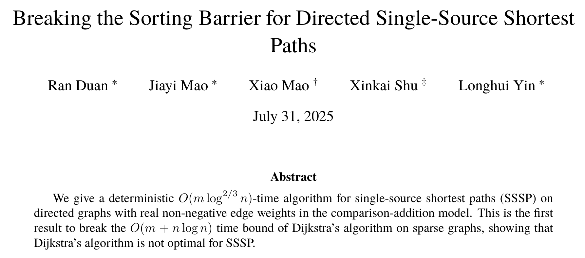

#+title: SimdQuickHeap:
#+subtitle: the fastest priority queue
#+author: Ragnar {Groot Koerkamp}, Johannes Breitling, Marvin Williams
#+hugo_section: slides
#+filetags: @slides hpc data-structure binary-search
#+OPTIONS: ^:{} num: num:0 toc:nil
#+hugo_front_matter_key_replace: author>authors
# #+toc: depth 2
#+reveal_theme: white
#+reveal_extra_css: /css/slide.min.css
#+reveal_extra_css: /css/p99.min.css
#+reveal_init_options: width:1920, height:1080, margin: 0.04, minScale:0.2, maxScale:2.5, disableLayout:false, transition:'none', slideNumber:'c/t', controls:false, hash:true, center:false, navigationMode:'linear', hideCursorTime:2000
#+REVEAL_PLUGINS: (highlight)
#+REVEAL_HIGHLIGHT_CSS: /css/vs.min.css
#+reveal_reveal_js_version: 4
#+export_file_name: quickheap-text
#+reveal_export_file_name: ../../static/slides/quickheap/index.html
#+hugo_paired_shortcodes: %notice
#+date: <2025-07-20 Sun>
# Export using C-c C-e R R
# Turn off org-special-block-extras-mode

# #+attr_html: :style display:none
# [[file:p99-title-slide.png]]

#+begin_export html

#+end_export

#+REVEAL_TITLE_SLIDE: <h1 class="title" style="text-transform:none;line-height:2.3rem;padding-top:1rem;padding-bottom:0rem;">%t %s</h1>
#+REVEAL_TITLE_SLIDE: <h2 class="author" style="margin:0;font-size:1rem;line-height:initial;margin-top:0.0rem;"><u>Ragnar {Groot Koerkamp}</u>, Johannes Breitling, Marvin Williams</h2>
#+REVEAL_TITLE_SLIDE: <h2 class="author" style="margin:0;font-size:0.7rem;font-family:monospace;line-height:initial;color:rgb(0, 133, 255);text-transform:none;">@curiouscoding.nl</h2>
#+REVEAL_TITLE_SLIDE: <h2 class="date" style="font-size:0.9rem;font-weight:normal;color:grey;margin-top:0.5rem">P99 2026</h2>
# #+REVEAL_TITLE_SLIDE: </img>
#+REVEAL_TITLE_SLIDE: </img>
#+REVEAL_TITLE_SLIDE: <a href="https://arxiv.org/abs/2604.25681" style="position:absolute;bottom:21.8%%;left:1%%;color:grey;font-size:smaller">arxiv.org/abs/2604.25681</a>
#+REVEAL_TITLE_SLIDE: <a href="https://github.com/RagnarGrootKoerkamp/quickheap" style="position:absolute;bottom:15.8%%;left:1%%;color:grey;font-size:smaller">github.com/RagnarGrootKoerkamp/quickheap</a>
#+REVEAL_TITLE_SLIDE: <a href="https://curiouscoding.nl/slides/quickheap" style="position:absolute;bottom:9.8%%;left:1%%;color:grey;font-size:smaller">curiouscoding.nl/slides/quickheap</a>
#+REVEAL_TITLE_SLIDE: <a href="https://curiouscoding.nl/posts/quickheap" style="position:absolute;bottom:3.8%%;left:1%%;color:grey;font-size:smaller">curiouscoding.nl/posts/quickheap</a>
# #+REVEAL_TITLE_SLIDE: </img>

* Ragnar {Groot Koerkamp}
:PROPERTIES:
:CUSTOM_ID: me
:END:
- Did IMO & ICPC; currently head-of-jury for NWERC.
- Some time at Google.
- Quit and solved all of [[https://projecteuler.net/][projecteuler.net]] (700+) during Covid.
- PhD on /high throughput bioinformatics/ @ ETH Zurich.
- Now postdoc @ KIT Karlsruhe.
  - Lots of sequenced DNA that needs processing.
  - Many /static/ datasets, e.g. a 3GB human genome.
  - Revisiting basic algorithms and optimizing them to the limit.
  - Good in theory $\neq$ fast in practice.
- Last year's talk on 40x faster binary search: 
  https://curiouscoding.nl/slides/p99
$$
\newcommand{\push}{\mathsf{push}}
\newcommand{\pop}{\mathsf{pop}}
$$

* Motivation: spite
:PROPERTIES:
:CUSTOM_ID: motivation
:END:
- \(O(m \log^{2/3} n)\) shortest path is nice, but how about a faster queue?
#+attr_html: :class large :style height:800px;top:60%;border:2px solid;width:auto :src /ox-hugo/sorting-barrier.png

* Problem Statement: Priority Queues
:PROPERTIES:
:CUSTOM_ID: problem-statement
:END:
Operations:
- $\push(x)$: Push the value $x$ onto the priority queue.
- $\pop()$: Remove the smallest value from the priority queue.

#+begin_src rust
type T = u64;
trait PriorityQueue {
    /// Initialize an empty priority queue.
    fn new() -> Self;
    /// Push x to the queue.
    fn push(&mut self, x: T) -> Self;
    /// Return the smallest value from the queue.
    fn pop(&mut self) -> T;
}
#+end_src
  
* Binary Heaps: probably worse than you thought
:PROPERTIES:
:CUSTOM_ID: binary-heap
:END:
Both $\push$ and $\pop$:
- $O(\log_2 n)$ operations, but
- $O(\log_2 n)$ I/O complexity for $\pop$!
  - Each $\pop$ requires a random access to $O(n)$ memory!
  - 80ns cache miss to RAM if we're unlucky

(todo figure & plot)

* Quad/Oct Heap: fewer layers, but still bad
:PROPERTIES:
:CUSTOM_ID: quad-heap
:END:
(todo figure & plot)

* Good $O(1/B)$ I/O complexity is possible
:PROPERTIES:
:CUSTOM_ID: good-io-complexity
:END:

Move a cache line worth of elements at a time into/out of RAM.
- Radix Heap [cite:@radix-heap-johnson]
- Sequence Heap [cite:@sequence-heap]
- QuickHeap [cite:@quickheap;@stronger-quickheaps]

(todo plot)

* The QuickHeap
:PROPERTIES:
:CUSTOM_ID: quickheap
:END:
1. Use in-place /quick select/ [cite:@quickselect] to find the smallest element.
2. Store the pivots.
4. To $\push$, /bubble/ down the new element through all pivots
3. To $\pop$, recursively partition the smallest part and return the leftmost element.

(todo fig & plot)

* The SimdQuickHeap
:PROPERTIES:
:CUSTOM_ID: simdquickheap
:END:

- Store each partition in its own layer
- use SIMD =_mm256_permutevar8x32_epi32= or AVX-612 =_mm512_maskz_compress_epi64= instructions for the partitioning
- Use SIMD-based linear-search over pivots to find the layer/partition to append to.

(todo fig & animated demo)

* Synthethic benchmarks
:PROPERTIES:
:CUSTOM_ID: synthetic-results
:END:
* Graph benchmarks
:PROPERTIES:
:CUSTOM_ID: graph-results
:END:

* Conclusion
:PROPERTIES:
:CUSTOM_ID: conclusion
:END:

- With XX input:
  - 2x speedup over radix heap
  - YY speedup over rust =collections::BinaryHeap=
  - ZZ ns per push/pop operation, down of AA
    
- Not limited by RAM (?)
- RAM is slow, caches are fast.
- Theoretical big-O complexities are useless here,
  since caches invalidate the RAM-model assumptions of constant-time access.

* P99 CONF
:PROPERTIES:
:CUSTOM_ID: last
:END:
\\
\\
\\
- X: [[https://x.com/curious_coding][@curious_coding]]
- Bsky: [[https://bsky.app/profile/curiouscoding.nl][@curiouscoding.nl]]
- Blog: [[https://curiouscoding.nl][curiouscoding.nl]]
  - [[https://curiouscoding.nl/posts/static-search-tree/][/posts/quickheap]]
  - [[https://curiouscoding.nl/slides/p99/][/slides/quickheap]]

#+attr_html: :class full :style z-index:-1 :src /ox-hugo/p99-last.png
[[file:p99-last.png]]

* Bibliography
#+print_bibliography: 

# Local Variables:
# eval: (org-hugo-auto-export-mode -1)
# eval: (toggle-org-reveal-export-on-save)
# End:
