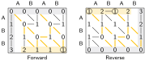
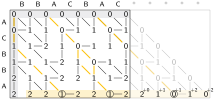
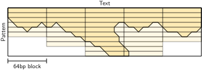
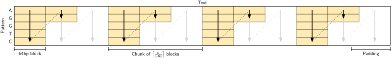
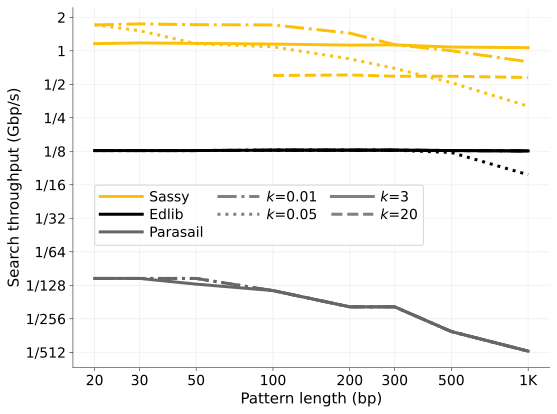
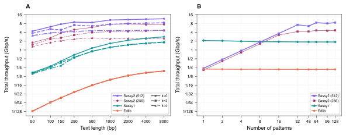

#+title: Sassy 1 & 2: Fuzzy searching DNA using SIMD
#+author: Ragnar Groot Koerkamp
#+hugo_section: slides
#+OPTIONS: ^:{} num: num:0 toc:0 
#+toc: headlines 1
#+hugo_front_matter_key_replace: author>authors
#+date: <2026-05-25 Mon 16:30>

#+reveal_theme: white
#+reveal_extra_css: /css/slide.min.css
#+reveal_extra_css: /css/kit.min.css
#+reveal_extra_css: /css/blog-yellow.min.css
#+reveal_init_options: width:1920, height:1080, margin: 0.06, minScale:0.2, maxScale:2.5, disableLayout:false, transition:'none', slideNumber:'c/t', controls:false, hash:true, center:false, navigationMode:'linear', hideCursorTime:2000
#+REVEAL_PLUGINS: (notes highlight)
#+REVEAL_HIGHLIGHT_CSS: /css/vs.min.css
#+reveal_reveal_js_version: 4

#+REVEAL_TITLE_SLIDE: <h1 style="font-size:1.2rem">%t</h1>
#+REVEAL_TITLE_SLIDE: 
%s

#+REVEAL_TITLE_SLIDE: <h2 class="author">Rick Beeloo & <u>Ragnar {Groot Koerkamp}</u></h2>
#+REVEAL_TITLE_SLIDE: <h2 class="date">RECOMB-Seq 2026, Thessaloniki</h2>

# #+REVEAL_TITLE_SLIDE: </img>
#+REVEAL_TITLE_SLIDE: </img>
#+REVEAL_TITLE_SLIDE: </img>
#+REVEAL_TITLE_SLIDE: </img>

#+REVEAL_TITLE_SLIDE: <a href="https://curiouscoding.nl/slides/sassy/slides" style="position:absolute;bottom:17%%;left:3%%;width:40%%;color:grey;font-size:smaller;text-align:left">curiouscoding.nl/slides/sassy/slides</a>
#+REVEAL_TITLE_SLIDE: <a href="https://github.com/RagnarGrootKoerkamp/sassy" style="position:absolute;bottom:12%%;left:3%%;width:40%%;color:grey;font-size:smaller;text-align:left">github.com/RagnarGrootKoerkamp/sassy</a>
#+REVEAL_TITLE_SLIDE: <a href="https://doi.org/10.1101/2025.07.22.666207" style="position:absolute;bottom:7%%;left:3%%;width:40%%;color:grey;font-size:smaller;text-align:left">doi.org/10.1101/2025.07.22.666207 (v1)</a>
#+REVEAL_TITLE_SLIDE: <a href="https://doi.org/10.64898/2026.03.10.710811" style="position:absolute;bottom:2%%;left:3%%;width:40%%;color:grey;font-size:smaller;text-align:left">doi.org/10.64898/2026.03.10.710811 (v2)</a>

# UPDATE
#+reveal_slide_footer: May, 2026 Rick Beeloo & Ragnar Groot Koerkamp: Sassy 1 & 2 </img>  

# For slides only!
# UPDATE and create dir
#+reveal_export_file_name: ../../static/slides/sassy/slides/index.html

# Export using C-c C-e R R
# Turn off org-special-block-extras-mode

#+begin_export html

#+end_export

* Takeaway 1: Math yay, Bio nay
* Takeaway 2: Do dumb stuff fast 

* Approximate String Matching
- Find pattern $P$ in text $T$.
  - $m := |P|$, $n := |T|$
- Allow up to $k$ unit-cost errors.
- Find /all/ matches.

\nbsp
#+attr_reveal: :frag t
- Not semi-global alignment
- Not $\Theta(nm/w)$
- Not new: Lots and LOTS of old literature

* Intricacies of ASM: What is a "match"?
- The end position?
- A start and end position?
- An alignment?
#+attr_html: :class float-right :style margin-right:-50%;overflow:hidden; :src /ox-hugo/sassy1-fwd-rev.svg

* Intricacies of ASM: Which "matches" to report?
- The end position?
  - One endpoint? (Semi-global)
  - All endpoints? (Navarro'01)
  - *Local minima!* (Sassy)
- A start and end position?
  - One pair per endpoint?
  - All pairs?
- An alignment?
  - One per endpoint?
  - /All/ alignments?
#+attr_html: :class float-right :style margin-right:-50%;overflow:hidden; :src /ox-hugo/sassy1-fwd-rev.svg

  
* ASM is not reverse-complement invariant!
#+attr_html: :class large :src /ox-hugo/sassy1-fwd-rev.svg

* Overhang: when $P$ extends beyond $T$
#+attr_html: :class large :src /ox-hugo/sassy1-overhang.svg

* ASM in $O(\lceil n/w\rceil k)$
- Myers' bitpacking on \(w=64\)-bit blocks.
- "Early break" when all states in block have cost $>k$.
- Horizontal tiling because $k\ll w$ makes $O(n \lceil k/w\rceil)$ inefficient.
  (Myers'99 does vertical tiling.)
#+attr_html: :class large :style top:62% :src /ox-hugo/sassy1-early-break.svg

* SIMD: Chunking the text
- Split the text in 4 chunks.
- Process 1 chunk per SIMD-lane.
#+attr_html: :class large :src /ox-hugo/sassy1-tiling.svg

* Sassy 1: search long text at ${>}1$ Gbp/s 
- Params:
  - $20 \leq |P| \leq 1000$
  - $n=10^5$
  - 1 thread
  - fwd search only
  - 10$\times$ Edlib, 128$\times$ parasail

#+attr_reveal: :frag t
*Applications:*
#+attr_reveal: :frag t
#+attr_html: :style background:white;padding:1em
- =sassy grep -k 1 ACTCACGCTATA human-genome.fasta=
- Crispr off-target searching
  - Many short patterns, fixed text → Columba (Renders+ 2025)
- Barcode detection for demultiplexing
  - Many short patterns, variable text → Batching!
#+attr_html: :class float-right :style z-index:-1 :src /ox-hugo/sassy1-throughput.svg

* Sassy 2: /batching/ $\gg$ chunking
- Text chunking requires =gathering= and transposing
- Take pattern suffix of len $w'\in\{16,32\}$
  - Random DNA has edit distance $\approx 45\%$.
  - $w'>2k+\varepsilon$ ensures few spurious matches.
- One suffix per SIMD lane.
- Post-process if suffix matches with cost $\leq k$.
#+attr_html: :class float-right :src /ox-hugo/sassy2-tiling.svg
[[file:./figs-2/sassy2-tiling.svg]]

* Sassy 2: search at 8 Gbp/s 
- *A*: 128 patterns of len 23, 1 thread, $k\in \{0,3,4\}$. *B*: $n=10^5$, $k=3$.
#+attr_html: :class large :style top:55% :src /ox-hugo/sassy2-throughput.svg

* Sassy 2 Application: Crispr off-target & Barbell
- Search a 23bp guide RNA in a human genome with $k=3$ in *30ms* or amortized *>100 Gbp/s* on 16 threads.
  - 3.7$×$ Sassy1, 35$×$ Edlib
- Scan Nanopore reads for 96 ONT rapid barcodes with $k=3$ at *1.2 Gbp/s*!
  - 4.6$×$ Sassy1, 45$×$ Edlib
- Barbell (Beeloo+) is a fast & accurate demultiplexer using Sassy2.
  - Poster @ RECOMB tomorrow evening!

* CLI: =sassy grep -p <pattern> -k 3 <hg>.fa=
#+attr_html: :class plot :src /ox-hugo/sassy-grep.gif :style top:4%;width:120%;height:280%;max-height:120%

# Local Variables:
# eval: (toggle-org-reveal-export-on-save)
# End:

