#+title: STPD: Compressing Suffix Trees by Path Decompositions
#+author: Ragnar Groot Koerkamp
#+hugo_section: slides
#+OPTIONS: ^:{} num: num:0 toc:0 
#+toc: headlines 1
#+hugo_front_matter_key_replace: author>authors
#+date: <2026-05-25 Mon 14:55>

#+reveal_theme: white
#+reveal_extra_css: /css/slide.min.css
#+reveal_extra_css: /css/kit.min.css
#+reveal_extra_css: /css/blog-yellow.min.css
#+reveal_init_options: width:1920, height:1080, margin: 0.06, minScale:0.2, maxScale:2.5, disableLayout:false, transition:'none', slideNumber:'c/t', controls:false, hash:true, center:false, navigationMode:'linear', hideCursorTime:2000
#+REVEAL_PLUGINS: (notes highlight)
#+REVEAL_HIGHLIGHT_CSS: /css/vs.min.css
#+reveal_reveal_js_version: 4

#+REVEAL_TITLE_SLIDE: <h1 style="font-size:1.2rem">%t</h1>
#+REVEAL_TITLE_SLIDE: 
The (lost?) art of suffix trees of repetitive texts

#+REVEAL_TITLE_SLIDE: <h2 class="author">Ruben Becker, Davide Cenzato, Travis Gagie, <u>Ragnar {Groot Koerkamp}</u>,  Sung-Hwan Kim, Giovanni Manzini, Nicola Prezza</h2>
#+REVEAL_TITLE_SLIDE: <h2 class="date">RECOMB-Seq 2026, Thessaloniki</h2>

#+REVEAL_TITLE_SLIDE: <a href="https://curiouscoding.nl/slides/stpd/slides" style="position:absolute;bottom:7%%;left:3%%;width:40%%;color:grey;font-size:smaller;text-align:left">curiouscoding.nl/slides/stpd/slides</a>
#+REVEAL_TITLE_SLIDE: <a href="https://doi.org/10.48550/ARXIV.2506.14734" style="position:absolute;bottom:2%%;left:3%%;width:40%%;color:grey;font-size:smaller;text-align:left">https://doi.org/10.48550/ARXIV.2506.14734</a>

# UPDATE
#+reveal_slide_footer: RECOMB-Seq, 2026 Becker, Cenzato, Gagie, Groot Koerkamp, Kim, Manzini, Prezza: STPD

# For slides only!
# UPDATE and create dir
#+reveal_export_file_name: ../../static/slides/stpd/slides/index.html

# Export using C-c C-e R R
# Turn off org-special-block-extras-mode

#+begin_export html

#+end_export

* Text indexing: Locate all matches of a pattern

#+attr_html: :class medium :src /ox-hugo/stpd-all-matches.svg

* Focus: Locate /leftmost/ match of a pattern

#+attr_html: :class medium :src /ox-hugo/stpd-one-match.svg

* FM/r-index: cache miss per character
#+attr_html: :class medium :src /ox-hugo/stpd-fm-index.png
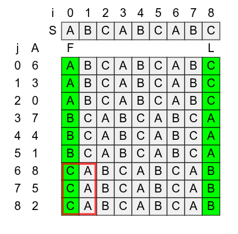

* Suffix trees of repetitive text are repetitive too!

@@html: Suffixient arrays, Cenzato+ @@

#+attr_html: :class medium :style top:55% :src /ox-hugo/stpd-suffix-tree-repetitive.png
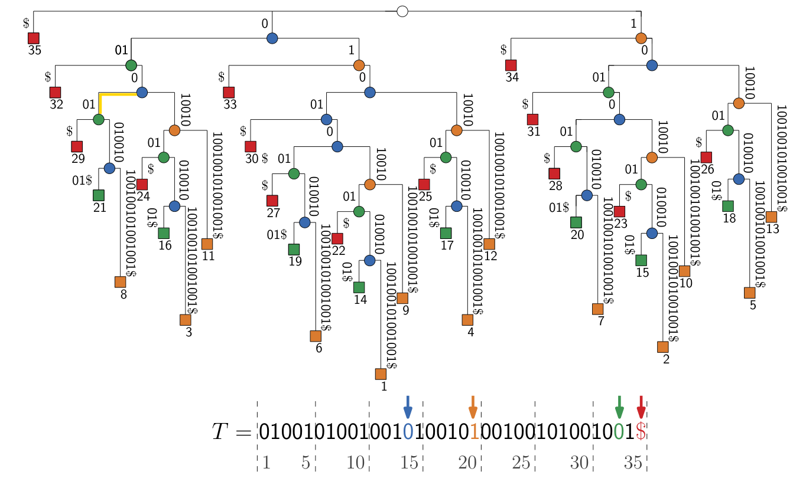

* Suffix tree: $O(d + m/B + \mathit{occ})$ I/O complexity
- $m$: pattern length
- $B$: block size
- $d$: depth in suffix tree, usually small
- $r$: runs in Burrows Wheeler Transform (BWT)

#+attr_reveal: :frag t
#+attr_html: :style color:green;font-size:1.2rem;background-color:white;z-index:20;position:relative;padding:1em;border:solid black
Goal: $O(r)$ space, $O(d+m/B+\mathit{occ})$ I/Os

#+attr_reveal: :frag t
#+attr_html: :style color:green;font-size:1.2rem;background-color:white;z-index:20;position:relative;padding:1em;border:solid black
STPD: $O(r)$ space, $O(d\color{red}{\cdot \log m}+m/B+\mathit{occ})$ I/Os

#+attr_html: :class float-right :src /ox-hugo/stpd-sa.svg

* Results: Small & fast ($m=15$)
@@html:Locate one@@ 19x chr19 @@html:Locate all@@
#+attr_html: :class large :style top:55% :src /ox-hugo/stpd-results-15.png
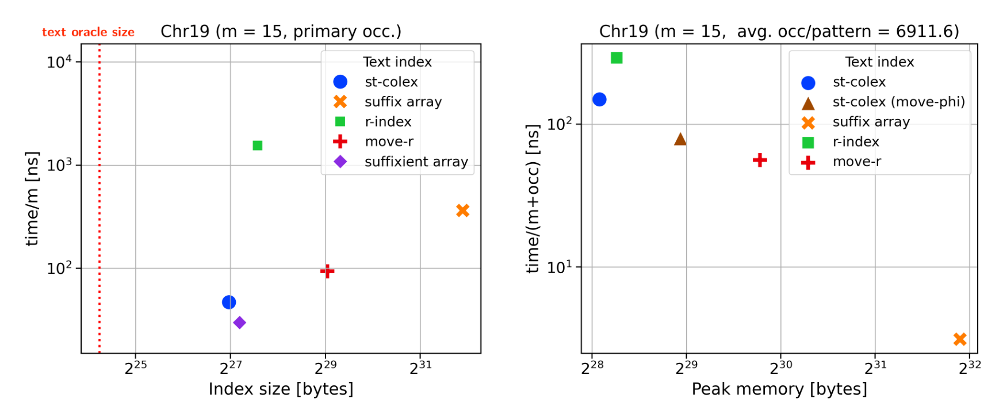
* Results: Small & fast ($m=150$)

@@html:Locate one@@ 19x chr19 @@html:Locate all@@
#+attr_html: :class large :style top:55% :src /ox-hugo/stpd-results-150.png
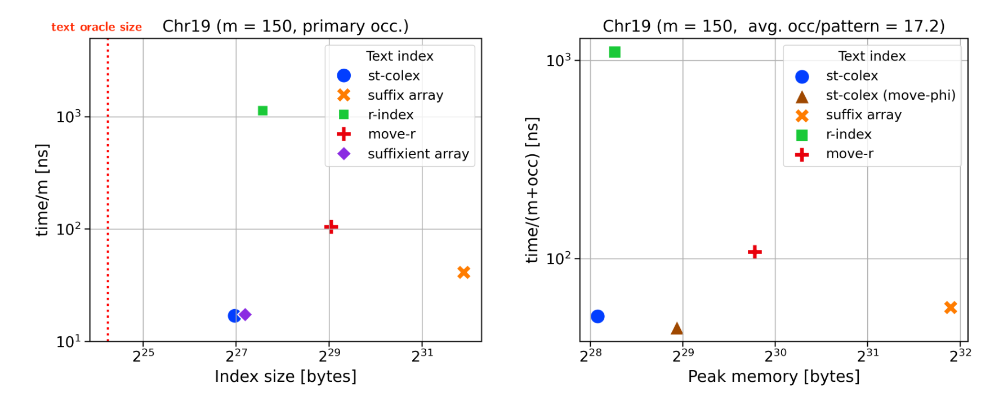
    
* Stringology time!
:PROPERTIES:
:CUSTOM_ID: stringology-1
:END:
#+begin_definition Right maximal substring (RMS)
Substring =x= for which at least two extensions =xA= and =xB= exist in $T$.
Aka: suffix-tree nodes.
#+end_definition

#+attr_html: :class medium :style top:70% :src /ox-hugo/stpd-rms.svg
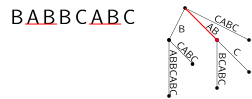
* Stringology time!
:PROPERTIES:
:CUSTOM_ID: stringology-2
:END:
#+begin_definition Right maximal substring (RMS)
Substring =x= for which at least two extensions =xA= and =xB= exist in $T$.
Aka: suffix-tree nodes.
#+end_definition
#+begin_definition Right maximal extension (RME)
Extension =xA= of an RMS =x=.
Aka: suffix-tree edges.
#+end_definition

#+attr_html: :class medium :style top:70% :src /ox-hugo/stpd-rme.svg
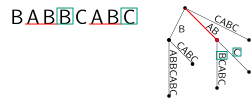
* Suffixient set
#+begin_definition Suffixient set
A set of text positions $S$ sorted in co-lex order, such that for each RME =xA=, there is $i\in S$ s.t.
$T[.. i)$ ends in =xA=.

$|S|\leq 2r$ is possible. Note that access to the (compressed) text is needed.
#+end_definition

#+attr_html: :class medium :style top:70% :src /ox-hugo/stpd-prefix-array.svg
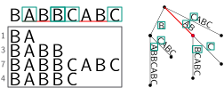

* Suffixient set queries
:PROPERTIES:
:CUSTOM_ID: query-1
:END:
#+begin_definition Query algorithm
Start greedily matching at start of $T$. Say that prefix $P[..j)$ of $P$ matches.

If the extension $P[..j]$ occurs in $T$, it is an RME,
and we can binary search a prefix from $S$ that ends in it.
Jump there and repeat.
#+end_definition

#+attr_html: :class medium :style top:70% :src /ox-hugo/stpd-query-1.svg
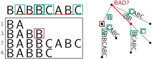
* Suffixient set queries
:PROPERTIES:
:CUSTOM_ID: query-2
:END:
#+begin_definition Query algorithm
Start greedily matching at start of $T$. Say that prefix $P[..j)$ of $P$ matches.

If the extension $P[..j]$ occurs in $T$, it is an RME,
and we can binary search a prefix from $S$ that ends in it.
Jump there and repeat.
#+end_definition

#+attr_html: :class medium :style top:70% :src /ox-hugo/stpd-query-2.svg
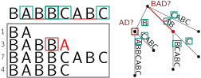
* Suffixient set queries
:PROPERTIES:
:CUSTOM_ID: query-3
:END:
#+begin_definition Query algorithm
Start greedily matching at start of $T$. Say that prefix $P[..j)$ of $P$ matches.

If the extension $P[..j]$ occurs in $T$, it is an RME,
and we can binary search a prefix from $S$ that ends in it.
Jump there and repeat.
#+end_definition

#+attr_html: :class medium :style top:70% :src /ox-hugo/stpd-query-3.svg
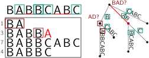
* Suffixient set queries
:PROPERTIES:
:CUSTOM_ID: query-4
:END:
#+begin_definition Query algorithm
Start greedily matching at start of $T$. Say that prefix $P[..j)$ of $P$ matches.

If the extension $P[..j]$ occurs in $T$, it is an RME,
and we can binary search a prefix from $S$ that ends in it.
Jump there and repeat.
#+end_definition

#+attr_html: :class medium :style top:70% :src /ox-hugo/stpd-query-4.svg
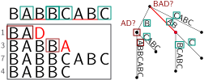

* Suffixient set
:PROPERTIES:
:CUSTOM_ID: suffixient-set (repeat)
:END:
#+begin_definition Suffixient set (repeated)
A set of text positions $S$ sorted in co-lex order, such that for each RME =xA=, there is $i\in S$ s.t.
$T[.. i)$ ends in =xA=.

Note that access to the (compressed) text is needed.
#+end_definition

#+attr_html: :class medium :style top:70% :src /ox-hugo/stpd-prefix-array.svg

* STPD 
#+begin_definition STPD
@@html:The@@ set of text positions $S$, such that for each RME =xA=
@@html:that is not the lefmost occurrence of
x@@, there is $i\in S$ s.t. $T[.. i)$ @@html:is the lefmost occurrence of xA@@.
#+end_definition

# #+begin_definition Locate all
# Locate further matches using $\phi$, which gives the location of
# the next-smallest suffix in $O(r)$ space.
# #+end_definition

#+attr_html: :class medium :style top:70% :src /ox-hugo/stpd-stpd.svg
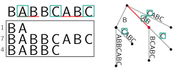

* Larger lexicographic example
#+attr_html: :class large :style top:55% :src /ox-hugo/stpd-fig1.png
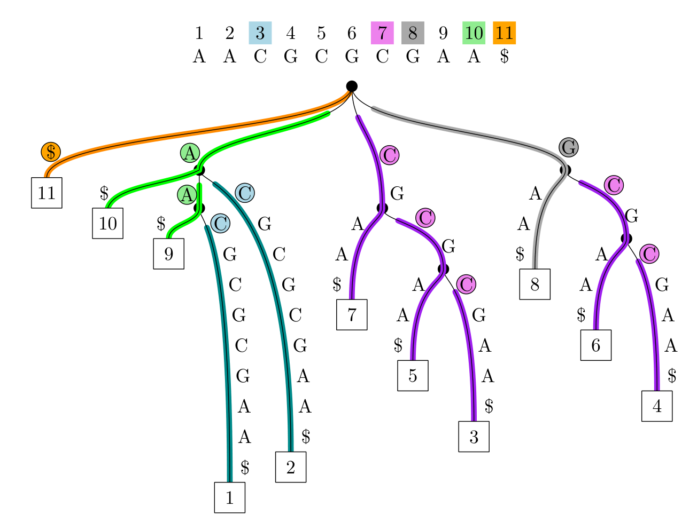

* Sizes on Pizza & Chili repetitive corpus
| (in millions)                | influenza |  cere | escherichia |
| n                            |     155.0 | 461.0 |       112.0 |
| BWT runs $r$                 |       3.0 |  11.6 |        15.0 |
| suffixient set $\chi\leq 2r$ |       2.2 |   9.9 |        13.1 |
| STPD: leftmost               |       1.9 |   8.9 |        11.7 |
| STPD: lex min    $\leq r$    |       1.8 |   7.5 |         9.8 |

* Conclusion
- $O(r)$ space alongside the text-oracle, in practice less than r-index
- Cache-friendly lookups, 30× faster than r-index

#+attr_reveal: :frag t
*Outlook:*
#+attr_reveal: :frag t
- Incremental construction, allowing to grow the text
- Direct pointer-based navigation on the text works great too???
  
* Pointers
#+attr_html: :class large :style top:55% :src /ox-hugo/stpd-pointers.png
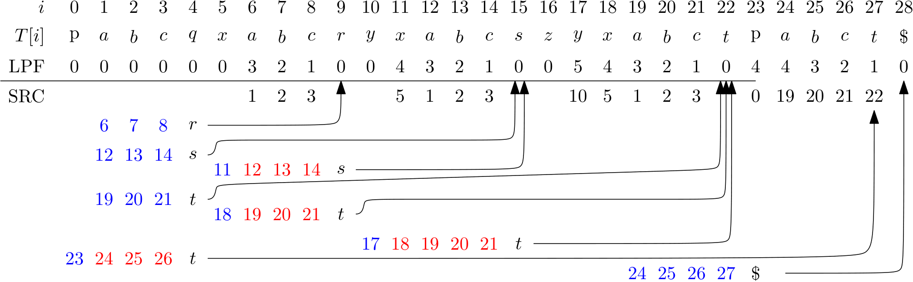
  
# Local Variables:
# eval: (toggle-org-reveal-export-on-save)
# End:

