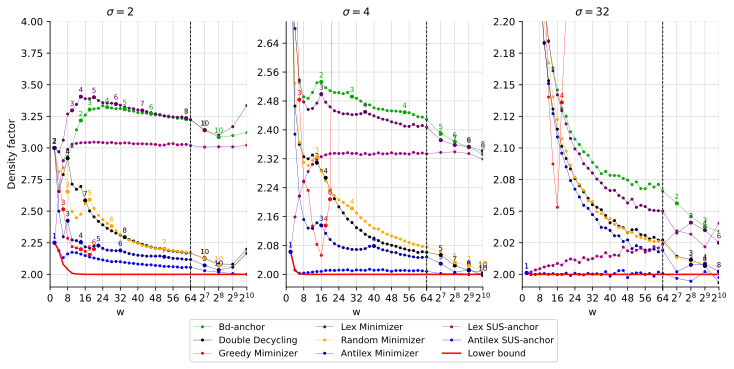
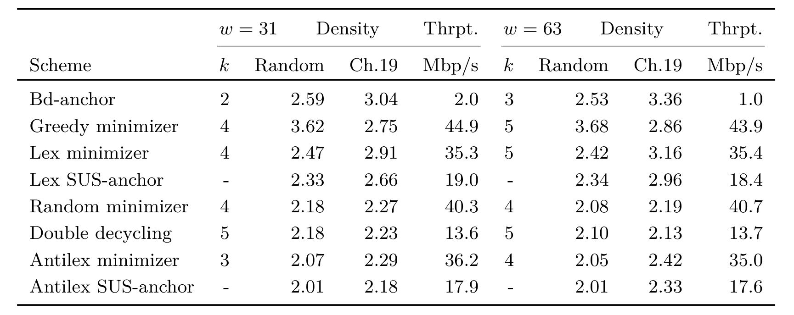

#+title: The Anti-Lexicographic SUS-anchor
#+subtitle: An empirically optimal /selection/ scheme
#+hugo_section: slides
#+filetags: @slides sus-anchors
#+OPTIONS: ^:{} num:nil toc:nil
#+hugo_front_matter_key_replace: author>authors
#+reveal_theme: white
#+reveal_extra_css: /css/slide.min.css
#+reveal_extra_css: /css/kit.min.css
#+reveal_extra_css: /css/blog-yellow.min.css
#+reveal_init_options: width:1920, height:1080, margin:0.04, minScale:0.2, maxScale:2.5, disableLayout:false, transition:'none', slideNumber:'c/t', controls:false, hash:true, center:false, navigationMode:'linear', hideCursorTime:2000
#+reveal_reveal_js_version: 4
#+export_file_name: sus-anchors-text
#+reveal_export_file_name: ../../static/slides/sus-anchors/index.html
#+date: <2026-09-02 Wed>
#+MACRO: c @@html:<code>$1</code>@@
#+MACRO: r @@html:<code>$1</code>@@
#+MACRO: g @@html:<code>$1</code>@@
#+MACRO: gg @@html:$1@@
#+MACRO: o @@html:<code>$1</code>@@
#+MACRO: gray @@html:<code>$1</code>@@

#+REVEAL_TITLE_SLIDE: <h1 style="font-size:1.2rem">%t</h1>
#+REVEAL_TITLE_SLIDE: 
%s

#+REVEAL_TITLE_SLIDE: <h2 class="author">Ragnar {Groot Koerkamp}</h2>
#+REVEAL_TITLE_SLIDE: <h2 class="date">WABI 2026, L'Aquila</h2>

#+REVEAL_TITLE_SLIDE: </img>
#+REVEAL_TITLE_SLIDE: </img>

#+REVEAL_TITLE_SLIDE: <a href="https://curiouscoding.nl/slides/sus-anchors" style="position:absolute;bottom:12%%;left:3%%;width:40%%;color:grey;font-size:smaller;text-align:left">curiouscoding.nl/slides/sus-anchors</a>
#+REVEAL_TITLE_SLIDE: <a href="https://github.com/RagnarGrootKoerkamp/minimizers" style="position:absolute;bottom:7%%;left:3%%;width:40%%;color:grey;font-size:smaller;text-align:left">github.com/RagnarGrootKoerkamp/minimizers</a>
#+REVEAL_TITLE_SLIDE: <a href="https://doi.org/10.4230/LIPIcs.WABI.2026.22" style="position:absolute;bottom:2%%;left:3%%;width:40%%;color:grey;font-size:smaller;text-align:left">doi.org/10.4230/LIPIcs.WABI.2026.22</a>

#+begin_export html

#+end_export

* Minimizer schemes
Input: a window $W\in \Sigma^{w+k-1}$

*Minimizer scheme*: Sample the \(k\)-mer with the one with smallest hash:
  $$f(W) = \mathrm{argmin}_{0\leq i\lt w\ \ } h(W_{i\dots i+k}).$$
#+attr_reveal: :frag (appear)
*Sampling scheme*: {{{gg(Arbitrary)}}} function \(f: \Sigma^{w+k-1}\to \{0, \dots, w-1\}.\)
#+attr_reveal: :frag (appear)
*Density*: The expected fraction of sampled \(k\)-mers in a random string:
#+attr_reveal: :frag (appear)
- =E=​{{{c(A)}}}​=DCAE.....=
#+attr_reveal: :frag (appear)
- =.=​{{{c(A)}}}​=DCAEB....=
#+attr_reveal: :frag (appear)
- =..DC=​{{{c(A)}}}​=EBE...=
#+attr_reveal: :frag (appear)
- =...C=​{{{c(A)}}}​=EBEC..=
#+attr_reveal: :frag (appear)
- =....=​{{{c(A)}}}​=EBECD.=
#+attr_reveal: :frag (appear)
- =.....E=​{{{c(B)}}}​=ECDC=
#+attr_reveal: :frag (appear)
- =E=​{{{c(A)}}}​=DC=​{{{c(A)}}}​=E=​{{{c(B)}}}​=ECDC=
  

* Density bounds [cite//b:@sampling-lower-bound]
#+attr_reveal: :frag (appear)
Conjecture: Optimal schemes exist for $k\equiv 1\pmod w$?
#+attr_reveal: :frag (appear)
- $k\to\infty$: {{{g(yes)}}}, mod-mini [cite//b:@modmini]
- $\sigma\to\infty$: {{{g(yes)}}}, mod-mini
- $w=2$: {{{g(yes)}}}, w.i.p. by Bryce
- $k=1$: {{{o(almost)}}}, today

#+attr_html: :class full :style height:75%;top:25%;left:15% :src /ox-hugo/lower-bound.svg
[[file:../../posts/minimizers/figs/lower-bound.svg]]

* Results

#+attr_html: :class inset large :style width:92% :src /ox-hugo/sus-anchors-1.svg

* Today: near-optimal /selection/ schemes
*Selection scheme*
- $k=1$, i.e., sample a /position/: \(f: \Sigma^w\to \{0, 1, \dots, w-1\}\).

*Bidirectional anchors* [cite//b:@bdanchors]
- Sample the start position of the lexicographically smallest /rotation/ of $W$.
#+attr_reveal: :frag (appear)
- =E=​{{{c(A)}}}​=DCAE.....=
#+attr_reveal: :frag (appear)
- =.=​{{{c(A)}}}​=DCAEB....=
#+attr_reveal: :frag (appear)
- =..DC=​{{{c(A)}}}​=EBE...=
#+attr_reveal: :frag (appear)
- =...C=​{{{c(A)}}}​=EBEC..=
#+attr_reveal: :frag (appear)
- =....=​{{{c(A)}}}​=EBECD.=
#+attr_reveal: :frag (appear)
- =.....E=​{{{c(B)}}}​=ECDC=
#+attr_reveal: :frag (appear)
- =E=​{{{c(A)}}}​=DC=​{{{c(A)}}}​=E=​{{{c(B)}}}​=ECDC=

- Can be used to build an index on selected prefixes & suffixes. [cite//b:@bdanchors]

* Drawbacks of bd-anchors

- Rotations wrap around:
  - ​=FB=​{{{c(A)}}}​=DC..=
  - ​=.BADC=​{{{c(A)}}}​=.=
  - ​=..=​{{{c(A)}}}​=DCAE=
#+attr_reveal: :frag (appear)
- Small strings cluster:
  - {{{c(A)}}}​=AABCD....=
  - =.=​{{{c(A)}}}​=ABCDE.=
  - =..=​{{{c(A)}}}​=BCDEF=
    
# - Reduced bd-anchors avoid the last $r=\Theta(\log_\sigma w)$ positions

* SUS-anchors
- Sample the /smallest unique substring/
- =CABBAB=.
  - =C= =A= =B= =B= =A= =B= =CA= =AB= =BB= =BA= =AB= =CAB= =ABB= =BBA= =BAB= =CABB= =ABBA= =BBAB= =CABBA= =ABBAB= =CABBAB=
  - =C= {{{c(A)}}} {{{c(B)}}} {{{c(B)}}} {{{c(A)}}} {{{c(B)}}} =CA= {{{c(AB)}}} =BB= =BA= {{{c(AB)}}} =CAB= =ABB= =BBA= =BAB= =CABB= =ABBA= =BBAB= =CABBA= =ABBAB= =CABBAB=
  - =C= {{{c(A)}}} {{{c(B)}}} {{{c(B)}}} {{{c(A)}}} {{{c(B)}}} =CA= {{{c(AB)}}} =BB= =BA= {{{c(AB)}}} =CAB= *{{{g(ABB)}}}* =BBA= =BAB= =CABB= *=ABBA=* =BBAB= =CABBA= =ABBAB= =CABBAB=
  
#+attr_reveal: :frag (appear)
- =C=​{{{c(ABB)}}}​=AB=.

- Equivalent: consider the smallest unique /suffix/
  
#+attr_reveal: :frag (appear)
- SUS-anchors are /forward/...
  - ​=FB=​{{{c(A)}}}​=DC..=
  - ​=.B=​{{{c(AD)}}}​=CA.=
  - ​=..=​{{{c(AD)}}}​=CAE=
#+attr_reveal: :frag (appear)
- but small strings still cluster:
  - {{{c(AAA)}}}​=BCD..=
  - =.=​{{{c(AA)}}}​=BCDE.=
  - =..=​{{{c(A)}}}​=BCDEF=
#+attr_reveal: :frag (appear)
- Goal: Avoid overlapping SUS-anchors
    

* The anti-lexicographic SUS-anchor
- *Anti-lexicographic order*:
  - compare the first character normally, and the remaining characters in reverse.
  - The smallest string is =AZZZZ...=.
  - Like 10-minimizers/DNA-spacers [cite/bb:@10-minimizers]
    
- *Anti-lexicographic SUS-anchor*: anti-lex smallest unique substring.

#+attr_reveal: :frag (appear)
- Small strings do not overlap anymore:
  - =AA=​{{{c(AB)}}}​=CD..=
  - =.A=​{{{c(AB)}}}​=CDE.=
  - =..=​{{{c(AB)}}}​=CDEF=
  
#+attr_reveal: :frag (appear)
- Some intuition
  - SUS-anchors are optimal when sampled substrings /never/ overlap
  - Bad case:
  - ​{{{c(10001000)}}}​=100.=
  - =.000=​{{{c(1000)}}}​=1001=
    
# * Computing SUS-anchors
# - Example: \(T=\texttt{abaababa}\), \(\ell=3\), anti-lexicographic order.
# - The deque stores \((a,x_a)\): substring start and the first time it becomes hot.

# #+attr_html: :class inset :style width:96%;margin-top:0.5em :src /ox-hugo/computing-sus-anchors.svg
# [[file:plots/computing-sus-anchors.svg]]

* Density results

#+attr_html: :class inset large :style width:92% :src /ox-hugo/sus-anchors-1.svg

* Results on real data

#+attr_html: :class inset large :style width:92% :src /ox-hugo/sus-anchor-results.png
 

* Conclusion
Anti-lex SUS-anchors...
- are parameter-free,
- have near-optimal density,
- and can be streamed in linear time.

* References
#+print_bibliography: 

# Local Variables:
# eval: (org-hugo-auto-export-mode -1)
# eval: (toggle-org-reveal-export-on-save)
# End:

