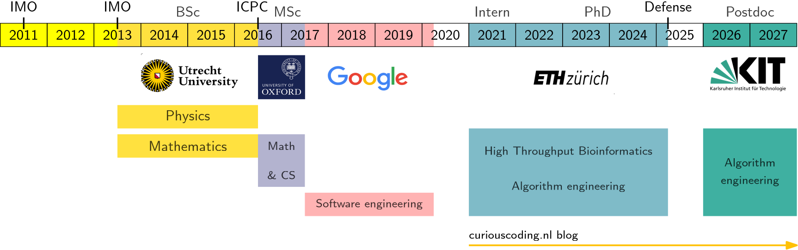
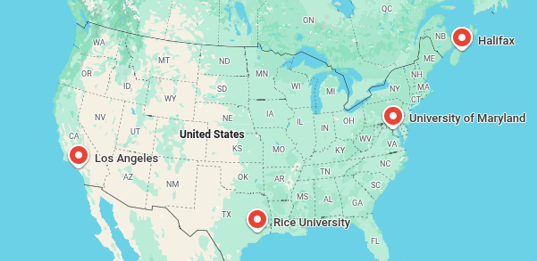
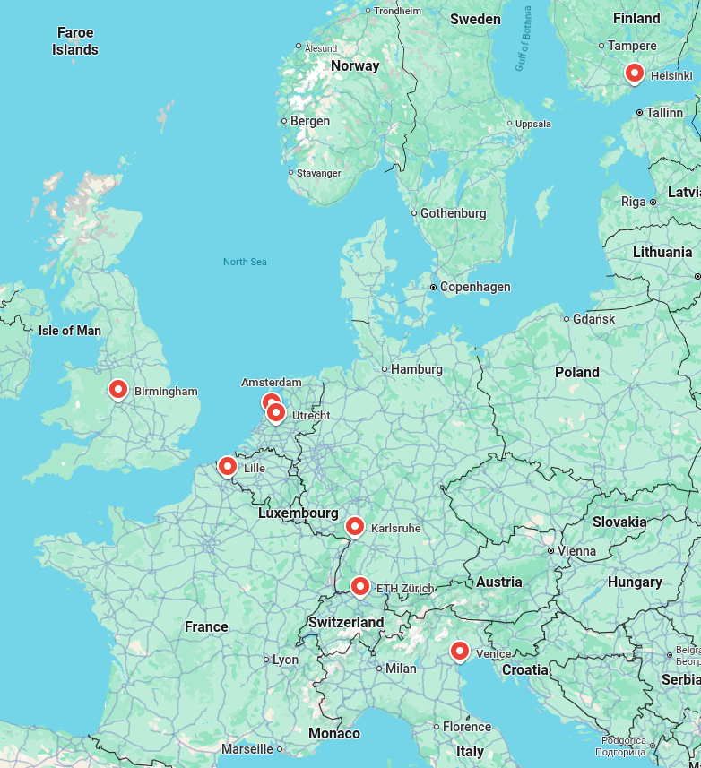
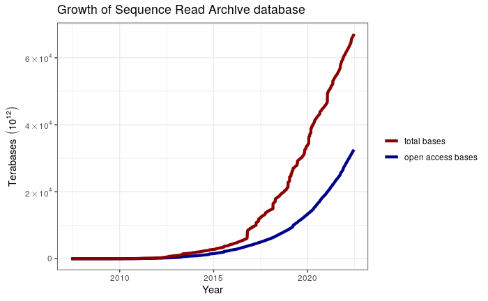
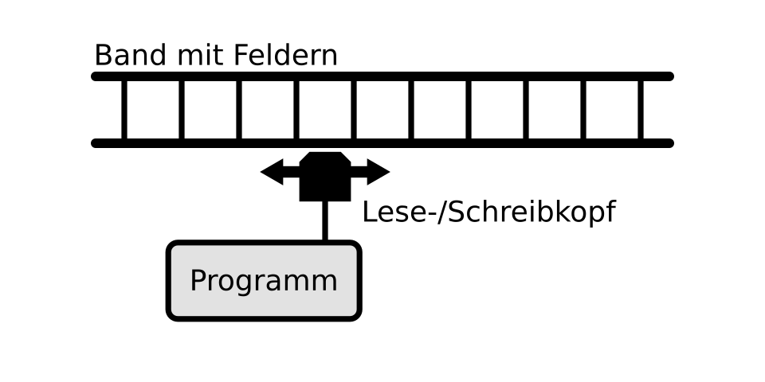
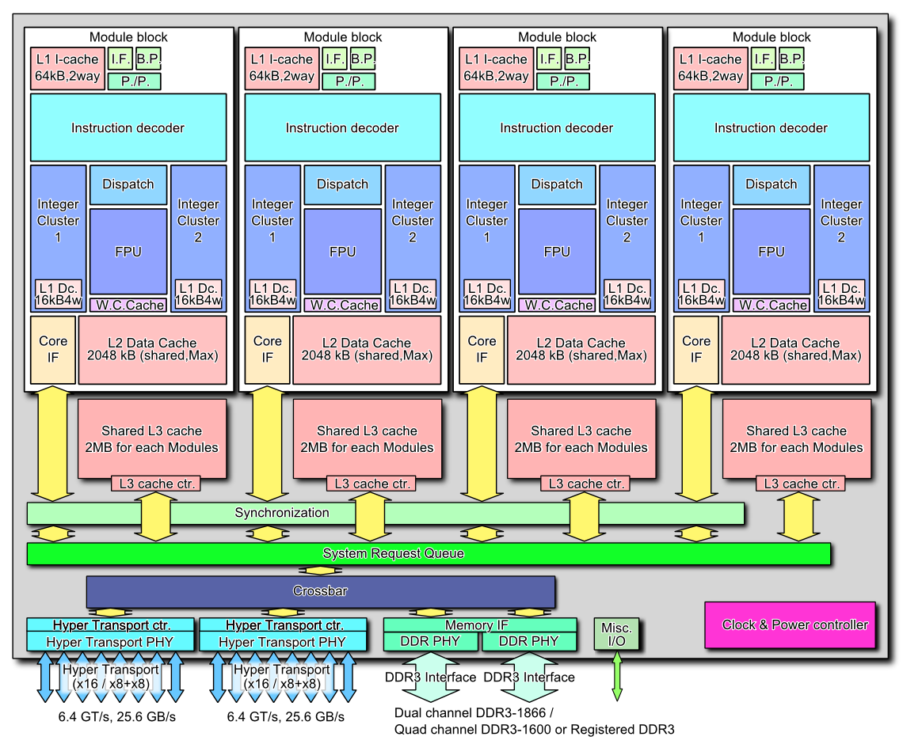
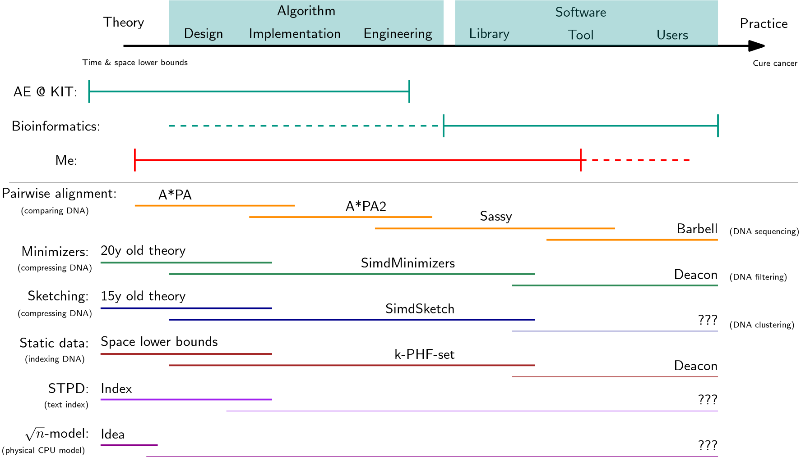

#+title: High Throughput Bioinformatics: Theory to/from Practice
#+subtitle: Yig Prep Pro application
#+author: Ragnar Groot Koerkamp
#+hugo_section: slides
#+OPTIONS: ^:{} num: num:0 toc:0 
#+toc: headlines 1
#+hugo_front_matter_key_replace: author>authors
#+date: <2026-04-29 Wed>

#+reveal_theme: white
#+reveal_extra_css: /css/slide.min.css
#+reveal_extra_css: /css/kit.min.css
#+reveal_init_options: width:1920, height:1080, margin: 0.06, minScale:0.2, maxScale:2.5, disableLayout:false, transition:'none', slideNumber:'c/t', controls:false, hash:true, center:false, navigationMode:'linear', hideCursorTime:2000
#+REVEAL_PLUGINS: (notes highlight)
#+REVEAL_HIGHLIGHT_CSS: /css/vs.min.css
#+reveal_reveal_js_version: 4

#+REVEAL_TITLE_SLIDE: <h1>%t</h1>
#+REVEAL_TITLE_SLIDE: 
%s

#+REVEAL_TITLE_SLIDE: <h2 class="author">Ragnar {Groot Koerkamp}</h2>
#+REVEAL_TITLE_SLIDE: <h2 class="date">2026-04-29</h2>
#+REVEAL_TITLE_SLIDE: </img>
#+REVEAL_TITLE_SLIDE: </img>

# UPDATE
#+reveal_slide_footer: April, 2026 Ragnar Groot Koerkamp: YIG Prep Pro application </img>

# For slides only!
# UPDATE and create dir
#+reveal_export_file_name: ../../static/slides/yigpp/slides/index.html

# Export using C-c C-e R R
# Turn off org-special-block-extras-mode

#+begin_export html

#+end_export

* My background
#+attr_html: :class float-left :style top:10%;max-height:50% :src /ox-hugo/education-timeline.png
 
    

#+attr_html: :class float-left :style top:55%;max-height:35% :src /ox-hugo/education.png
[[file:./education.png]] 

# - Physics
#   - Undergrad @ Utrecht
# - Mathematics
#   - Undergrad @ Utrecht, Masters @ Oxford, IMO (international math olympiad, 2x)
# - Computer science
#   - Masters @ Oxford, ICPC (international collegiate programming contest, world finals)
# - Software engineering
#   - Google Zurich
# - Algorithm engineering
#   - PhD @ ETH, Postdoc @ KIt
# - Bioinformatics
#   - PhD @ ETH

* International co-authors in bioinformatics
- Theory
  - KIT, Venice, Halifax
- Bioinformatics
  -  Venice, Lille, Helsinki, Maryland
- Practice
  - Birmingham, Utrecht (de-facto PhD "supervisor")
    

#+attr_html: :class float-left :style top:50%;max-height:40% :src /ox-hugo/network-us.png
 
#+attr_html: :class float-right :src /ox-hugo/network-eu.png
 

* Background

- DNA sequencing is cheap → data grows exponentially
  - High pace of new, fast, heuristic tools
- Theoretical CS does not match modern hardware
  - Need for new theory and engineered algorithms
- Modern CPUs: SIMD instructions; caches

#+attr_html: :class float-right :style top:10%;max-height:45% :src /ox-hugo/sra-growth.png
 
#+attr_html: :class float-right :style left:0%;top:55%;max-height:25% :src /ox-hugo/turing-machine.png
 
#+attr_html: :class float-right :style left:27%;top:45%;max-height:45% :src /ox-hugo/cpu-layout.png
 

* Proposal: From theory to practice
#+attr_html: :class float-left :style height:100%;max-height:100%;top:0;margin:0;background:white;z-index:100 :src /ox-hugo/theory-practice.png
 

# #+attr_html: :class two-col
# - Theoretical time & space lower bounds
# - Data structure
#   - Theoretical → practical → engineered (my core skill)
# - Software library
#   - Research-only → developer-friendly
# - Tools using library
#   - Academic → user-friendly
# - Scientists/doctors/...
#   - Run tool → analysis → ... → cure cancer
# - "Push" theory to practice
#   - Both new and 20y old
# - "Pull" practical problems up into theory
#   - Design for throughput
# - Bridge the gap
# - Few engineers in the field

#   \nbsp
  
#   \nbsp
  
#   \nbsp
  
#   \nbsp
  
#   \nbsp

# * Concretely
# - Pairwise alignment / edit distance:
#   - A*PA (theory) → A*PA2 (engineered) → Sassy (practical library) → Barbell
#     (software for DNA sequencing)
# - Minimizers:
#   - Density lower bound (theory) → SimdMinizers (engineered, practical) → Deacon
#     (software), ...
# - Sketching
#   - Minhash (classic) → SimdSketch (engineered) → ??? → Sketchlib (software)
# - Static hash sets
#   - k-PHF lower bound (theory) → k-PHF-set (engineered) → ??? ← Deacon (software)  
# - Text indexing
#   - STPD (theory) → ??? → ???
# - Develop \(\sqrt n\)-complexity model TODO: physics-inspired model
#   - Motivated by practice

* Sanders' Algorithm Engineering group @ KIT
- Strong alumni
  - Simon Gog, Florian Kurpicz
- Strong theoreticians
  - Stefan Walzer
- Strong in data structures
  - Stefan Hermann
- Strong engineers
  - Marvin Williams

KIT Focus areas:
- Mathematics in Sciences, Engineering, and Economics
- Health Technologies

* Why I need YIG Prep Pro
- How to sell "doing too much"?
- How to sell "engineering simple algorithms"?
- Travel budget for networking
  - Presenting at ~7 conferences this year
# nothing is 'deep'

#+attr_reveal: :frag t
*Outlook*
#+attr_reveal: :frag t
- Highly interdisciplinary group
  - PhD/postdoc engineer
  - large network
  - close contact with users

# * comments
# - terms to use:
#   - research software engineering
#     - bridge between non-CS applications; CS 
# - use 'interdisciplinary'

# Local Variables:
# eval: (toggle-org-reveal-export-on-save)
# End:
