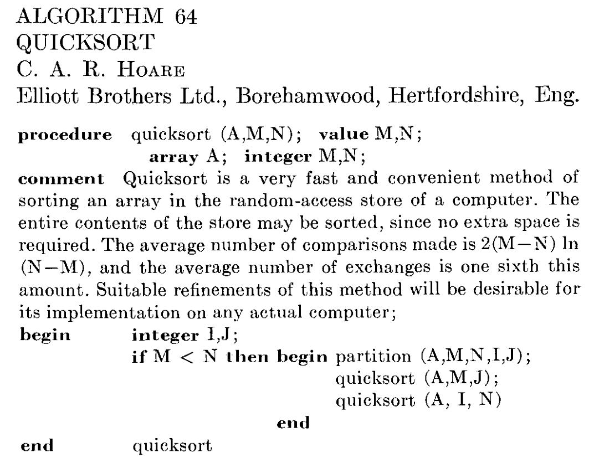

#+title: Models of computation
#+subtitle: Advanced Data Structures -- Summer 2026 -- Lecture 1
#+author: Ragnar Groot Koerkamp
#+hugo_section: teaching
#+filetags: @teaching
#+OPTIONS: ^:{} num: num:0 toc:0
#+toc: headlines 1
#+hugo_front_matter_key_replace: author>authors
#+date: <2026-04-20 Mon 14:00>

#+reveal_theme: white
#+reveal_extra_css: /css/slide.min.css
#+reveal_extra_css: /css/kit.min.css
#+reveal_init_options: width:1920, height:1080, margin: 0.06, minScale:0.2, maxScale:2.5, disableLayout:false, transition:'none', slideNumber:'c/t', controls:false, hash:true, center:false, navigationMode:'linear', hideCursorTime:2000
#+REVEAL_PLUGINS: (notes highlight)
#+REVEAL_HIGHLIGHT_CSS: /css/vs.min.css
#+reveal_reveal_js_version: 4

#+REVEAL_TITLE_SLIDE: <h1>%t</h1>
#+REVEAL_TITLE_SLIDE: 
%s

#+REVEAL_TITLE_SLIDE: <h2 class="author">Ragnar {Groot Koerkamp}, Stefan Walzer, Stefan Hermann</h2>
#+REVEAL_TITLE_SLIDE: <h2 class="date">%d</h2>
#+REVEAL_TITLE_SLIDE: <a class="source" href="https://curiouscoding.nl/teaching">curiouscoding.nl/teaching</a>
#+REVEAL_TITLE_SLIDE: </img>
#+REVEAL_TITLE_SLIDE: </img>

# UPDATE
#+reveal_slide_footer: April, 2026 Ragnar Groot Koerkamp: Models of Computation </img>

# For slides only!
# UPDATE and create Dir
#+reveal_export_file_name: ../../static/teaching/models-of-computation/slides/index.html

#+MACRO: note @@html:$1@@

# Export using C-c C-e R R

#+begin_export html

#+end_export

# -------------------------------------------------

* Today
- Why do we care about models?
- Big-\(O\) notation
- The complexity of sorting
- Properties data structures
- The word RAM model
  - Variations
  - Limitations

* Motivation
#+reveal: split:t

We want to design fast algorithms, but when is an algorithm /fast/?
- Implement it, and /measure/ the time.
  - Extrapolate experiments to predict performance on larger $n$.
  - May or may not give understanding.
  - Does not provide lower bounds. 
- Analyse exactly what happens on the CPU.
  - Unwieldy; they are massive black boxes.
- Instead: use a simplified abstract /model/ of the CPU.
  - Allows exact lower and upper bounds.

* Big-O notation (recap)

#+reveal: split:t

Big-$O$, or $\mathcal O$ notation relates the asymptotic growth of two abstract
functions to each other.

#+begin_definition Big-O :label bigo
Given two functions $f, g: \mathbb N \to \mathbb R_{\geq 0}$, we say that
\begin{align*}
f(n) &= O(g(n)), \text{ or }\\
 f(n)&\in O(g(n))
\end{align*}
when there exists constants $n_0\in \mathbb N$ and $M\in \mathbb R$ such that for all sufficiently
large $n\geq n_0$:
$$ f(n) \leq M\cdot g(n).$$
#+end_definition

#+begin_example
\begin{align*}
n &= O(n)
&
\ln n &= O(\sqrt n)
\\
n &= O(n^2)
&
(\lg n)^{100}\cdot n &= O(n^{1.0001})
\\
1/n &= O(1)
&
\ln n! &= n \lg n - n + O(\lg n) = O(n \lg n)
\end{align*}
#+end_example

#+reveal: split

#+begin_definition Extended notation
- $f(n) = o(g(n))$ is like $<$: $$\lim_{n\to\infty} f(n)/g(n) \to 0.$$
- $f(n) = O(g(n))$ is like $\leq$: $$f(n) \leq M\cdot g(n) \quad \forall n\geq n_0.$$
- $f(n) = \Theta(g(n))$ is like $=$: $$f(n) = O(g(n)) \text{ and } g(n) = O(f(n)).$$
- $f(n) \sim g(n)$ is a stronger $\Theta$: $$\lim_{n\to\infty} f(n)/g(n) = 1.$$
- $f(n) = \Omega(g(n))$ is like $\geq$: $$f(n) \geq M\cdot g(n) \quad \forall n\geq n_0.$$
- $f(n) = \omega(g(n))$ is like $>$: $$\limsup_{n\to\infty} f(n)/g(n) \to \infty.$$
#+end_definition

* Quiz time!
** What is the complexity of sorting?

#+reveal: split:t

- $O(n \lg n)$?
# - $O(n \lg \lg n)$?
- $O(n \lg w)$?
- $O(n \sqrt {\lg n})$?
- $O(n \sqrt {\lg \lg n})$?
- Linear $O(n)$?
- Constant $O(1)$?
- Something else?

#+reveal: split:t
All of the above!

#+attr_html: :class two-col
- $O(n \lg n)$
  - Minimum number of /comparisons/ is $\Omega(n \lg n)$.
  - Merge sort indeed uses $O(n \lg n)$ of them.
  - Or QuickSort, with $O(n \lg n)$ comparisons /in
    expectation/.
- $O(n \lg w)$
  - Expected complexity of Van Emde-Boas trees
    
    [cite:@van-emde-boas-trees].
- $O(n \sqrt {\lg n})$
  - Fusion trees [cite:@fusion-trees] 
- $O(n \sqrt {\lg \lg n})$, $O(n\sqrt{\lg w})$
  - Fastest /randomized/ algorithm  
    
    [cite:@integer-sorting-n-sqrt-log-log-n-time]
- Linear $O(n)$
  - Linear /space/? Sure!
  - Counting sort when all values are $O(n)$.
  - Radix sort on 64-bit integers.
  - Randomized when $w \geq (\lg n)^{2+\varepsilon}$

    [cite:@sorting-in-linear-time]
- Constant $O(1)$
  - $n \leq 2^{64}$ makes $f(n)$ bounded.
  - There's only so many atoms in the universe.
# - $O(n \lg \lg n)$
#   - /randomized/ algorithm [cite:@sorting-in-linear-time]

    
#+reveal: split

#+caption: Algorithm 64: Quicksort [cite:@quicksort]. RIP Tony Hoare.
#+attr_html: :src /ox-hugo/quicksort.png

** "Complexity"
#+reveal: split:t

#+attr_html: :class two-col
- Lower or upper bound?
  - Complexity of a /problem/ is at least $\Omega(\dots)$.
  - Complexity of an /algorithm/ at most $O(\dots)$.
  - "The complexity": matching lower and upper bound.
- Which metric?
  - "Operations"
  - Comparisons
  - Memory accesses
  - Memory touched
  - Wall time
  - Space usage
- What input type?
  - Integers
  - Floats
  - Abstract "/objects/"
- What input properties?
  - (Uniform?) random
  - Worst-case
- What algorithmic properties?
  - Deterministic
  - Randomized
* Properties of data structures
** Space usage

Let $S$ be the minimum space required to represent some data.
#+begin_definition Compact data structure
A /compact/ data structure uses $O(S)$ bits of space.
#+end_definition

#+begin_definition Succinct data structure
A /succinct/ data structure uses $S + o(S)$ bits of space.
#+end_definition

Example: many Rank & Select data structures are succinct.

#+begin_definition Implicit data structure
An /implicit/ data structure uses $S + O(1)$ bits of space.
#+end_definition

Example: bit arrays.

** Dynamic data structures

#+begin_definition Dynamic data structure
Allows mutating the structure.
#+end_definition

Example: hash tables.

#+begin_definition Static data structure
Build once, then read-only queries.
#+end_definition

Example: minimal perfect hash functions.

#+begin_definition Incremental data structure
Insert-only; deletions not allowed.
#+end_definition

Example: bloom filters.

** Running time
From stronger to weaker:
#+begin_definition Worst-case running time
An algorithm has /worst-case/ running time $O(f(n))$ when for /every possible/
input, it is guaranteed to finishes in $O(f(n))$ time.
#+end_definition
#+begin_definition Expected running time
An algorithm has /expected/ running time $O(f(n))$ when for /every possible/
input, the /expected/ running time is $O(f(n))$.
#+end_definition
#+begin_definition Running time with high probability
An algorithm has running time $O(f(n))$ /with high probability/ (w.h.p.) when for /every possible/
input, the running time is $O(f(n))$ with probability $1-o(1)$.
#+end_definition

#+reveal: split:t

#+begin_definition Amortized running time
An operation on a data structure has /amortized/ running time $O(f(n))$ when for /every possible/
sequence of $i$ operations with amortized complexities $f_i$, the total
running time is $O(\sum_i f_i)$.
#+end_definition

Example: pushing on a vector is worst-case $O(n)$, but amortized $O(1)$.

* Models of computation
** The RAM model
#+begin_definition Random-access machine (RAM) model
Models a machine that has an /infinite/ list of /registers/.

- Each register can store an **unbounded (!)** natural number!
- Each register has an /address/.
- Retrieving the register corresponding to an address takes constant time. 
#+end_definition

#+begin_myquestion
Any problems with this?
#+end_myquestion

#+begin_answer :skip t
Infinite memory, infinite registers, and constant-time access are strong assumptions.
#+end_answer

** The /real/ RAM model
#+begin_definition 
Like the RAM model, but each register can store a /real/ number.
#+end_definition

** The /word/ RAM model
#+begin_definition 
Like the RAM model, but operates on /words/ of $w$ bits.
- Registers are also $w$ bits.
- Constant-time \(w\)-bit arithmetic operations:
  - bit-operations, addition, multiplication.
Evolved with CPUs to include:  [[https://en.wikipedia.org/wiki/X86_Bit_manipulation_instruction_set][{{{note(https://en.wikipedia.org/wiki/X86_Bit_manipulation_instruction_set)}}}]]
  - Popcount (=popcnt=), count trailing zeros (=tzcnt=, BMI1)
  - Parallel bit deposit (=pdep=), parallel bit extract (=pext=, BMI2)
#+end_definition

Most commonly used model.

#+begin_myquestion
Any remaining problems with /this/?
#+end_myquestion

#+begin_answer :skip t
Word RAM still assumes constant-time access. Constant time \(w\)-bit multiplication?
#+end_answer

** We must talk about $w$
#+reveal: split:t

- In practice, $w=64$ is constant.
- But the problem size $n$ grows to infinity.
- What if $n > 2^w$? Then we can't even represent $n$?

#+attr_reveal: :frag t
Solution: we assume
$$ \lg n \leq w. $$
This has far-reaching implications!

#+attr_reveal: :frag t
- The complexity of pop-counting $n$ bits is *sub-linear* $O(n / \lg n)$!
- Fusion trees can binary search on $O(\sqrt w)$ \(w\)-bit integers in /constant/ $O(1)$
  time!

** The pointer model
#+begin_definition Pointer model
RAM-model without the RAM:
- Registers can only be accessed via direct pointers.
#+end_definition

Used in the analysis of some heap-based priority queues.

** The cell-probe model
#+begin_definition Cell-probe model
Like the RAM-model, but all operations apart from accessing memory are free.
#+end_definition

- Typically, an infinite cache is assumed, so that each address only has to be
  read once.
- Used for lower bounds on the number of addresses that must be read
  to solve some task, and thus a lower bound on RAM-model complexity.

** The RAM-model is unphysical
#+reveal: split:t
- Infinite memory with constant time access is fundamentally not possible:
  - Each bit takes some small volume $v$ to store.
  - Signals can only travel at the speed of light $c$.
  - In time $t$, we can read from a sphere of radius $tc$, containing
    $$\frac 43 \pi (tc)^3/v = \Theta(t^3)\quad \text{ bits}.$$

#+begin_observation Latency
The /latency/ of a uniform random access into a memory of size $n$ is at least
$$\Omega(\sqrt[3]{n}).$$
#+end_observation

** The RAM-model is unphysical (2)
#+reveal: split:t
- Black holes have only /quadratic/ mass $\Theta(r^2)$!
  - Filling a volume with cubic information is /impossible/.
  - But we are far away from the constant.
- If each bit of memory requires some energy, we need to dissipate $\Theta(r^3)$
  heat through $\Theta(r^2)$ of surface area.
  - This is an actual bottleneck for CPUs! They are mostly flat (2.5D) for a reason!
    - AMD now has "3D V-Cache" which vertically stacks caches.

#+begin_observation Black holes and cooling (handwavy)
We can store/cool at most $O(r^2)$ bits in a sphere of radius $r$, and so the /latency/ of a uniform random access into a memory of size $n$ is at least
$$\Omega(\sqrt[2]{n}).$$
#+end_observation

- See this blog: [[https://www.ilikebigbits.com/2014_04_21_myth_of_ram_1.html][The Myth of RAM]]

** The RAM-model is unrealistic

#+attr_html: :src /ox-hugo/bs-3.svg :class float-right
[[file:../../slides/p99/bs-plots/bs-3.svg]]

- Green: latency of array indexing.
  - Clearly not $O(1)$!
  - More like $\sqrt[3] n$ (dashed blue)

- Black: latency of binary search.
  - Clearly not $O(\lg n)$ (solid blue)

- Red: binary search with heap-layout
  - $<3\times$ slower than just indexing?!

$\sqrt[3]{1} + \sqrt[3]{2}+\dots+\sqrt[3]{n} = \Theta(\sqrt[3]n)$.

- *TODO:* \(\sqrt n\)-complexity model!
    
** The I/O-complexity
Introduced by [cite/t:@io-complexity-sorting].
#+begin_definition I/O-complexity
Like the cell-probe model, the I/O-complexity only counts I/O operations.
- Fast and free /internal/ memory of $M$ words.
- Slow (infinite) /external/ memory.
- Count I/O-operations between them go in /blocks/ of $B$ words.
#+end_definition

#+begin_theorem I/O-complexity of sorting 
Sorting $n$ word-sized integers has an I/O-complexity lower-bound of
$$
\Omega\left(\frac n B \log_{M/B} \frac nB\right),
$$
and external merge-sort achieves this.
#+end_theorem

# TODO: Cache-oblivious

* Takeaways
#+begin_observation 
We need precisely defined models to theoretically analyse algorithms.
#+end_observation
#+begin_observation 
Models approximate reality; some do so better than others.
#+end_observation

The rest of this course will mostly use the *word RAM model* to analyse both
theoretically and practically efficient algorithms.

* Further reading
- These slides: [[https://curiouscoding.nl/teaching][curiouscoding.nl/teaching]]
- Algorithmica on binary search:
  - https://en.algorithmica.org/hpc/data-structures/binary-search/
  - Great resource for understanding and optimizing for modern CPUs
- Paper: Array layouts for comparison-based searching [cite:@khuong-array-layouts]
- Blog: The Myth of RAM
  - https://www.ilikebigbits.com/2014_04_21_myth_of_ram_1.html
- My P99 talk on binary search
  - https://curiouscoding.nl/slides/p99/
  - [[https://www.youtube.com/watch?v=B9--hyQhka8][recording on youtube]]
- Aggarwal and Vitter's slides on I/O-complexity:
  - https://jshun.csail.mit.edu/6886-s19/lectures/lecture5-1.pdf

* Next week: [[../../rank-select/slides/][Bitvectors, Rank, & Select]]

* Bibliography

#+print_bibliography:

# Local Variables:
# eval: (toggle-org-reveal-export-on-save)
# End:
