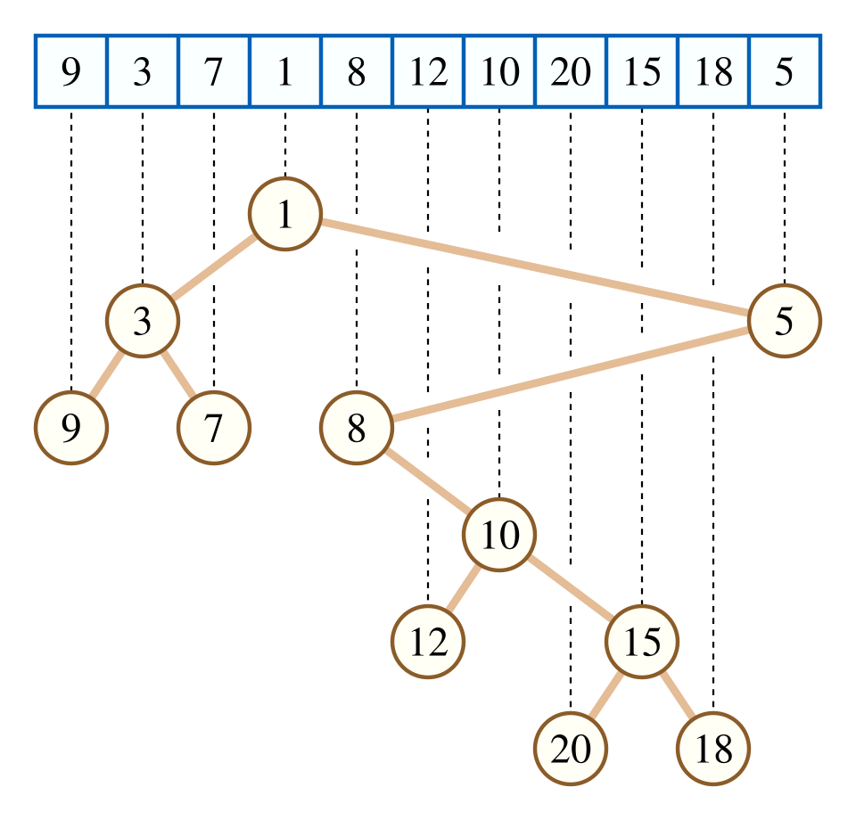
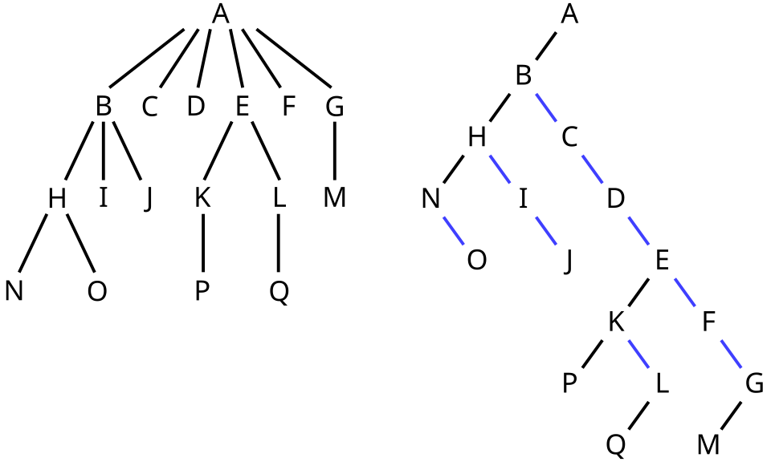
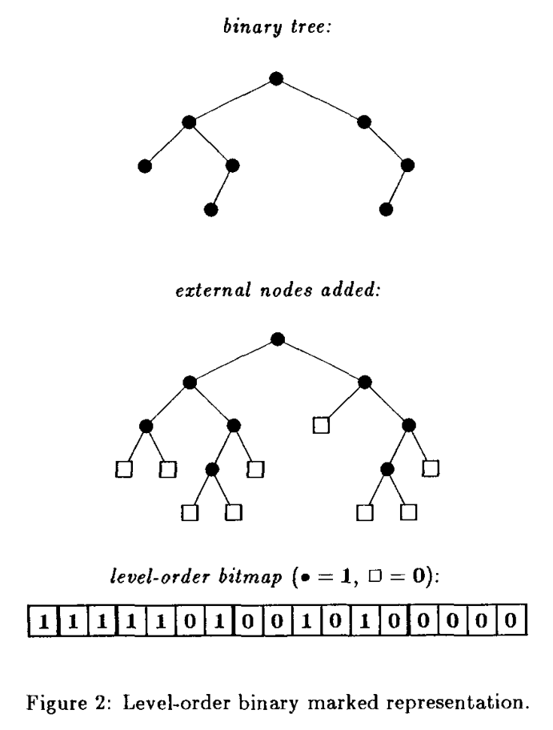
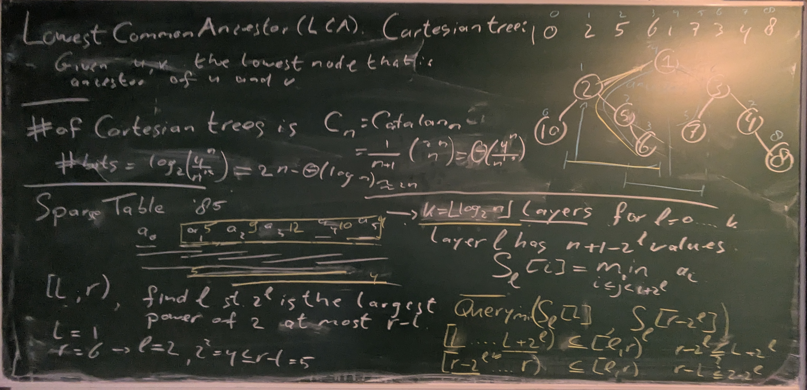
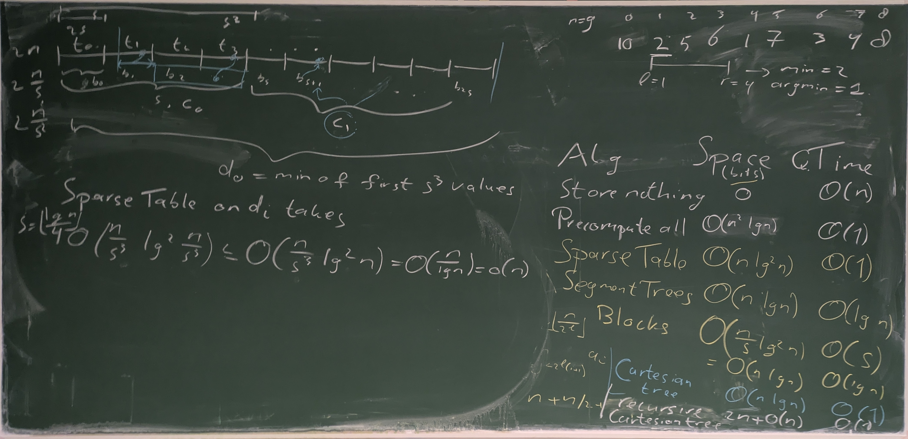
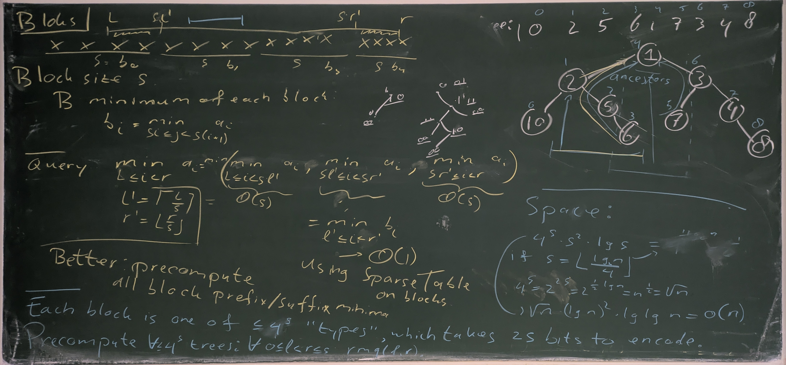

#+title: Range Minimum Queries
#+hugo_section: teaching
#+filetags: @survey data-structure
#+OPTIONS: ^:{} num: num:t
#+hugo_front_matter_key_replace: author>authors
#+hugo_paired_shortcodes: %notice %detail
#+toc: headlines 3
#+hugo_level_offset: 1
#+date: <2026-05-11 Mon>

$$
\DeclareMathOperator*{\argmin}{arg\,min}
\newcommand{\rmq}{\mathsf{rmq}}
$$

These notes are based on slides by Florian Kurpicz and the paper by
[cite/t:@rmq] that introduces a number of optimal implementations.

#+begin_definition Range Minimum Query (RMQ)
Given a list of $n$ values $A=(a_0, \dots, a_{n-1})$, build a data structure that can
answer queries $[l,r)$ ($0\leq l < r\leq n$):
$$
\rmq(l, r) = \argmin_{l\leq i< r}(a_i).
$$
Note that this returns the /index/ of the minimum.
For convenience, we assume throughout that ties are broken to the left (smaller index).
#+end_definition

The goal is to have $O(1)$ queries while using as little space as possible.

There are two variants:
1. systematic schemes: where the data structure has access to $A$, and
2. nonsystematic schemes: where it does not have access to $A$. 
Additionally there is the /offline/ setting where the queries are given in
advance and can be processed as a batch. Here, we only consider the /online/ setting.

One last remark is that the values $a_i$ might take $\omega(w)=\omega(\ln n)$
bits per element. For methods that normally store values $a_i$ internally, a
workaround is to /compress/ the values into the range $[n]$ so that they can be
stored in a single word.

* Naive 

** Compute on-the-fly
The simplest option is to simply take $A$, and answer all queries on-the-fly.
- Space overhead: $0$.
- Query time: $O(n)$.
** Precompute everything
A second option is to precompute all $\binom{n+1}2$ answers $\rmq(l,r)$.
Since each $\rmq$ value is between $1$ and $n$, they take $\log n$ bits to store,
regardless of the number of bits required by each $a_i$.
- Space overhead: $\binom{n+1}2 = O(n^2)$ words, or $O(n^2 \log n)$ bits.
- Query time: $O(1)$.

Note first that from here on, we will measure space overhead in /bits/, and
second, that we will avoid using $O()$ for the leading term.

* Space lower bounds
Before we continue, let's consider space /lower/ bounds, so we have an idea
of how close to optimal the upcoming data structures are.

First, we show the following theorem (first stated in
[cite/t:@static-trees-and-graphs], who also introduced succinct data structures):
#+begin_theorem Space lower bound
A nonsystematic data structure must use at least $2n - \Theta(\log n)$ bits.
#+end_theorem

As a first note, we need at least $n-1$ bits to store for each pair $(a_i,
a_{i+1})$ whether $a_i \leq a_{i+1}$ or $a_i>a_{i+1}$, since this information is
needed to answer queries $\rmq(i, i+1)$.

More generally, we can use the $\rmq$ values to reconstruct the /cartesian/
tree ([[https://en.wikipedia.org/wiki/Cartesian_tree][wikipedia]]):

We can use $\rmq(1,n)=i$ to find the smallest element in the array.
Then, we can use $\rmq(1, i-1)$ to find the smallest element left of it (if
$i>1$) and $\rmq(i+1, n)$ to find the smallest element right of it (if $i < n$).

*Cartesian trees.*
The Cartesian tree is the binary tree we get by repeating this process
recursively, where nodes are numbered in-order from left to right.
Specifically, the Cartesian tree fully encodes the $\rmq$ answers: $\rmq(i,j)$
is (the label of) the /lowest common answer/ of nodes $i$ and $j$.

This also implies that any two different trees correspond to different $\rmq$ answers:
given two distinct trees, compare them recursively starting at the root. As soon
as a node has a different label in the two trees, that means the $\rmq$ of the
interval of the corresponding subtrees differs in the two cases.

Thus, the $\rmq$ answers are in bijection with Cartesian trees, and the number
of bits we need to encode all $\rmq$ values is the log of the number of
Cartesian trees.

*Binary trees.*
Cartesian trees are simply binary trees wit an in-order numbering of the nodes.
Binary trees are in bijection with the /ordered rooted trees/ we saw before
([[https://en.wikipedia.org/wiki/Left-child_right-sibling_binary_tree][wikipedia]]):

In the binary tree, each edge to the left introduces a child, while each edge to
the right means the two nodes are siblings.

As we already saw before, the number of ordered trees on $n$ nodes is the
Catalan number
$$
C_n := \frac 1{n+1} \binom{2n}n \sim \frac{4^n}{n^{3/2}\sqrt \pi}.
$$
Thus, the number of Cartesian trees is the same and the number of bits needed to
represent one is
$$\log_2 C_n = 2n - \Theta(n).$$

So the goal is: RMQ with $2n$ bits and constant-time queries.

As an aside, [cite/t:@rmq] show that if we have access to $A$, we can trade
space for query time and have $2n/c(n)$ bits of space with query-time $O(c(n))$.
Basically, we can split $A$ in blocks of size $c(n)$, build the RMQ data
structure on the $n/c(n)$ blocks in $2n/c(n)$ bits, and then use $A$ to find the
minimum of each block in $c(n)$ time.

* Sparse Table: $O(1)$ queries, $O(n \log_2 n)$ words
- Let $k = \lfloor \log_2 n \rfloor$.
- Store a tree of $k+1$ levels $0, \dots, k$.
- In level $\ell$, store $n+1-2^\ell$ values for $0\leq i < n+1-2^\ell$,
  each storing the minimum over a (sliding) /window/ of length $2^\ell$:
  $$S_\ell[i] := \min_{i\leq j < i + 2^\ell} a_i.$$
- To answer a query $[l,r)$, first find the largest power $2^\ell$ that is at
  most $r-l$.
  Then we have
  $$l \leq r-2^\ell \leq l + 2^\ell \leq r,$$
  i.e., the intervals $[l, l+2^\ell)$ and $[r-2^\ell, r)$ together cover
  $[l, r)$. Thus, we get:
  $$\min_{l\leq i< r} a_i = \min(S_\ell[l], S_\ell[r-2^\ell]).$$

- To get the /index/ of the minimum, store that instead, and take the argmin
  over the two indices returned by the two lookups.
  
* Segment Tree: $O(\log n)$ queries, $O(n)$ words
Sparse tables are quire redundant since consecutive nodes store mostly the same
information.
/Segment trees/ reduce the space usage, but have slower query times.
- Again, use $k=\lfloor \log_2 n\rfloor$ and make levels $\ell\in\{0, 1, \dots, k\}$.
- Level $\ell$ has $\lfloor n/2^\ell\rfloor$ nodes, each storing the
  minimum over a /chunk/ of length $2^\ell$:
  $$S_\ell[i] := \min_{i\cdot 2^\ell \leq j < (i + 1)\cdot 2^\ell} a_j.$$
- To query an interval $[l, r)$, we check for each level whether to include a
  segment from that level or not.
  - If $l$ is odd, use $S_0[l]$ and then increment $l$ by $1$.
  - If $r$ is odd, use $S_0[r-1]$ and then decrement $r$ by $1$.
- Then:
  - if $l\bmod 4 = 2$, use $S_1[l/2]$ and increment $l$ by $2$.
  - if $r\bmod 4 = 2$, use $S_1[r/2-1]$ and decrement $r$ by $2$.
- Then:
  - if $l\bmod 8 = 4$, use $S_1[l/4]$ and increment $l$ by $4$.
  - if $r\bmod 8 = 4$, use $S_1[r/4-1]$ and decrement $r$ by $4$.
- Continue this with increasing powers of $2$, until $l=r$.

In practice, the segment tree admits a nice linear data layout where the data of
all levels is concatenated.

* Blocks: $O(s)$ queries, $O(n/s \log n)$ words
A technique we've seen before with rank & select is to use a simple but
space-consuming technique on a sufficiently sparse subset of the data.
Here we can do the same:
- Split the data into $n/s$ /blocks/ of size $s$:
  $$b_i := \min_{i\cdot s \leq j < (i+1)\cdot s} a_i.$$
- Store a sparse table over the $b_i$, consuming $O(n/s \cdot \log(n/s)) \leq
  O(n/s \log n)$ words.
- To answer a query $[l, r)$, compute $l'=\lceil l/s\rceil$ and $r'=\lfloor
  r/s\rfloor$. Then return
  $$\min_{l\leq i < r}a_i = \min_{l\leq i < l'\cdot s} a_i +
  \min_{l'\leq i' < r'} b_{i'} +
  \min_{r'\cdot s\leq i < r} a_i.$$
- This takes $O(s)$ for computing the minimum of the suffix of the first block
  and the minimum of the prefix of the last block, and $O(1)$ for the
  sparse-table lookups for the middle.
- If $s=\log_2 n$, this gives (like the segment tree) $O(\log n)$ queries and
  $O(n)$ memory.
- Storing the suffix and prefix minima of each block takes $2n$ words, which
  fits in the $O(n)$ budget. That makes most queries $O(1)$, apart from those
  where $[l, r)$ is contained entirely within a single block.

* Cartesian Trees: $O(1)$ queries, $O(n)$ words
Cartesian trees can be used to efficiently answer the within-block queries.
- As we saw before, there are $o(4^s)$ possible Cartesian trees (and thus sets
  of possible answers) for a block of size $s$.
- Choosing $s=\frac 12 \log_4 n = \frac 14 \log_2 n$, there are $\sqrt n$
  different cartesian trees.
- We can now do the same trick as we saw before for popcount:
  - there are $4^s = o(\sqrt n)$ trees;
  - for each, there are $\binom{s+1}2 = O(s^2) = O(\log^2 n)$ possible queries;
  - the /position/ of the minimum takes $\log_2 s = O(\log \log n)$ bits to
    store
  for a total precomputation space of
  $$4^s s^2 \log_2 s = O(\sqrt n \cdot \log^2 n \cdot \log\log n) = o(n).$$
- All that remains is to store for each block its "shape" (see below): a \(2s\)-bit string
  encoding its Cartesian tree. When storing these in a "bitpacked vector", this
  takes a total of $2s \cdot n/s = 2n$ bits, exactly matching the lower bound!
- When used in combination with the block-based sparse table above, we can also
  use the Cartesian trees for the precomputed index of the prefix/suffix
  minimum.
  
*Encoding Cartesian Trees.*
As we saw before, the number of Cartesian trees on $n$ nodes is the Catalan
number $C_n = \frac 1{n+1}\binom {2n} n \leq 2^{2(s-1)}$. Thus, $2(s-1)$ bits
suffice to encode it, but here we will use $2s$ instead.

We already saw that Cartesian trees are simply (non-balanced!) binary trees.
Binary trees can be encoded in /many/ ways:
- by using the bijection to ordered trees and using a method from last lecture (LOUDS/DFUDS/BS).
- by extending the tree with leaves so that all original nodes have degree 2,
  and then traversing the tree in BFS or DFS order, writing 1 for each internal
  node and 0 for each leaf.
  #+caption: Figure from [cite/t:@static-trees-and-graphs]
  
- Or maybe simplest: by writing for each node whether it has a left child (1
  or 0) and whether it has a right child (1 or 0) and then traversing the tree
  in DFS or BFS order.

*Overview.*
All-together, we store:
- precomputed query answers for all Cartesian trees in $o(n)$ bits total;
- for each block, its Cartesian tree in $2n$ bits total;
- the sparse table on block-minima, in $O(n/s \cdot \log n) = O(n)$ words.
Thus, the sparse table is the largest part.

* Recursive Cartesian Trees: $O(1)$ queries, $2n+o(n)$ bits
To reduce the space from $O(n)$ words, we need to make the blocks larger so that
the sparse table is smaller.
To this effect, we can use the Cartesian tree technique recursively on the
block-minima $b_i$ (see section 3.3 of [cite/t:@rmq]), but repeated recursion
would not give constant queries.

Applying the recursion once, that is, effectively using a sparse table on blocks
of size $s^2$, makes it use $O(n/s^2 \log(n/s^2)) \leq O(n / \log^2 n  \log n)
= O(n /\log n)$ /words/ of space, or $O(n)$ /bits/.

Using the recursion one more time, for a total of three layers of Cartesian
trees, yields $O(n/s^3 \log(n/s^3)) \leq O(n/\log^3 n \log n) = O(n/\log^2 n)$
words, or $O(n / \log n) = o(n)$ bits of space, for $2n + o(n)$ bits of space
all together! Most bits are used to store the type of the Cartesian trees at the
root level.

One thing to note is that 'unpacking' the answer requires multiple steps now:
if the recursive tree gives a minimum in block $b_i$, then we must get the type
of that block and do a lookup to find the position of the minimum inside the block.

* Blackboard

#+attr_html: :class blackboard
[[file:./blackboard-rmq-1.jpg]]
#+attr_html: :class blackboard

#+attr_html: :class blackboard

#+attr_html: :class blackboard

#+print_bibliography:
