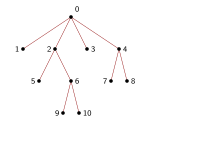
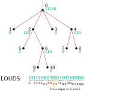
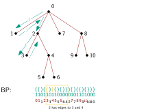
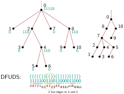
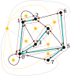
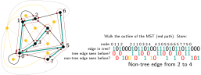
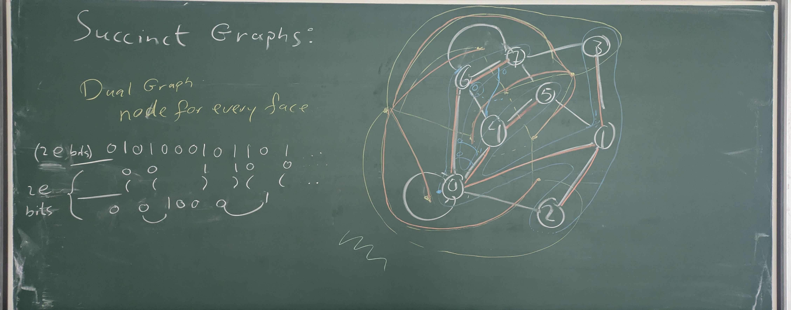

#+title: Succinct trees
#+subtitle: Advanced Data Structures -- Summer 2026 -- Lecture 3
#+author: Ragnar Groot Koerkamp
#+hugo_section: teaching
#+filetags: @teaching
#+OPTIONS: ^:{} num: num:0 toc:0
#+toc: headlines 1
#+hugo_front_matter_key_replace: author>authors
#+date: <2026-05-04 Mon 14:00>

#+reveal_theme: white
#+reveal_extra_css: /css/slide.min.css
#+reveal_extra_css: /css/kit.min.css
#+reveal_init_options: width:1920, height:1080, margin: 0.06, minScale:0.2, maxScale:2.5, disableLayout:false, transition:'none', slideNumber:'c/t', controls:false, hash:true, center:false, navigationMode:'linear', hideCursorTime:2000
#+REVEAL_PLUGINS: (notes highlight)
#+REVEAL_HIGHLIGHT_CSS: /css/vs.min.css
#+reveal_reveal_js_version: 4

#+REVEAL_TITLE_SLIDE: <h1>%t</h1>
#+REVEAL_TITLE_SLIDE: 
%s

#+REVEAL_TITLE_SLIDE: <h2 class="author">Ragnar {Groot Koerkamp}, Stefan Walzer, Stefan Hermann</h2>
#+REVEAL_TITLE_SLIDE: <h2 class="date">%d</h2>
#+REVEAL_TITLE_SLIDE: <a class="source" href="https://curiouscoding.nl/teaching">curiouscoding.nl/teaching</a>
#+REVEAL_TITLE_SLIDE: </img>
#+REVEAL_TITLE_SLIDE: </img>

# UPDATE
#+reveal_slide_footer: April, 2026 Ragnar Groot Koerkamp: Rank & Select </img>

# For slides only!
# UPDATE and create Dir
#+reveal_export_file_name: ../../static/teaching/succinct-trees/slides/index.html

#+MACRO: note @@html:$1@@

# Export using C-c C-e R R

#+begin_export html

#+end_export

# -------------------------------------------------

* Previous slides: [[../../rank-select/slides/][Rank & Select]], [[../../elias-fano/slides/][Elias-Fano]]
- Rank: counting 1 bits
  - 2 levels of blocks of length $\log^2 n$ and $\log n$
- Select: finding 1 bits
  - 2 levels of blocks with $\log^2 n$ 1-bits and $\sqrt{\log n}$ 1-bits.
- There exist succinct $o(n)$ space data structures for rank and select.
- Elias-Fano: efficient encoding of sorted list of integers
  - Split in high and \(\ell\)-bit low part; $\approx 0.5$ bit/elem overhead.
  - Encode high parts using /stars & bars/: \\
    1 for each element, 0 each time a multiple of $2^\ell$ is crossed.
  
* Today: Succinct representation of trees
A.k.a.: applications of rank and select.
- What is a tree?
- How many trees on $n$ nodes are there?
- How do we encode the tree?
  - 3 options: LOUDS (BFS),
  - balanced parentheses (in-order DFS),
  - DFUDS (pre-order DFS)
- Operations on trees
  - degree, parent, $i$'th child, subtree size

Application: [[https://www.reddit.com/r/rust/comments/1qleizg/succinctly_a_fast_jqyq_alternative_built_on/][in-place json parsing]]

* Ordered trees
#+begin_definition 
An /ordered tree/ is a tree with:
- $n$ nodes, $n-1$ edges,
- a single root,
- an order on the children of each node.
#+end_definition

#+begin_myquestion
How many ordered trees are there at least? At most?
#+end_myquestion

* Bijection to balanced parentheses
#+begin_theorem  Balanced parentheses
There is a bijection between ordered trees on $n$ nodes and /balanced
parentheses (BP) sequences/ of $n-1$ "(" and ")", where each "(" has a matching ")".
#+end_theorem
#+begin_proof
#+attr_reveal: :frag t
"Trace" the outline of the tree in DFS-order: each time an edge goes down, write "(", and
each time an edge goes up, write ")".
#+end_proof
* Upper bound
#+begin_theorem  Upper bound
There are $o(4^n)$ ordered trees on $n$ nodes.
#+end_theorem
#+begin_proof
#+attr_reveal: :frag t
The number of BP sequences is at most
$$\textsf{#trees} \leq \binom{2(n-1)}{n-1} = \Theta\left(\frac{2^{2n}}{\sqrt n}\right).$$
Or simpler: each of the $2(n-1)$ positions is =(= or =)=, giving $\leq
2^{2(n-1)}< 4^n$.
#+end_proof

* Lower bound
#+begin_theorem Lower bound
There are $\Omega(4^n/n^{1.5})$ ordered trees on $n$ nodes.
#+end_theorem
#+begin_proof
#+attr_reveal: :frag t
Partition the $\binom{2(n-1)}{n-1}$ possible BP sequences in equivalence classes
under rotation of the string.
Take a random element of any class. Find the prefix with the largest
value of $\mathsf{count}_)(i) - \mathsf{count}_((i)$, and consider the rotation
starting after this prefix. This is a BP.
Thus, each class has size $\leq 2(n-1)$, and contains at least one BP:

#+attr_reveal: :frag t
$$\textsf{#trees} \geq \frac 1{2(n-1)}\binom{2(n-1)}{n-1} = \Omega\left(\frac{2^{2n}}{n^{1.5}}\right).$$
#+end_proof

* Space lower bound
#+begin_theorem 
We need at least
$$\frac 1n\log_2(4^n/n^{1.5}) = 2 - o(1)$$
bits per node, and this is tight.
#+end_theorem

#+begin_problem Goal for the lecture
Represent trees using $2 + o(1)$ bits per node, while
supporting common operations.
#+end_problem

* Aside: Catalan numbers
#+begin_theorem 
The /exact/ number of ordered trees on $n$ nodes is the /Catalan number/:
$$
C_{n-1} := \frac1{n} \binom{2(n-1)}{n-1} \sim \frac{4^{n-1}}{n^{3/2} \sqrt \pi}.
$$
#+end_theorem

* Aside: Bijection to binary trees
#+begin_example left-child right-sibling binary tree
- Bijection between ordered trees and binary trees.
- Given a binary tree, transform it to an ordered tree like this:
- a /left/ child of a node is a /child/ in the ordered tree.
- a /right/ child of a node is a /sibling/ in the ordered tree.
#+end_example

#+attr_html: :class float :style width:50% :src /ox-hugo/tree-example.svg

 
* Level Ordered Unary Degree Sequence (LOUDS)
#+begin_definition 
Start with =10=.
Then append the degree of each node in level/BFS order in unary:
1 for each child, and then a 0.
#+end_definition

#+begin_example
=10111100110011001100000= \\
=0_123401562378459067890=

- 1: /introduce/ node as child.
- 0: end the list of children of the node.

$2n+1$ bits:
- a 1 to add the node as child,
- an 'end' marker 0 for each node,
- an extra 0.
#+end_example

#+attr_html: :class float-right :style max-height:45%;top:50%;right:10% :src /ox-hugo/louds.svg

** Operations
#+begin_myquestion
How to implement operations:
- degree,
- $i$'th child,
- parent,
- subtree size.
#+end_myquestion

# Other possible operations:
# - depth,
# - lowest common ancestor (LCA),
# - rank (pre- or post-order),
# - ...

#+begin_example
=10111100110011001100000= \\
=0_123401562378459067890=
#+end_example

$$
\newcommand{\rank}{\mathsf{rank}}
\newcommand{\select}{\mathsf{select}}
$$

#+attr_html: :class float-right :style max-height:70%;top:0%;right:-10%;background:white;padding:1em :src /ox-hugo/louds.svg

** Implementing the operations

#+begin_example
=10111100110011001100000= \\
=0_123401562378459067890=
#+end_example

#+attr_html: :class float-right :style max-height:60%;top:0%;right:-10%;background:white;padding:1em :src /ox-hugo/louds.svg

#+begin_definition
Number nodes $0$ to $n-1$ in level/BFS-order.
#+attr_reveal: :frag t
- Position of 0 of $u$: $p_0(u):=\select_0(u+1)$
- Position of 1 of $u$: $p_1(u):=\select_1(u)$
- Children of $u$: position $\select_0(u)+1$ to $\select_0(u+1)$
- Degree of $u$: $\select_0(u+1) - \select_0(u) - 1$.
- $i$'th child of $u$: (number of children before $u) + i = \rank_1(\select_0(u)) + 1 + i$
- Parent of $u$: the node containing the $u$'th 1: $\rank_0(\select_1(u))-1$
  - Roughly inverse of $\mathsf{child}$
- Subtree size: hard; data is all over the place
#+end_definition

* Balanced Parentheses (BP)
#+begin_definition 
Traverse tree in DFS-order.
Write a =(= each time a node/subtree is first entered, and a =)= a node/subtree
is left.
#+end_definition

#+begin_example
#+attr_reveal: :frag t
=(()(()(()()))()(()()))= \\
=1101101101000101101000=  10 instead of ()\\
=0112334556642778990080=

#+attr_reveal: :frag t
- 1: /enter/ subtree
- 0: /leave/ subtree

#+attr_reveal: :frag t
$2n$ bits: a =(= and =)= for each node.\\
Note: the children of =a= are all over the place!\\
$\rank$ and $\select$ won't work here.
#+end_example

#+attr_html: :class float-right :style max-height:50%;top:34%;right:0%;background:white;padding:0.5em :src /ox-hugo/balanced-parentheses.svg

** Additional operations on BP
#+begin_definition 
- $\mathsf{findclose(i)}$: given =(= at pos $i$, get the position of the matching =)=.
- $\mathsf{findopen(i)}$: given =)= at pos $i$, get the position of the matching =(=.
- $\mathsf{enclose(i)}$: given =(= at pos $i$, get the position of the
  closest =(= left of it enclosing it.
#+end_definition

Can all be done in $O(1)$ time and $o(n)$ space

Implementation: See [cite/t:@fully-functional-succinct-trees]

** Implementing findclose and enclose
- Uses a segment tree (next week) over $\mathsf{excess}(i) = \rank_((i) - \rank_)(i)$.
  - matches depth in the tree
- $\mathsf{findclose}(i) = \min\{j > i: \mathsf{excess}(j)=\mathsf{excess}(i-1)\}$
- $\mathsf{findopen}(i) = \max\{j < i: \mathsf{excess}(i)=\mathsf{excess}(j-1)\}$
- $\mathsf{enclose}(i) = \max\{j < i: \mathsf{excess}(i)=\mathsf{excess}(j-1)+2\}$

- Each node of the segment tree stores the difference of ( and ) over its range,
  and the minimum depth node it contains.
    
- Further details omitted.

** Implementing the BP operations

#+begin_example
=(()(()(()()))()(()()))= \\
=1101101101000101101000=  10 instead of ()\\
=0112334556642778990080=
#+end_example

#+attr_html: :class float-right :style max-height:65%;top:10%;right:-10%;background:white;padding:0.5em :src /ox-hugo/balanced-parentheses.svg

#+begin_definition
Number nodes $0$ to $n-1$ in DFS-order.
#+attr_reveal: :frag t
- Position of ( of $u$: $p=\select_((u)$
- Subtree size of $u$: $(\mathsf{findclose}(p) - p + 1)/2$
- Parent of $u$: $\mathsf{enclose}(p)$
- Degree, $i$'th child: hard [cite:@fully-functional-succinct-trees] 
#+end_definition

* Depth-First Unary Degree Sequence (DFUDS)
#+begin_definition 
Start with =1=.
Then traverse the nodes in DFS order, and append for each its degree in unary:
a =1= for each child and then a =0=.

Then convert =1= to =(= and =0= to =)= to get a BP sequence.
#+end_definition

#+begin_example
=((((())(())(())))(()))= \\
=1111100110011000011000= \\
=0872101432365456790890=

- 1: /introduce/ node as child.
- 0: end the list of children of the node.

# Uses the equivalence to binary trees!

$2n$ bits: 1 to introduce each node,\\
0 to end the unary degree encoding of each node.
#+end_example

#+attr_html: :class float-right :style max-height:60%;top:30%;right:0%;background:white;padding:0.5em :src /ox-hugo/dfuds.svg

** Implementing the DFUDS operations

#+begin_example
=((((())(())(())))(()))= \\
=1111100110011000011000= \\
=0872101432365456790890=
#+end_example

#+attr_html: :class float-right :style max-height:45%;top:08%;right:0%;background:white;padding:0.5em :src /ox-hugo/dfuds.svg

#+begin_definition
#+attr_reveal: :frag t
- Start position of $u$: $\select_0(u-1)+1$. (Edge case $u=0$.)
- End position of 0 or ) of $u$: $q=\select_0(u)$
- Degree of $u$: $\select_0(u) - \select_0(u-1) - 1$. (Edge case $u=0$.)
- Start position of $i$'th child: position after the matching =)=: $\mathsf{findclose}(q-1-i)+1$
- Parent of $u$: inverse of child: get preceding ), then matching (, then succeeding ):
  $\select_0(\rank_0(\mathsf{findopen}(\select_0(u-1))))$
- Subtree size of $u$, starting at first bit $p$: find succeeding =)= that leaves the
  subtree:
  $(\mathsf{findclose}(\mathsf{enclose}(p)) - p)/2 + 1$
#+end_definition

* Compact planar graphs

#+attr_html: :class float-right :style max-width:50%;height:70% :src /ox-hugo/succinct-planar-graph.svg

- Euler's formula: $v - e + f = 2$,\\
   i.e. $e = (v-1) + (f-1)$
- Two spanning trees
  - one of nodes
  - one of faces
- DFS-Traverse the spanning tree $T$ (red)
  - Start on outer face.
  - In each node go clockwise.
- Data:
  - For each edge we see, whether is in $T$
  - For each \(T\)-edge, whether we saw it before
  - For each non-$T$ edge, whether we saw it before
- [cite:@succinct-graphs;@compact-planar-embeddings]

#+reveal: split:t
#+attr_html: :class float :style width:100% :src /ox-hugo/succinct-planar-graph-full.svg

    
* Further reading / sources
- Florian Kurpicz' [[https://ae.iti.kit.edu/download/kurpicz/2024_advanced_data_structures/02_succinct_trees_handout.pdf][slides]] from 2024
- Wikipedia on [[https://en.wikipedia.org/wiki/Catalan_number][Catalan numbers]]
- Wikipedia on [[https://en.wikipedia.org/wiki/Binary_tree#Encoding_ordered_trees_as_binary_trees][binary trees]]
- Wikipedia on [[https://en.wikipedia.org/wiki/Left-child_right-sibling_binary_tree][binary tree equivalence]]
- Paper on succinct trees: [cite/bibentry/b:@fully-functional-succinct-trees]

* Bibliography
#+print_bibliography:

* Possible exam questions
- How many bit are needed to succinctly encode an ordered tree? 
  - Why is this sufficient?
  - Why is this required?
- What are three different ways to succinctly encode an ordered tree?
  - How do they relate?
  - How do they differ?
  - Which operations are (not) easily supported by each variant?
- Why is it hard to support both 'subtree size' and '$i$'th child' queries at
  the same time?
- In the LOUDS or DFUDS order, how does one get the degree of a node?

* Blackboard: Succinct Trees
#+attr_html: :class blackboard :src /ox-hugo/blackboard-succinct-trees.jpg
[[file:./blackboard-succinct-trees.jpg]]

* Blackboard: Succinct Graphs
#+attr_html: :class blackboard :src /ox-hugo/blackboard-succinct-graphs.jpg 

    
# #+attr_reveal: :frag t
# #+reveal: split:t

# Local Variables:
# eval: (toggle-org-reveal-export-on-save)
# End:
